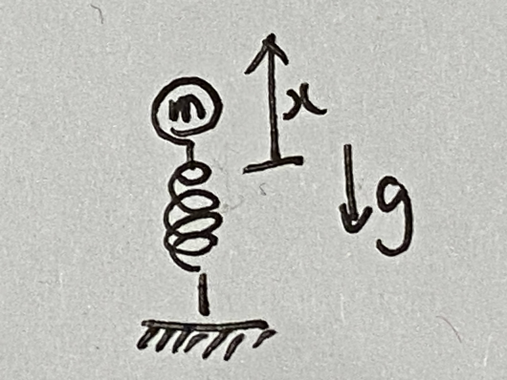
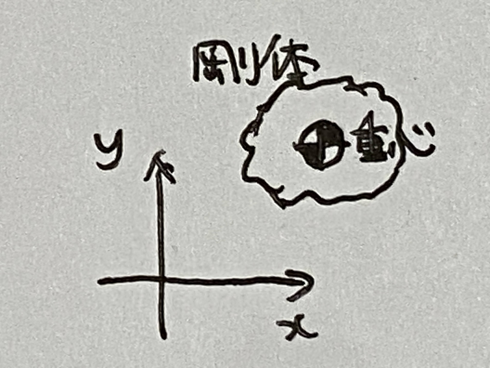
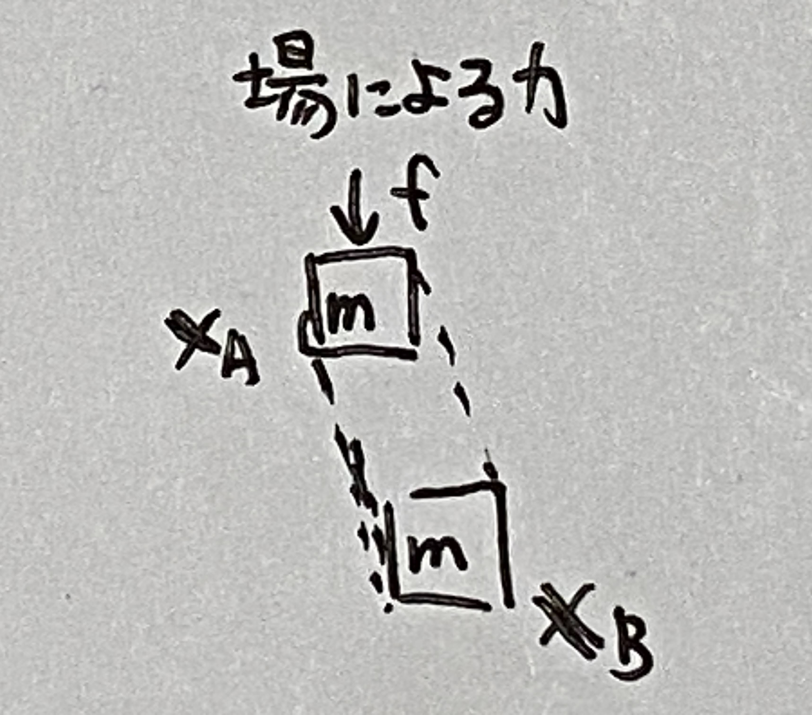
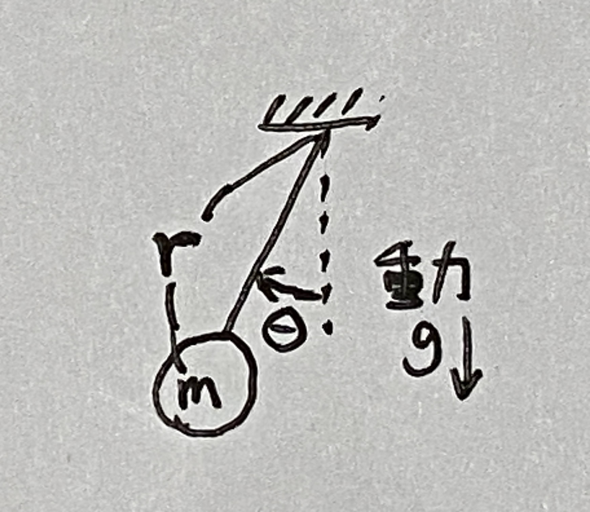
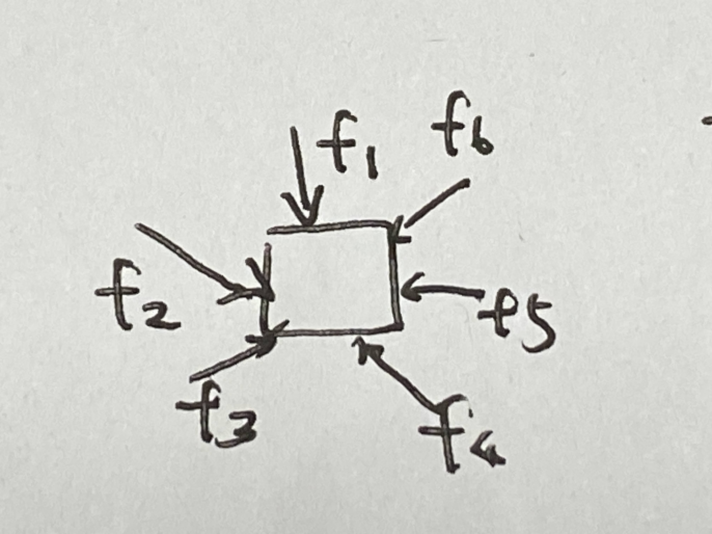
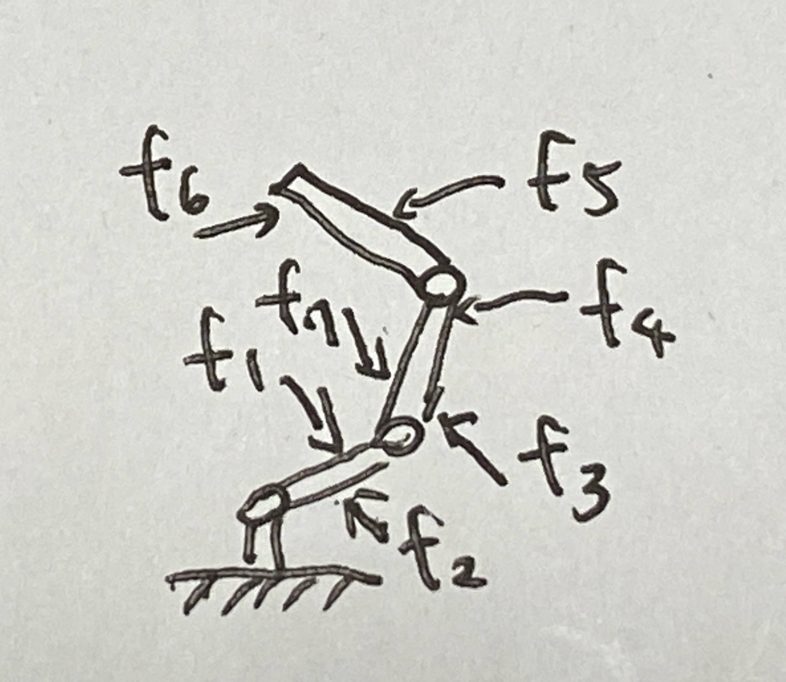
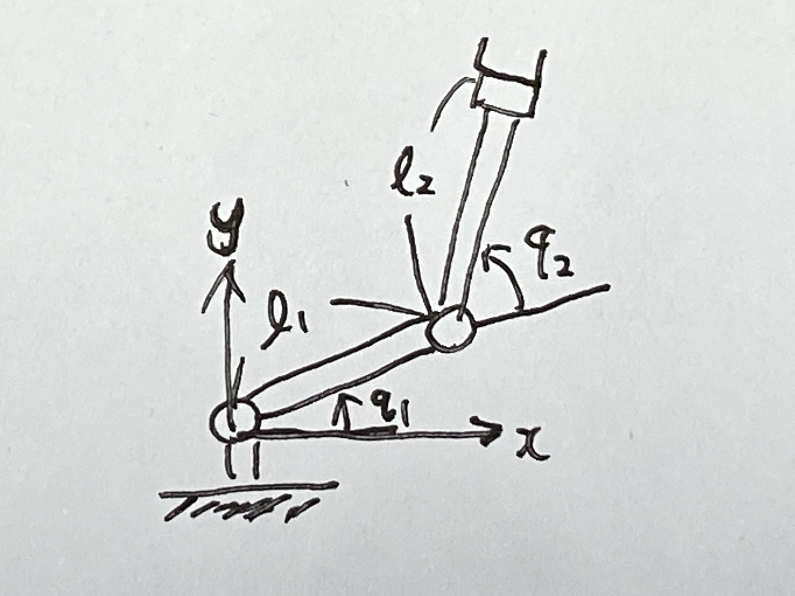
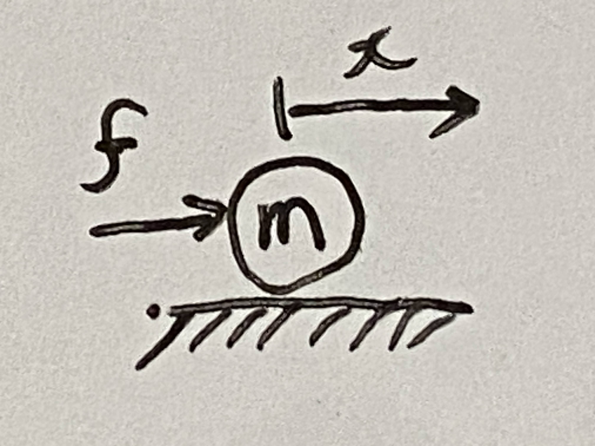

# インデックス

1. [第１週　解析力学の概要、ラグランジュの運動方程式](#第１週解析力学の概要ラグランジュの運動方程式)
1. [第2週　ラグランジュの運動方程式の基礎②、一般化座標](#第2週ラグランジュの運動方程式の基礎②一般化座標)
1. [第３週　運動エネルギー](#第３週運動エネルギー)
1. [第４週　３次元空間を移動する剛体の運動エネルギー](#第４週３次元空間を移動する剛体の運動エネルギー)
1. [第５週　ポテンシャルエネルギー](#第５週ポテンシャルエネルギー)
1. [第６週　仮想仕事の原理](#第６週仮想仕事の原理)
1. [第７週　ダランベールの原理・変分法](#第７週ダランベールの原理・変分法)
1. [第８週　変分法の適用例](#第８週変分法の適用例)
1. [第９週　変分法とラグランジュの運動方程式の導出](#第９週変分法とラグランジュの運動方程式の導出)
1. [第１０週　リンク機構の運動方程式](#第１０週リンク機構の運動方程式)
1. [第１１週　リンク機構の運動方程式②](#第１１週リンク機構の運動方程式)
1. [第１２週　リンク機構のエネルギー保存則](#第１２週リンク機構のエネルギー保存則)
1. [第１３週　外力が作用する場合の運動方程式](#第１３週外力が作用する場合の運動方程式)
1. [第１４週　拘束がある場合の運動方程式](#第１４週拘束がある場合の運動方程式)
1. [第１５週（最終週）　拘束がある場合の運動方程式②](#第１５週最終週拘束がある場合の運動方程式)

# 第１週　解析力学の概要、ラグランジュの運動方程式

* [Youtube](https://www.youtube.com/watch?v=kwGFway0duQ)
* [pdf](http:/www.ritsumei.ac.jp/~uemura-m/AnalyticalMechanics/AnalyticalMechanics1stWeek.pdf)

## 力学とは

力に関係した現象を数学的に調べる。

## 力学の分類

* 静力学　：　**力/トルク** と **力/トルク** の関係を調べる
* 動力学　：　**力/トルク** と **運動** の関係を調べる

## 解析力学の概要

**運動方程式(動力学)** を統一的に導出

運動方程式の例

```math
m\ddot{x} = f
```

$\ddot{x}$は運動、fは力を表す

## 運動方程式の用途

* シミュレーション
* 制御の設計
* 運動の解析
* CG・ゲーム

## 解析力学の物理的位置づけ

1. ニュートン力学(1687)
1. 解析力学(1788)
1. 相対性理論(1905)
1. 量子力学(1900)
1. 超弦理論(1960)

## ラグランジュの運動方程式

```math
ポテンシャルエネルギー : U
```

```math
運動エネルギー : K
```

```math
ラグランジアン : L = K - U
```

```math
一般化座標 : \bf{X}
```

```math
ラグランジュの運動方程式 : \frac{d}{dt}(\frac{\partial L}{\partial \dot{\bf{X}}}) - \frac{\partial L}{\partial \bf{X}} = 0
```

ラグランジアンは定義。

### ポテンシャルエネルギー

例： 高さhの位置にある質量mの物体


```math
U = mgh
```

例： バネ係数kにつながる質量mの物体がxの位置にあるとき


```math
U = \frac{1}{2}kx^2
```

### 運動エネルギー

例： 速さvで動く、質量mの物体


```math
K = \frac{1}{2}mv^2

```

### ラグランジュの運動方程式の利点

* 複雑な系でも、統一的な方法で比較的容易に運動方程式を導出できる
* 拘束のある系も取り扱える

### ラグランジュの運動方程式の例　１

質量mの物体が自由落下する。縦方向の位置はx(下向きに正)。


```math
ポテンシャルエネルギー : U = -mxg \\
```

```math
運動エネルギー : K = \frac{1}{2}m\dot{x}^2 \\
```

```math
ラグランジアン : L = K - U \\
```

```math
座標 : x \\
```

```math
ラグランジュの運動方程式 : \frac{d}{dt}(\frac{\partial L}{\partial \dot{x}}) - \frac{\partial L}{\partial x} = 0
```

$\partial $は偏微分。

ラグランジュの運動方程式を求める。

$L = K - U$より

```math
L = \frac{1}{2}m\dot{x}^2 + mxg
```

$\dot{x}$で偏微分する。

```math
\begin{aligned}
\frac{\partial L}{\partial \dot{x}} &= \frac{\partial (\frac{1}{2}m\dot{x}^2 + mxg)}{\partial \dot{x}} \\
&= \frac{\partial (\frac{1}{2}m\dot{x}^2)}{\partial \dot{x}} + \frac{\partial (mxg)}{\partial \dot{x}} \\
&= \frac{1}{2} \times 2 \times m\dot{x} + 0 \\
&= m\dot{x}
\end{aligned}
```

時間tで全微分する

```math
\begin{aligned}
\frac{d}{dt}(\frac{\partial L}{\partial \dot{x}}) &= \frac{d}{dt}(m\dot{x}) \\
&= m\ddot{x}
\end{aligned}
```

第二項の計算

```math
\begin{aligned}
\frac{\partial L}{\partial x} &= \frac{\partial (\frac{1}{2}m\dot{x}^2 + mxg)}{\partial x} \\
&= \frac{\partial (\frac{1}{2}m\dot{x}^2)}{\partial x} + \frac{\partial (mxg)}{\partial x} \\
&= 0 + mg \\
&= mg
\end{aligned}
```

よってラグランジュの運動方程式は

```math
\begin{aligned}
\frac{d}{dt}(\frac{\partial L}{\partial \dot{x}}) - \frac{\partial L}{\partial x} = 0
\\
m\ddot{x} - mg = 0
\end{aligned}
```

### ラグランジュの運動方程式の例　２

水平な面に置かれた質点ｍの物体がバネにつながっている。バネ係数k、位置は水平方向にx。

質点の定義 : 質点（しつてん、英語: point mass）とは力学的概念で、位置が一意的に定まり質量を持つ運動の要素だが、それ以外の、体積・変形・角速度などの内部自由度を一切持たないものと定義される。[wikipedia](https://ja.wikipedia.org/wiki/%E8%B3%AA%E7%82%B9)


ポテンシャルエネルギー

```math
U = \frac{1}{2}kx^2
```

運動エネルギー

```math
K = \frac{1}{2}m\dot{x}^2
```

ラグランジアン

```math
\begin{aligned}
L &= K - U \\
&= \frac{1}{2}m\dot{x}^2 - \frac{1}{2}kx^2
\end{aligned}
```

ラグランジュの運動方程式を解く。

```math
\begin{aligned}
\frac{d}{dt}(\frac{\partial L}{\partial \dot{x}}) - \frac{\partial L}{\partial x} &= 0 \\
\frac{d}{dt}(\frac{\partial (\frac{1}{2}m\dot{x}^2 - \frac{1}{2}kx^2)}{\partial \dot{x}}) - \frac{\partial (\frac{1}{2}m\dot{x}^2 - \frac{1}{2}kx^2)}{\partial x} &= 0 \\
\frac{d}{dt}(m\dot{x}-0) -  (0 - kx) &= 0 \\
m\ddot{x} -  (0 - kx) &= 0 \\
m\ddot{x} + kx &= 0
\end{aligned}
```

# 第2週　ラグランジュの運動方程式の基礎②、一般化座標

* [Youtube](https://www.youtube.com/watch?v=s1kWqnYJJfQ)
* [pdf](http:/www.ritsumei.ac.jp/~uemura-m/AnalyticalMechanics/AnalyticalMechanics2ndWeek.pdf)

## 質点の運動方程式 (2次元平面)


(重力はないものとする)

ポテンシャルエネルギー

```math

U = 0
```

運動エネルギー

```math
K = \frac{1}{2}mv^2 = \frac{1}{2}m(\sqrt{\dot{x}^2+\dot{y}^2})^2 = \frac{1}{2}m(\dot{x}^2+\dot{y}^2)
```

ラグランジアン

```math

L = K - U
```

座標

```math
\bf{X} = \begin{pmatrix}
x \\
y
\end{pmatrix}
```

ラグランジュの運動方程式

```math
\begin{aligned}
\frac{d}{dt}(\frac{\partial L}{\partial \dot{\bf{X}}}) - \frac{\partial L}{\partial \bf{X}} &= 0 \\
\frac{d}{dt}(\frac{\partial (\frac{1}{2}m(\dot{x}^2+\dot{y}^2))}{\partial \dot{\bf{X}}}) - \frac{\partial (\frac{1}{2}m(\dot{x}^2+\dot{y}^2))}{\partial \bf{X}} &= 0  \\
\frac{d}{dt}\begin{pmatrix}
\frac{\partial}{\partial \dot{x}} \frac{1}{2}m(\dot{x}^2+\dot{y}^2) \\
\frac{\partial}{\partial \dot{y}} \frac{1}{2}m(\dot{x}^2+\dot{y}^2)
\end{pmatrix} - \begin{pmatrix}
\frac{\partial}{\partial {x}}(\frac{1}{2}m(\dot{x}^2+\dot{y}^2)) \\
\frac{\partial}{\partial {y}}(\frac{1}{2}m(\dot{x}^2+\dot{y}^2))
\end{pmatrix} &= 0  \\
\frac{d}{dt}\begin{pmatrix}
m \dot{x} \\
m \dot{y}
\end{pmatrix} - \begin{pmatrix}
0 \\
0
\end{pmatrix} &= 0  \\
\begin{pmatrix}
m \ddot{x} \\
m \ddot{y}
\end{pmatrix} - \begin{pmatrix}
0 \\
0
\end{pmatrix} &= 0  \\
m \ddot{\bf{X}} &= 0
\end{aligned}
```

## 偏微分、全微分のおさらい

```math
f = 7x(t)+3\dot{x}(t)+4y(x(t))+2t
```

### 偏微分

微分対象の変数以外は定数として微分する

```math
\frac{\partial}{\partial x}f = \frac{\partial}{\partial x}(7x(t)+3\dot{x}(t)+4y(x(t))+2t) = 7
```

```math
\frac{\partial}{\partial t}f = \frac{\partial}{\partial x}(7x(t)+3\dot{x}(t)+4y(x(t))+2t) = 2
```

### 全微分

```math
\frac{d}{dt}f = \frac{d}{dt}(7x(t)+3\dot{x}(t)+4y(x(t))+2t) = 7\dot{x}+3\ddot{x}+4\frac{\partial y}{\partial x}+2
```

## 演習

次の偏微分・全微分を計算せよ

### ①

```math
\begin{aligned}
\frac{\partial}{\partial x}(ax^2+bx+c) &= 2ax + b\\
\end{aligned}
```

### ②

```math
\begin{aligned}
\frac{\partial}{\partial x}(x \sin x) &= \sin x + x \cos x
\end{aligned}
```

### ③

だたし、aは定数、x,yはtに依存した変数

```math
\begin{aligned}
\frac{d}{dt}axy = a\dot{x}y + ax\dot{y}
\end{aligned}
```

### ④

だたし、xはtに依存した変数

```math
\begin{aligned}
\frac{d}{dt}\sin x = \frac{\partial}{\partial x} \sin x \times \frac{d}{dt}x = \cos x \times \dot{x} = \dot{x} \cos x
\end{aligned}
```

## 一般化座標

一般化座標の定義： 系の位置を決める最小の変数の組

### 3関節ロボット


* 関節角度ベクトル $(q_1, q_2, q_3)$ は一般化座標
* 手先位置 $(x, y)$ は一般化座標ではない（系の位置を決められない）

### 質点


* 座標 $(x, y, r, \theta)$ は一般化座標ではない（変数の数が最小ではない）
* ベクトル $(x, y)$ は一般化座標
* 極座標 $(r, \theta)$ も一般化座標

## 自由度

自由度の定義： 系の位置を決めるのに必要な変数の数

### 質点

* 2次元平面： 2自由度
* 3次元平面： 3自由度

### N個の質点系

* 2次元平面： 2N自由度
* 3次元平面： 3N自由度

### 剛体


* 2次元平面： 3自由度
* 3次元平面： 6自由度

### 拘束なしのロボットアーム

* 関節の数をNとするとN自由度

## 拘束

### 2つの質点が棒で拘束


拘束条件

```math
\sqrt{(x_1 - x_2)^2 + (y_1 - y_2)^2} = l
```

自由度

```math
2 + 2 - 1 = 3
```

1は↑の拘束条件の数

### ロボットの手先が壁に拘束


拘束条件

```math
k_y(q_1, q_2, q_3) = y_{kabe}
```

自由度

```math
3 - 1 = 2
```

## ロボットの先端リンクが壁に固定


手先の $x$ 座標、 $y$ 座標、手先角度 $\theta$ が拘束
自由度

```math
3 - 3 = 0
```

ロボットは動かない。

## 演習

次の系の自由度を求めよう。


3関節ロボットと2関節ロボットに分割して考える。
左側の手先と右側の手先の $x$ 座標、 $y$ 座標、手先角度 $\theta$ が拘束

自由度

```math
3 + 2 - 3 = 2
```

# 第３週　運動エネルギー

* [Youtube](https://www.youtube.com/watch?v=IV4GuiRr7_Y)
* [pdf](http:/www.ritsumei.ac.jp/~uemura-m/AnalyticalMechanics/AnalyticalMechanics3rdWeek.pdf)

## 運動エネルギーとは

運動エネルギーの定義： 運動する物体が持つエネルギー


### 質点の運動エネルギー

```math
K = \frac{1}{2}mv^2
```

### $v^2$ の別表現

```math
v^2 = (\sqrt{\dot{x}^2 + \dot{y}^2})^2 = \dot{x}^2 + \dot{y}^2 = \dot{{\bf{X}}}\cdot\dot{{\bf{X}}}
```

## 内積のおさらい

ベクトルaとbの内積
内積の結果はスカラーになる。

```math
\begin{aligned}
{\bf{a}}\cdot{\bf{b}} &= a_1 b_1 + a_2 b_2 \cdots a_n b_n \\
&= (a_1 a_2 \cdots a_n )\begin{pmatrix}
b_1 \\
b_2 \\
\vdots \\
b_n
\end{pmatrix} \\
&= {\bf{a}}^T{\bf{b}} \\
&= \sum_{i=1}^{n} a_i b_i
\end{aligned}
```

↑すべて別表現

## 演習

### 問い

体重60 [kg] の人が、4 [m/s] で走っている。この人が持つ運動エネルギーを答えよ。

### 解答

```math
\begin{aligned}
K = \frac{1}{2}mv^2 = \frac{1}{2} \times 60 \times 4^2 = 480 [J] \\
1 [cal] \fallingdotseq 4 [J] なので、480 [J] \fallingdotseq 120 [J]
\end{aligned}
```

## 剛体の運動エネルギー（2次元）

### 剛体の運動エネルギー


```math
K = \frac{1}{2}mv_{cm}^2 + \frac{1}{2}I\omega^2
```

$I$ : 慣性モーメント \
$\omega$ : 角速度

**重心の並進運動**と**重心周りの回転運動**に分離可能

### 別表現


```math
K = \frac{1}{2}m \dot{{\bf{X_{cm}}}}\cdot\dot{{\bf{X_{cm}}}} + \frac{1}{2}I\dot{\theta}^2
```

## 証明：剛体の運動エネルギー（2次元）

剛体を質点の集まりとして考える <br>
↓　これまでの力学の延長線上で考える <br>
重心の並行移動と重心周りの回転を考える <br>
↓ <br>
全質点の運動エネルギーの和

```math
K = \sum_{i=1}^{n}\frac{1}{2}m_iv_i^2
```

↓ <br>
剛体の運動エネルギー

```math
K = \frac{1}{2}mv_{cm}^2 + \frac{1}{2}I\omega^2
```

## 剛体の重心

剛体を質点の集まりとして考える

### 剛体の重心位置

```math
{\bf{X_{cm}}} = \frac{1}{m}\sum_{i=1}^{N}m_i {\bf{X_i}} \\
```

$m$ : 剛体全体の質点 \
$m_i$ : 各質点の質量 \
${\bf{X_i}}$ : 各質点の位置ベクトル

### ２質点系での例


```math
x_{cm} = \frac{1}{m_1 + m_2}(m_1 x_1 + m_2 x_2) \\
```

## 各質点の位置


### 各質点の位置 ${\bf{X_i}}$

```math
{\bf{X_i}} = {\bf{X_{cm}}} + \rho_i \\
\rho_i = l_i\begin{pmatrix}
\cos (\theta + \theta_i) \\
\sin (\theta + \theta_i)
\end{pmatrix}
```

$\rho_i$ : 重心から見た位置

### $\rho_i$の性質①

```math
\begin{aligned}
{\bf{X_{cm}}} &= \frac{1}{m}\sum_{i=l}^{N} m_i {\bf{X_i}} \\
&= \frac{1}{m}\sum_{i=l}^{N} m_i {\bf{X_{cm}}} + \frac{1}{m}\sum_{i=l}^{N} m_i {\bf{\rho_i}} \\
&= {\bf{X_{cm}}} \frac{1}{m}\sum_{i=l}^{N} m_i  + \frac{1}{m}\sum_{i=l}^{N} m_i {\bf{\rho_i}} \\

\frac{1}{m}\sum_{i=l}^{N} m_i &= 1 なので \\
&= {\bf{X_{cm}}} + \frac{1}{m}\sum_{i=l}^{N} m_i {\bf{\rho_i}} \\

\therefore \sum_{i=l}^{N} m_i {\bf{\rho_i}} = 0
\end{aligned}
```

### $\rho_i$の性質②

```math
\begin{aligned}
\dot{\rho_i} \cdot \dot{\rho_i} &= l_i^2 \begin{pmatrix}
- \sin (\theta + \theta_i)\dot{\theta} \\
\cos (\theta + \theta_i)\dot{\theta}
\end{pmatrix} \cdot \begin{pmatrix}
- \sin (\theta + \theta_i)\dot{\theta} \\
\cos (\theta + \theta_i)\dot{\theta}
\end{pmatrix} \\
&= l_i^2\dot{\theta^2} \\
&= l_i^2 \omega^2
\end{aligned}
```

## 剛体の運動エネルギーの導出

```math
\begin{aligned}
v_i^2 &= {\bf{\dot{X_i}}} \cdot {\bf{\dot{X_i}}} \\
&= ({\bf{\dot{X_{cm}}}} + {\bf{\dot{\rho_i}}}) \cdot ({\bf{\dot{X_{cm}}}} + {\bf{\dot{\rho_i}}}) \\
&= {\bf{\dot{X_{cm}}}} \cdot {\bf{\dot{X_{cm}}}} +2{\bf{\dot{X_{cm}}}} \cdot {\bf{\dot{\rho_i}}} + {\bf{\dot{\rho_i}}} \cdot {\bf{\dot{\rho_i}}} \\

\dot{{\bf{X_{cm}}}} \cdot \dot{{\bf{X_{cm}}}} &= v_{cm}^2 と \dot{\rho_i} \cdot \dot{\rho_i} = l_i^2 \omega^2 より \\

&= v_{cm}^2 +2{\bf{\dot{X_{cm}}}} \cdot {\bf{\dot{\rho_i}}} + l_i^2 \omega^2 \\
\end{aligned}
```

### 全体の運動エネルギー

```math
\begin{aligned}

K &= \sum_{i=1}^N \frac{1}{2}m_i v_i^2 \\
&= \sum_{i=1}^N \frac{1}{2}m_i (v_{cm}^2 +2{\bf{\dot{X_{cm}}}} \cdot {\bf{\dot{\rho_i}}} + l_i^2 \omega^2) \\
&= \frac{1}{2}\sum_{i=1}^N m_i v_{cm}^2 + {\bf{\dot{X_{cm}}}} \cdot \sum_{i=1}^N m_i {\bf{\dot{\rho_i}}} + \frac{1}{2}\sum_{i=1}^N m_i l_i^2 \omega^2 \\

\sum_{i=1}^N m_i &= m 、 \sum_{i=1}^N m_i {\bf{\dot{\rho_i}}} = 0 、 \sum_{i=1}^N m_i l_i^2 = I より \\

&= \frac{1}{2}mv_{cm}^2 + \frac{1}{2}I \omega^2
\end{aligned}
```

## 慣性モーメント

| 並進運動 | 単位    | 記号         | 回転運動 | 単位       | 記号                |
| ------ | ------- | ----------  | ------- | -----     | ------------------ |
| 位置    |$[m]$   | $x$          |角度     |$[rad]$    |$\theta$             |
| 速度    |$[m/s]$ |$\dot{x}, v$  |角速度    |$[rad/s]$ |$\dot{\theta}, \omega$|
| 加速度  |$[m/s^2]$|$\ddot{x}, a$|角加速度  |$[rad/s^2]$|$\ddot{\theta}$      |
|力      |$[N]$    |$f$           |力のモーメント、<br>またはトルク|$[Nm]$|$\tau$|
|質量     |$[kg]$   |$m$          |慣性モーメント|$[kgm^2]$|$I$|

## 演習

```math
運動エネルギーを K = \frac{1}{2}mv_{cm}^2 + \frac{1}{2}I \dot{\theta}^2 ポテンシャルエネルギーを U = mgy_{cm} とする剛体の運動方程式を求めよ。ただし、座標は {\bf{X}} = \begin{pmatrix}
x_{cm} \\
y_{cm} \\
\theta
\end{pmatrix} とする。
```


ラグランジアン

```math
\begin{aligned}
L &= K - U \\
&= \frac{1}{2}mv_{cm}^2 + \frac{1}{2}I \dot{\theta}^2 - mgy_{cm} \\

v_{cm}^2 = \dot{x}^2_{cm} + \dot{y}^2_{cm} より  \\

&= \frac{1}{2}m(\dot{x}^2_{cm} + \dot{y}^2_{cm}) + \frac{1}{2}I \dot{\theta}^2 - mgy_{cm} \\


\end{aligned}
```

ラグランジュの運動方程式

```math
\begin{aligned}
\frac{d}{dt}(\frac{\partial L}{\partial \dot{\bf{X}}}) - \frac{\partial L}{\partial \bf{X}} &= 0
\end{aligned}
```

各項を計算する。第一項の偏微分を解く。

```math
\begin{aligned}
\frac{\partial L}{\partial \dot{\bf{X}}} &= \frac{\partial}{\partial \dot{\bf{X}}} (\frac{1}{2}m(\dot{x}^2_{cm} + \dot{y}^2_{cm}) + \frac{1}{2}I \dot{\theta}^2 - mgy_{cm}) \\
&= \begin{pmatrix}
\frac{\partial}{\partial \dot{x}} (\frac{1}{2}m(\dot{x}^2_{cm} + \dot{y}^2_{cm}) + \frac{1}{2}I \dot{\theta}^2 - mgy_{cm}) \\
\frac{\partial}{\partial \dot{y}} (\frac{1}{2}m(\dot{x}^2_{cm} + \dot{y}^2_{cm}) + \frac{1}{2}I \dot{\theta}^2 - mgy_{cm}) \\
\frac{\partial}{\partial \dot{\theta}} (\frac{1}{2}m(\dot{x}^2_{cm} + \dot{y}^2_{cm}) + \frac{1}{2}I \dot{\theta}^2 - mgy_{cm})
\end{pmatrix} \\
&= \begin{pmatrix}
m\dot{x}_{cm}\\
m\dot{y}_{cm}\\
I \dot{\theta}
\end{pmatrix}

\end{aligned}
```

第一項の全微分を解く。

```math
\begin{aligned}
\frac{d}{dt}(\frac{\partial L}{\partial \dot{\bf{X}}}) &= \frac{d}{dt}\begin{pmatrix}
m\dot{x}_{cm} \\
m\dot{y}_{cm} \\
I\dot{\theta}
\end{pmatrix} \\
&= \begin{pmatrix}
m\ddot{x}_{cm} \\
m\ddot{y}_{cm} \\
I\ddot{\theta}
\end{pmatrix}
\end{aligned}
```

第二項の偏微分を解く。

```math
\begin{aligned}
\frac{\partial L}{\partial \bf{X}} &= \frac{\partial }{\partial \bf{X}}(\frac{1}{2}m(\dot{x}^2_{cm} + \dot{y}^2_{cm}) + \frac{1}{2}I \dot{\theta}^2 - mgy_{cm}) \\
&= \begin{pmatrix}
0 \\
-mg \\
0
\end{pmatrix}
\end{aligned}
```

よって、ラグランジュの運動方程式

```math
\begin{aligned}
\frac{d}{dt}(\frac{\partial L}{\partial \dot{\bf{X}}}) - \frac{\partial L}{\partial \bf{X}} &= 0 \\

\begin{pmatrix}
m\ddot{x}_{cm} \\
m\ddot{y}_{cm} \\
I\ddot{\theta}
\end{pmatrix} - \begin{pmatrix}
0 \\
-mg \\
0
\end{pmatrix} &= 0 \\

\begin{pmatrix}
m\ddot{x}_{cm} \\
m\ddot{y}_{cm} \\
I\ddot{\theta}
\end{pmatrix} + \begin{pmatrix}
0 \\
mg \\
0
\end{pmatrix} &= 0 \\
\end{aligned}
```

* 重心は放物運動する
* 重心周りは等速回転運動する

# 第４週　３次元空間を移動する剛体の運動エネルギー

* [Youtube](https://www.youtube.com/watch?v=pLsiqW_BP-0)
* [PDF](http:/www.ritsumei.ac.jp/~uemura-m/AnalyticalMechanics/AnalyticalMechanics4thWeek.pdf)

## 剛体の運動エネルギー（3次元）

## 剛体の運動エネルギー


```math
K = \frac{1}{2}mv_{cm}^2 + \frac{1}{2}\omega^T I \omega^2
```

```math
\begin{aligned}
{\boldsymbol{\omega}} = \begin{pmatrix}
\omega_x \\
\omega_y \\
\omega_z
\end{pmatrix} : 角速度ベクトル  \\
I = \begin{pmatrix}
I_{xx} & I_{xy} & I_{xz} \\
I_{yx} & I_{yy} & I_{yz} \\
I_{zx} & I_{zy} & I_{zz}
\end{pmatrix} : 慣性テンソル \\
\end{aligned}
```

回転軸によって慣性モーメントが違う
剛体に固定した座標系で考える。

## 重心

### 重心位置 ${\bf{X}}_{cm}$

```math
{\bf{X}}_{cm} = \frac{1}{m}\sum_{i=1}^N m_i{\bf{X}}_i
```

### 各質点の位置 ${\bf{X}}_{i}$

```math
{\bf{X}}_{i} = {\bf{X}}_{cm} + {\bf{\rho}}_{i}
```

### ${\bf{\rho}}_{i}$ の性質①

```math
\sum_{i=1}^N mi {\bf{\rho}}_{i} = 0
```

## 各質点の速度


### 質点の速度

```math
\dot{{\bf{X}}}_{i} = \dot{{\bf{X}}}_{cm} + \dot{{\boldsymbol{\rho}}}_{i}
```

```math
\begin{aligned}
\dot{{\boldsymbol{\rho}}}_{i} \cdot \dot{{\boldsymbol{\rho}}}_{i} &= {\bf{v}}_{ri} \cdot {\bf{v}}_{ri} \\
&= ({\boldsymbol{\omega}} \times {\bf{r}}_i) \cdot ({\boldsymbol{\omega}} \times {\bf{r}}_i) \\
&= ({\bf{R}}_i {\boldsymbol{\omega}}) \cdot ({\bf{R}}_i {\boldsymbol{\omega}}) \\
&= ({\bf{R}}_i {\boldsymbol{\omega}})^T ({\bf{R}}_i {\boldsymbol{\omega}}) \\
&= {\boldsymbol{\omega}}^T {\bf{R}}_i^T {\bf{R}}_i {\boldsymbol{\omega}} \\
&= {\boldsymbol{\omega}}^T \bar{{\bf{R}}}_i {\boldsymbol{\omega}} \\
\end{aligned}
```

```math
\begin{aligned}
ただし {\boldsymbol{\omega}} \times {\bf{r}}_i = \begin{pmatrix}
\omega_y r_{zi} + \omega_z r_{yi} \\
\omega_z r_{xi} + \omega_x r_{zi} \\
\omega_x r_{yi} + \omega_y r_{xi}
\end{pmatrix} より
{\bf{R}}_i = \begin{pmatrix}
0 & r_{zi} & -r_{yi} \\
-r_{zi} & 0 & r_{xi} \\
r_{yi} & -r_{xi} & 0
\end{pmatrix} とする \\
ただし \bar{{\bf{R}}}_i = \begin{pmatrix}
r_{yi}^2 + r_{zi}^2 & -r_{xi}r_{yi} & -r_{zi}r_{xi} \\
-r_{xi}r_{yi} & r_{xi}^2 + r_{zi}^2 & -r_{yi}r_{zi} \\
-r_{zi}r_{xi} & -r_{yi}r_{zi} & r_{xi}^2 + r_{yi}^2
\end{pmatrix} とする
\end{aligned}
```

## 外積のおさらい


### 外積

```math
\begin{aligned}
{\bf{c}} &= {\bf{b}} \times {\bf{a}} \\
&= \begin{pmatrix}b_x\\b_y\\b_z\end{pmatrix} \times \begin{pmatrix}a_x\\a_y\\a_z\end{pmatrix} \\
&= \begin{pmatrix}
b_y a_z - b_z a_y\\
b_z a_x - b_x a_z\\
b_x a_y - b_y a_x
\end{pmatrix}
\end{aligned}
```

### 軸周りの速度

```math
v = \omega r \sin \theta \\
```

```math
{\bf{v}} = \omega {\bf{e}} \times {\bf{r}} \\
```

```math
ただし |{\bf{e}}| = 1
```

## 外積による3次元速度の計算(続き)


### 質点の速度

```math
\begin{aligned}
{\bf{v}}_{ri} &= {\boldsymbol{\omega}} \times {\bf{r}}_i \\
{\bf{v}}_{ri} &: 重心から見た質点の速度ベクトル \\
{\bf{r}}_i &: 剛体座標系から見た質点の位置ベクトル
\end{aligned}
```

```math
\begin{aligned}
{\bf{v}}_{ri} &= \omega_x {\bf{e}}_{\bf{x}} \times {\bf{r}}_i
+ \omega_y {\bf{e}}_{\bf{y}} \times {\bf{r}}_i
+ \omega_z {\bf{e}}_{\bf{z}} \times {\bf{r}}_i \\
&= {\boldsymbol{\omega}} \times {\bf{r}}_i
\end{aligned}
```

```math
ただし {\bf{e}}_x = \begin{pmatrix}
1, 0, 0
\end{pmatrix}^T ,
{\bf{e}}_y = \begin{pmatrix}
0, 1, 0
\end{pmatrix}^T ,
{\bf{e}}_z = \begin{pmatrix}
0, 0, 1
\end{pmatrix}^T
```

## 運動エネルギーの導出

```math
\begin{aligned}
v_i^2 &= \dot{{\bf{X}}}_i \cdot \dot{{\bf{X}}}_i \\
&= v_{cm}^2 + 2\dot{{\bf{X}}}_{cm} \cdot \dot{{\boldsymbol{\rho}}}_i + \dot{{\boldsymbol{\rho}}}_i \cdot \dot{{\boldsymbol{\rho}}}_i
\end{aligned}
```

### 運動エネルギー

```math
\begin{aligned}
K &= \sum_{i=1}^N \frac{1}{2}m_i v_i^2 \\
&= \sum_{i=1}^N \frac{1}{2}m_i (v_{cm}^2 + 2\dot{{\bf{X}}}_{cm} \cdot \dot{{\boldsymbol{\rho}}}_i + \dot{{\boldsymbol{\rho}}}_i \cdot \dot{{\boldsymbol{\rho}}}_i) \\
&= \frac{1}{2} \sum_{i=1}^N m_i v_{cm}^2 + \dot{{\bf{X}}}_{cm} \cdot \sum_{i=1}^N m_i \dot{{\boldsymbol{\rho}}}_i + \frac{1}{2} \sum_{i=1}^N m_i {\boldsymbol{\omega}}^T \bar{{\bf{R}}}_i {\boldsymbol{\omega}} \\
\sum_{i=1}^N m_i &= m 、 \sum_{i=1}^N m_i \dot{{\boldsymbol{\rho}}}_i = 0  、 I = \sum_{i=1}^N mi \bar{{\bf{R}}}_i より\\
&= \frac{1}{2} m v_{cm}^2 + \frac{1}{2} {\boldsymbol{\omega}}^T I {\boldsymbol{\omega}} \\
\end{aligned}
```

## 演習

### 問い

```math
\begin{aligned}
質量 m の質点の位置を {\bf{r}} = \begin{pmatrix}r_x\\r_y\\r_z\end{pmatrix} とし、\\
その質点がベクトル {\bf{e}} = \begin{pmatrix}e_x\\e_y\\e_z\end{pmatrix} を回転軸として角速度 ω で回転しているとき、\\
質点の速度 v と運動エネルギー K を求めよ
\end{aligned}
```

### 解答

#### 質点の速度

```math
\begin{aligned}
{\bf{v}} &= \omega {\bf{e}} \times {\bf{r}} \\
&= \omega \begin{pmatrix}e_x\\e_y\\e_z\end{pmatrix} \times \begin{pmatrix}r_x\\r_y\\r_z\end{pmatrix} \\
&= \omega \begin{pmatrix}
e_y r_z - e_z r_y \\
e_z r_x - e_x r_z \\
e_x r_y - e_y r_x
\end{pmatrix}
\end{aligned}
```

#### 運動エネルギー

```math
\begin{aligned}
K &= \frac{1}{2} m v^2 \\
(質点は&慣性テンソルがゼロなので) \\
&= \frac{1}{2} m {\bf{v}} \cdot {\bf{v}} \\
&= \frac{1}{2} m (\omega {\bf{e}} \times {\bf{r}}) \cdot (\omega {\bf{e}} \times {\bf{r}}) \\
\end{aligned}
```

# 第５週　ポテンシャルエネルギー

* [PDF](http:/www.ritsumei.ac.jp/~uemura-m/AnalyticalMechanics/AnalyticalMechanics5thWeek.pdf)
* [Youtube](https://www.youtube.com/watch?v=_oxF2fsdC3g)

## ポテンシャルエネルギーとは？

力を発生する場によって蓄えられるエネルギー


ポテンシャルエネルギー<br>
ばねによって力が蓄えられる。

```math
\begin{aligned}
U = \frac{1}{2}kx^2
\end{aligned}
```


ポテンシャルエネルギー<br>
重力によって力が蓄えられる。

```math
\begin{aligned}
U = -mgx
\end{aligned}
```

## 演習



### 問い

剛性 $k = 2000 [N/m]$ のバネの上に $2 [kg]$ の物体を乗せ、物体の上から力をかけてバネを $0.2 [m]$ 変形させた後、力を抜いたとき、物体の跳ぶ高さを答えよ。ただし、バネを $0.2 [m]$ 変形させたときの物体の位置を $x=0 [m]$ とする。

### 解答

```math
\begin{aligned}
-2 \times 9.8  \times x + \frac{1}{2} \times 2000 \times 0.2^2 = 0 \\
x \fallingdotseq 2.0 [m]
\end{aligned}
```

## 剛体の位置エネルギー



### 剛体の位置エネルギー

```math
\begin{aligned}
U &= \sum_{i=1}^n m_i g y_i \\
&= mgy_{cm}
\end{aligned}
```

### 剛体の重心の高さ

```math
\begin{aligned}
y_{cm} = \frac{1}{m} \sum_{i=1}^n m_i y_i
\end{aligned}
```

## ポテンシャルエネルギーの導出



質点に**場による力** $f$ が作用している場合を考える。このとき、質点が座標 ${\bf{x}_A}$ から ${\bf{x}_B}$ まで移動した。<br>

力 $f$ が質点にする仕事

```math
\begin{aligned}
W = \int_{\bf{x}_A}^{\bf{x}_B} f \cdot d{\bf{x}}
\end{aligned}
```

仕事 : エネルギーと同じ意味。力学では、ある力が生じさせるエネルギーのことを力が成す仕事と呼ぶ。<br>

仕事 $W$ が ${\bf{x}_A}$ から ${\bf{x}_B}$ までの経路によらず一定である場合、力 $f$ を**保存力**という。<br>
逆に力が一定ではなく変化する場合、ポテンシャルエネルギーを導出できない。<br>

力 $f$ が保存力のとき、

```math
\begin{aligned}
U({\bf{x}_A}) - U({\bf{x}_B}) = W \\
U : ポテンシャルエネルギー
\end{aligned}
```

## 例題（重力場）


重力によるポテンシャルエネルギー<br>

場(重力)による力 $f = mg$<br>

重力が質点にする仕事

```math
\begin{aligned}
W = \int_{x_1}^{x_2}fdx = \int_{x_1}^{x_2}mgdx = \left[mgx\right]_{x_1}^{x_2} = mgx_2 - mgx_1
\end{aligned}
```

ポテンシャルエネルギー

```math
\begin{aligned}
U(x_1) - U(x_2) = mgx_2 - mgx_1 \\
U(x) = -mgx
\end{aligned}
```

## 例題（バネ）


場(バネ)による力 $f = -kx$ (フックの法則[wikipedia](https://ja.wikipedia.org/wiki/%E3%83%95%E3%83%83%E3%82%AF%E3%81%AE%E6%B3%95%E5%89%87))<br>

バネが質点にする仕事

```math
\begin{aligned}
W = \int_{x_1}^{x_2} fdx = \int_{x_1}^{x_2} -kxdx = \left[-\frac{1}{2}x^2\right]_{x_1}^{x_2} = -\frac{1}{2}x_{2}^2 + -\frac{1}{2}x_1^2
\end{aligned}
```

ポテンシャルエネルギー

```math
\begin{aligned}
U(x_1) - U(x_2) = -\frac{1}{2}x_{2}^2 + -\frac{1}{2}x_1^2 \\
U(x) = \frac{1}{2}kx^2
\end{aligned}
```

## 保存力の性質

Uの全微分

```math
\begin{aligned}
\partial U &= \frac{\partial}{\partial {\bf{x}}} U \cdot d{\bf{x}} \\
&= \frac{\partial}{\partial x}Udx + \frac{\partial}{\partial y}Udy + \frac{\partial}{\partial z}Udz
\end{aligned}
\tag{1}
```

```math
\begin{aligned}
\partial U &= U({\bf{x}} + d {\bf{x}}) - U({\bf{x}}) \\
&= -f \cdot d{\bf{x}} \\
&= -f_xdx - f_ydy - f_zdz
\end{aligned}
\tag{2}
```

(1)と(2)より、保存力 $f$ の性質

```math
\begin{aligned}
f_x = -\frac{\partial}{\partial x}U , f_y = -\frac{\partial}{\partial y}U, f_z = -\frac{\partial}{\partial z}U
\end{aligned}
```

さらに偏微分すると

```math
\begin{aligned}
\frac{\partial}{\partial y}f_x = -\frac{\partial^2}{\partial x \partial y}U = \frac{\partial}{\partial x}f_y ,　
\frac{\partial}{\partial z}f_x = \frac{\partial}{\partial x}f_z ,　
\frac{\partial}{\partial z}f_y = \frac{\partial}{\partial y}f_z
\end{aligned}
```

## 演習

### 問い

1. $x$ 方向に $f_x = -k_1x^3$ 、y方向に $f_y = -k_2y$ の力を発揮するバネのポテンシャルエネルギーを求めよ
1. 力 $f_x,f_y$ が保存力であることを証明せよ

### 解答

1.

```math
\begin{aligned}
W &= \int_{x_1}^{x_2} {\bf{f}} \cdot dx \\
&= \int_{x_1}^{x_2} (f_x + f_y)dx \\
&= \int_{x_1}^{x_2} (-k_1x^3 -k_2y)dx \\
&= \left[-\frac{1}{4}k_1x^4 -\frac{1}{2}k_2y^2 \right]_{x_1}^{x_2} \\
&= -\frac{1}{4}k_1x_2^4 -\frac{1}{2}k_2y_2^2 + \frac{1}{4}k_1x_1^4 + \frac{1}{2}k_2y_1^2 \\
U({\bf{x}}_1) - U({\bf{x}}_2) = W
\end{aligned}
```

ポテンシャルエネルギー

```math
\begin{aligned}
U({\bf{x}}) &= \frac{1}{4}k_1x^4 + \frac{1}{2}k_2y^2 \\
\end{aligned}
```

2.

```math
\begin{aligned}
\frac{\partial}{\partial x} U &= \frac{\partial}{\partial x}(\frac{1}{4}k_1x^4 + \frac{1}{2}k_2y^2) \\
&= k_1x^3 \\
&= -f_x
\end{aligned}
```

```math
\begin{aligned}
\frac{\partial}{\partial y} U &= \frac{\partial}{\partial y}(\frac{1}{4}k_1x^4 + \frac{1}{2}k_2y^2) \\
&= k_2y \\
&= -f_y
\end{aligned}
```

```math
\begin{aligned}
\frac{\partial}{\partial y} fx = 0, \frac{\partial}{\partial x} fy = 0 であることから\\
\therefore \frac{\partial}{\partial y} fx = \frac{\partial}{\partial x} fy
\end{aligned}
```

よって、力 $f$ は保存力

## エネルギー保存則

系に保存力だけが働く場合、系全体のエネルギーは時間が経過しても変化しない

## エネルギー保存則の例


運動エネルギー $K=\frac{1}{2}m\dot{x}^2$ <br>
ポテンシャルエネルギー $U=\frac{1}{2}kx^2$ <br>
全エネルギー $V = K + U$ <br>
運動方程式 $m \ddot{x} + kx = 0$ <br>
 <br>
エネルギーの時間変化

```math
\begin{aligned}
\dot{V} &= \frac{d}{dt} (\frac{1}{2}m\dot{x}^2 + \frac{1}{2}kx^2) \\
&= m\dot{x}\ddot{x} + kx\dot{x} \\
&= \dot{x}(m\ddot{x} + kx) \\
&= 0
\end{aligned}
```

全エネルギーの変化がゼロであることから、エネルギー保存則が証明された。

## 演習



### 問い

振り子運動に関するエネルギー保存則を導出せよ <br>
 <br>
運動エネルギー $K=\frac{1}{2}m(r\dot{\theta})^2$ <br>
ポテンシャルエネルギー $U=mg(r - r \cos \theta)$ <br>
全エネルギー $V = K + U$ <br>
運動方程式 ? <br>
エネルギーの時間変化 ? <br>

### 解答

運動方程式 <br>
 <br>
ラグランジアン <br>

```math
\begin{aligned}
L &= K - U \\
&= \frac{1}{2}m(r\dot{\theta})^2 - mg(r - r \cos \theta) \\
\end{aligned}
```

ラグランジュの運動方程式

```math
\begin{aligned}
\frac{d}{dt}(\frac{\partial L}{\partial \dot{\theta}}) - \frac{\partial L}{\partial \theta} &= 0 \\
\frac{d}{dt}(\frac{\partial}{\partial \dot{\theta}}(\frac{1}{2}m(r\dot{\theta})^2 - mg(r - r \cos \theta))) - \frac{\partial}{\partial \theta}(\frac{1}{2}m(r\dot{\theta})^2 - mg(r - r \cos \theta)) &= 0 \\
\frac{d}{dt}(mr^2\dot{\theta}) + \frac{\partial}{\partial \theta}(mg(r - r \cos \theta)) &= 0 \\
mr^2\ddot{\theta} + mgr \sin \theta &= 0 \\
\end{aligned}
```

エネルギーの時間変化

```math
\begin{aligned}
\dot{V} &= \frac{d}{dt}(K+U) \\
&= \frac{d}{dt}(\frac{1}{2}m(r\dot{\theta})^2 + mg(r - r \cos \theta)) \\
&= mr^2\dot{\theta}\ddot{\theta} + mgr \dot{\theta} \sin \theta\\
&= \dot{\theta} ( mr^2\ddot{\theta} + mgr \sin \theta)\\
&= 0
\end{aligned}
```

# 第６週　仮想仕事の原理

* [PDF](http:/www.ritsumei.ac.jp/~uemura-m/AnalyticalMechanics/AnalyticalMechanics6thWeek.pdf)
* [Youtube](https://www.youtube.com/watch?v=rtTUMerZj-w)

## 仮想仕事の原理の概要

仮想仕事の原理（かそうしごとのげんり、英: principle of virtual work）

* 静力学の概念
* 「釣り合い」の概念を一般化したもの
* スカラー値の仕事を解析することで、複雑な系でも統一的に釣り合いを解析
* ラグランジュの運動方程式の導出に必要

## 演習（復習）

### 問い


右図の系が釣り合いの状態にあるとき、 $f_1$ と $f_2$ の関係を求めよ。

### 解答

```math
\begin{aligned}
f_1 l_1 = f_1 l_2
\end{aligned}
```

### 問い


右図のモータが $\tau$ のトルクを出力している。この系が釣り合いの状態にあるとき、 $f$ と $\tau$ の関係を求めよ。

### 解答

```math
\begin{aligned}
\tau = f l
\end{aligned}
```

## 質点における釣り合い



```math
質点に働いている力 f_i の合計 \sum_{i=1}^n f_i が 0 のとき、系は釣り合いの状態
```

## 釣り合いの一般化



では、複雑な系での釣り合いは？

→　**仮想仕事の原理**で解析

## 仮想仕事の原理

系が釣り合いの状態にあるとき、系に作用する力がなす仮想仕事の合計は $0$ である（逆も真）

## 仮想仕事の原理の数学的表現


図には沢山の質点があり、お互いに拘束されている。

質点 $i$ に作用している拘束力 $s_i$ と外力 $f_i$ の和が $0$ のとき、釣り合う

### 仮想仕事 $\delta W$

```math
\begin{aligned}
\delta W = \sum_{i=1}^n (s_i + f_i) \cdot \delta {\bf{x}}_i = 0
\end{aligned}
```

$\delta {\bf{X}}_i$ : 各質点の仮想変位 (拘束に矛盾しない微小変位(この場合質点間の距離が一定という条件))

拘束力は仕事をしない

```math
\begin{aligned}
\sum_{i=1}^n s_i \cdot \delta {\bf{x}}_i = 0
\end{aligned}
```

```math
よって、 \delta W = \sum_{i=1}^n f_i \cdot \delta {\bf{x}}_i = 0 であれば系全体は釣り合う
```

## 仮想仕事の原理の適用例


各仮想変位の関係

```math
\begin{aligned}
\frac{\delta x_2}{\delta x_1} = - \frac{l_2}{l_1}
\end{aligned}
```

仮想仕事

```math
\begin{aligned}
\delta W = f_1 \delta x_1 + f_2 \delta x_2
\end{aligned}
```

釣り合いの条件

```math
\begin{aligned}
\delta W = f_1 \delta x_1 + f_2 \delta x_2 = (f_1 l_1 - f_2 l_2) \frac{\delta x_1}{l_1} = 0
\end{aligned}
```

## 演習


### 問い

下図の釣り合いの条件を求めよ。ただし、 $\delta x_1$ ,  $\delta x_1$ は拘束に矛盾しない方向の微小変位であり、 $f_1$ ,  $f_2$ , は仮想変位に平行な力を表すスカラ変数である。

### 解答

各仮想変位の関係

```math
\begin{aligned}
\frac{\delta x_2}{\delta x_1} &= \frac{l_2}{\sqrt{2}l_1} \\
\delta x_2 &= \frac{l_2 \delta x_1}{\sqrt{2}l_1}
\end{aligned}
```

仮想仕事

```math
\begin{aligned}
\delta W &= \sum_{i=1}^n f_i \cdot \delta {\bf{x}}_i \\
&= f_1 \delta x_1 + f_2 \delta x_2
\end{aligned}
```

釣り合いの条件

```math
\begin{aligned}
\delta W &= f_1 \delta x_1 + f_2 \delta x_2 \\
&= f_1 \delta x_1 + f_2 (\frac{l_2 \delta x_1}{\sqrt{2}l_1}) \\
&= \frac{\delta x_1}{l_1} (f_1 l_1 + \frac{1}{\sqrt{2}}f_2 l_2) \\
&= \frac{\delta x_1}{\sqrt{2}l_1} (\sqrt{2} f_1 l_1 + f_2 l_2) = 0
\end{aligned}
```

よって、釣り合いの条件は $\sqrt{2} f_1 l_1 + f_2 l_2 = 0$

## リンク構造の仮想仕事の原理


関節角度のベクトル

```math
\begin{aligned}
\delta {\bf{q}} = \begin{pmatrix}
\delta q_1 \\
\delta q_2
\end{pmatrix}
\end{aligned}
```

各仮想変位の関係

```math
\begin{aligned}
\delta {\bf{x}} = {\bf{J}}({\bf{q}}) \delta {\bf{q}}
\end{aligned}
```

ヤコビ行列(ヤコビアン)

```math
\begin{aligned}
{\bf{J}}({\bf{q}}) = \begin{pmatrix}
\frac{\partial x}{\partial q_1} & \frac{\partial x}{\partial q_2} \\
\frac{\partial y}{\partial q_1} & \frac{\partial y}{\partial q_2}
\end{pmatrix}
\end{aligned}
```

トルクのベクトル

```math
\begin{aligned}
{\boldsymbol{\tau}} = \begin{pmatrix}
\tau_1 \\
\tau_2
\end{pmatrix}
\end{aligned}
```

釣り合いの条件

```math
\begin{aligned}
\delta W &= \sum_{i=1}^n {\bf{f}}_i \cdot \delta {\bf{x}}_i \\
&= {\bf{f}} \cdot \delta {\bf{x}} + {\boldsymbol{\tau}} \cdot \delta {\bf{q}} \\
{\boldsymbol{\tau}} \cdot \delta {\bf{q}} : 回転系の場合&は (トルク)・(角度変位) で仕事を表す \\
{\bf{f}} \cdot \delta {\bf{x}} &= {\bf{f}} \cdot {\bf{J}} \delta {\bf{q}} \\
&= {\bf{f}}^T {\bf{J}} \delta {\bf{q}} \\
&= {\bf{J}}^T {\bf{f}} \cdot \delta {\bf{q}} より \\
\delta W &= {\bf{f}} \cdot \delta {\bf{x}} + {\boldsymbol{\tau}} \cdot \delta {\bf{q}} \\
&= {\bf{J}}^T {\bf{f}} \cdot \delta {\bf{q}} + {\boldsymbol{\tau}} \cdot \delta {\bf{q}} \\
&= ({\bf{J}}^T {\bf{f}} + {\boldsymbol{\tau}}) \cdot \delta {\bf{q}} = 0\\
\end{aligned}
```

よって、 $\boldsymbol{\tau} = - {\bf{J}}^T {\bf{f}}$ のとき系は釣り合う

## 演習


### 問い

下図のリンク系の手先に、 $f = (2, 1)^T$ の力が加わっている。この系を釣り合いの状態にするために必要な関節トルク $\tau$ を求めよ。ただし、手先の微小変位と各関節の微小変位の間には $\delta {\bf{x}} = {\bf{J}}({\bf{q}}) \delta {\bf{q}}$ が成り立っている。

```math
\begin{aligned}
{\bf{J}}({\bf{q}}) = \begin{pmatrix}
2 & 2 \\
3 & 1
\end{pmatrix}
\end{aligned}
```

### 解答

```math
\begin{aligned}
\boldsymbol{\tau} &= - {\bf{J}}^T {\bf{f}} \\
&= - \begin{pmatrix}
2 & 3 \\
2 & 1
\end{pmatrix}\begin{pmatrix}
2 \\
1
\end{pmatrix} \\
&= -\begin{pmatrix}
7 \\
5
\end{pmatrix} \\
&= \begin{pmatrix}
-7 \\
-5
\end{pmatrix} \\\end{aligned}
```

## ヤコビ行列 (ヤコビアン)

手先速度と関節角速度、手先力と関節トルクの関係を表す行列


手先速度と関節速度の関係

```math
\begin{aligned}
\dot{{\bf{x}}} = {\bf{J}}({\bf{q}})\dot{{\bf{q}}}
\end{aligned}
```

ヤコビ行列

```math
\begin{aligned}
{\bf{J}}({\bf{q}}) = \begin{pmatrix}
\frac{\partial x}{\partial q_1} & \frac{\partial x}{\partial q_2} \\
\frac{\partial y}{\partial q_1} & \frac{\partial y}{\partial q_2}
\end{pmatrix}
\end{aligned}
```

手先力・関節トルクの関係

```math
\begin{aligned}
\boldsymbol{\tau} &= - {\bf{J}}^T {\bf{f}} \\
\end{aligned}
```

## 演習

### 問い

下図の関節角 $q_1$ , $q_2$ と手先位置 ${\bf{x}}$ の関係を導出せよまた、ヤコビ行列を導出せよ



$\dot{{\bf{x}}} = {\bf{J}}({\bf{q}})\dot{{\bf{q}}}$
${\bf{J}}({\bf{q}})$ : ヤコビ行列

### 解答


手先位置を求める

```math
\begin{aligned}
{\bf{x}} &= \begin{pmatrix}
x \\
y
\end{pmatrix}  \\
&= \begin{pmatrix}
l_1 \cos q_1 + l_2 \cos (q_1 + q_2) \\
l_1 \sin q_1 + l_2 \sin (q_1 + q_2)
\end{pmatrix}  \\
\end{aligned}
```

時間tで微分し、手先速度を求める。

```math
\begin{aligned}
\dot{\bf{x}} &= \frac{d}{dt}\begin{pmatrix}
l_1 \cos q_1 + l_2 \cos (q_1 + q_2) \\
l_1 \sin q_1 + l_2 \sin (q_1 + q_2)
\end{pmatrix}  \\
&= \begin{pmatrix}
- \dot{q_1} l_1 \sin q_1 - (\dot{q_1} + \dot{q_2}) l_2 \sin (q_1 + q_2) \\
\dot{q_1} l_1 \cos q_1 + (\dot{q_1} + \dot{q_2})l_2 \cos (q_1 + q_2)
\end{pmatrix}  \\
&= \begin{pmatrix}
\dot{q_1}(-l_1 \sin q_1 - l_2 \sin (q_1 + q_2)) + \dot{q_2}(-l_2 \sin (q_1 + q_2)) \\
\dot{q_1}(l_1 \cos q_1 + l_2 \cos (q_1 + q_2)) + \dot{q_2}(l_2 \cos (q_1 + q_2))
\end{pmatrix}  \\
&= \begin{pmatrix}
-l_1 \sin q_1 - l_2 \sin (q_1 + q_2) & -l_2 \sin (q_1 + q_2) \\
l_1 \cos q_1 + l_2 \cos (q_1 + q_2) & l_2 \cos (q_1 + q_2)
\end{pmatrix}\begin{pmatrix}
\dot{q_1} \\
\dot{q_2}
\end{pmatrix}  \\
\end{aligned}
```

よって

```math
\begin{aligned}
{\bf{J}}({\bf{q}}) &= \begin{pmatrix}
-l_1 \sin q_1 - l_2 \sin (q_1 + q_2) & -l_2 \sin (q_1 + q_2) \\
l_1 \cos q_1 + l_2 \cos (q_1 + q_2) & l_2 \cos (q_1 + q_2)
\end{pmatrix} \\
\end{aligned}
```

# 第７週　ダランベールの原理・変分法

* [Youtube](https://www.youtube.com/watch?v=S-XDelGLDcQ&t=2s)
* [PDF](http:/www.ritsumei.ac.jp/~uemura-m/AnalyticalMechanics/AnalyticalMechanics7thWeek.pdf)

## ダランベールの原理の概要

* 動力学を釣り合いの観点から考察。釣り合いは静力学の考え方であるが、動力学に拡張する。
* 仮想仕事の原理を動力学へ拡張
* ラグランジュの運動方程式の導出に用いる

## ダランベールの原理考え方



質点の運動方程式

```math
\begin{aligned}
m \ddot{x} = f
\end{aligned}
```

これは動力学なので釣り合いの式ではない。

### ダランベールの原理


$-m\ddot{x}$ を力(慣性力)とみなし、慣性力を含めた全体の力が釣り合っているとみなす

```math
\begin{aligned}
0 = f + (-m\ddot{x})
\end{aligned}
```

これまでの動力学を解釈し直したものだが、仮想仕事の原理を動力学に拡張し、ラグランジュの運動方程式を導出できる、という利点をもたらす。

## ダランベールの原理の例

### 坂を転がる質点


重力、慣性力、床反力が釣り合う <br>
↓ <br>
ベクトルの総和が 0 <br>

```math
\begin{aligned}
m{\bf{g}} + {\bf{n}} + (-m\ddot{{\bf{x}}}) = 0
\end{aligned}
```

```math
\begin{aligned}
m \begin{pmatrix}
0 \\
-g
\end{pmatrix} + n \begin{pmatrix}
- \sin \theta \\
\cos \theta
\end{pmatrix} - m\ddot{x}\begin{pmatrix}
\cos \theta \\
\sin \theta
\end{pmatrix} = \begin{pmatrix}
0 \\
0
\end{pmatrix}
\end{aligned}
```

## 演習


### 問い

坂を転がる質点の運動方程式（ $m, \ddot{x}, 𝑔, \theta$ の関係）をダランベールの原理を用いて導出せよ

### 解答

```math
\begin{aligned}
ダランベールの原理より \\
m{\bf{g}} + {\bf{n}} + (-m\ddot{{\bf{x}}}) &= 0 \\
m \begin{pmatrix}
0 \\
-g
\end{pmatrix} + n \begin{pmatrix}
- \sin \theta \\
\cos \theta
\end{pmatrix} - m\ddot{x}\begin{pmatrix}
\cos \theta \\
\sin \theta
\end{pmatrix} &= \begin{pmatrix}
0 \\
0
\end{pmatrix} \\
最初の式 \\
-n \sin \theta - m\ddot{x} \cos \theta &= 0 \\
n &= - m\ddot{x} \frac{\cos \theta}{\sin \theta} \\
2つ目の式 \\
-mg + n \cos \theta - m\ddot{x} \sin \theta &= 0 \\
-mg - m\ddot{x} \frac{\cos \theta}{\sin \theta} \cos \theta - m\ddot{x} \sin \theta &= 0 \\
-mg \sin \theta - m\ddot{x} \cos^2 \theta - m\ddot{x} \sin ^2 \theta &= 0 \\
-mg \sin \theta - m\ddot{x} (\cos^2 \theta + \sin ^2 \theta ) &= 0 \\
-mg \sin \theta - m\ddot{x} &= 0 \\
m\ddot{x} &= - mg \sin \theta \\
\end{aligned}
```

## 仮想仕事の原理の動力学への拡張


質点 $i$ に拘束力 $s_i$ と外力 $f_i$ が作用しているとき

### 仮想仕事 $\delta W$

```math
\begin{aligned}
\delta W = \sum_{i=0}^n({\bf{s}}_i + {\bf{f}}_i - m_i \ddot{{\bf{x}}}_i) \cdot \delta {\bf{x}}_i = 0
\end{aligned}
```

$\delta {\bf{x}}_i$ : 各質点の仮想変位 (拘束に矛盾しない微小変位) <br>
拘束力は仕事をしない

```math
\begin{aligned}
\sum_{i=0}^n{\bf{s}}_i \cdot \delta {\bf{x}}_i = 0
\end{aligned}
```

よって、以下が成り立つ。

```math
\begin{aligned}
\delta W = \sum_{i=0}^n({\bf{f}}_i - m_i \ddot{{\bf{x}}}_i) \cdot \delta {\bf{x}}_i = 0
\end{aligned}
```

この式は一般化ダランベールの原理とも呼ばれる。次の変分法を用いて、ラグランジュの運動方程式を導出する。

## 変分法の概要

* 変分は微分の一種
* 汎関数の極値を求める方法
* ラグランジュの運動方程式で使用する

## 関数の極値

```math
変数 y(x) の極値は微分 \frac{d}{dx}y(x) = 0 を用いて求まる。
```

### 例

```math
関数 y=ax^2+bx+c のとき x が 2ax+b=0 を満たすとき y は極値をとる。
```

### 変分法

```math
変分法では、汎関数 I の極値を変分 \delta I = 0 を用いて求める
```

## 汎関数

関数の関数を積分したもの <br>

変数 $x$ と関数 $y(x)$ 、その微分 $y' = \frac{d}{dx}y(x)$ からなる関数 $f(x, y, y')$ を $x$ で定積分した関数 $I = \int_{x_1}^{x_2} f(x, y, y') dx$ を汎関数と呼ぶ。 <br>
$y'$ : $y$ を $x$ で微分したもの

### 例

```math
I = \int_{x_1}^{x_2} f(y^2+y'^2+x) dx
```

## 変分法

```math
汎関数 I = \int_{x_1}^{x_2} f(x, y, y') dx の極値は \\
オイラーの微分方程式 \\
\frac{d}{dx}(\frac{\partial}{\partial y'}f) - \frac{\partial}{\partial y}f = 0 \\
により求まる。 \\
このとき、 \delta I = 0 となり、この \delta I を I の変分と呼ぶ。
```

↑ラグランジュの運動方程式と同じ形式。これはラグランジュの運動方程式はオイラーの微分方程式から導出されたため。

## 変分の意味

$\delta I$ は関数 $y$ の形が微小に変化したときの汎関数 $I$ の微小変化 <br>
↓ <br>
最適な関数の形を求める問題に有効！ <br>


## 変分法による最短経路問題

### 最短経路問題

２次元平面上の点Ａと点Ｂを結ぶ最短経路を示せ


直感的に最短経路は直線であるが、これを変分法で理論的に説明する。

## 変分法による最短経路問題の解法


微小区間 $dx$ における経路の長さ $dl$

```math
\begin{aligned}
三平方の定理より \\
dl &= \sqrt{(dx)^2 + (\frac{dy}{dx}dx)^2} \\
&= \sqrt{(dx)^2 + (dy)^2} \\
&= \sqrt{1 + (\frac{dy}{dx})^2}dx \\
&= \sqrt{1 + y'^2}dx
\end{aligned}
```

全経路の長さ $l$

```math
\begin{aligned}
l = \int_A^B dl = \int_{x_1}^{x_2} \sqrt{1 + y'^2}dx
\end{aligned}
```

$l$ の極値

```math
\begin{aligned}
l = \int_{x_1}^{x_2} fdx , f = \sqrt{1 + y'^2} より \\
\frac{d}{dx}(\frac{\partial}{\partial y'}f) - \frac{\partial}{\partial y}f &= 0 \\
\frac{d}{dx}(\frac{\partial \sqrt{1 + y'^2}}{\partial y'}) - \frac{\partial \sqrt{1 + y'^2}}{\partial y} &= 0 \\
\frac{d}{dx}(\frac{y'}{\sqrt{1 + y'^2}}) - 0 &= 0 \\
\end{aligned}
```

よって、 $y' =$ 定数 であれば $l$ は極値 <br>
↓ <br>
直線のとき、最短経路


# 第８週　変分法の適用例

* [Youtube](https://www.youtube.com/watch?v=KejBJNKcoLM&t=551s)
* [PDF](http:/www.ritsumei.ac.jp/~uemura-m/AnalyticalMechanics/AnalyticalMechanics8thWeek.pdf)

## 以下Latex数式のコピペ用

```math
\begin{aligned}
\begin{pmatrix}
{\bf{x}}
\end{pmatrix}
\end{aligned}
```

# 第９週　変分法とラグランジュの運動方程式の導出

* [Youtube](https://www.youtube.com/watch?v=KzOMiY1U_-4)
* [PDF](http:/www.ritsumei.ac.jp/~uemura-m/AnalyticalMechanics/AnalyticalMechanics9thWeek.pdf)

# 第１０週　リンク機構の運動方程式

* [Youtube](https://www.youtube.com/watch?v=gc2XSC9NJj4)
* [PDF](http:/www.ritsumei.ac.jp/~uemura-m/AnalyticalMechanics/AnalyticalMechanics10thWeek.pdf)

# 第１１週　リンク機構の運動方程式②

* [Youtube](https://www.youtube.com/watch?v=Hr2h-5ZaAto)
* [PDF](http:/www.ritsumei.ac.jp/~uemura-m/AnalyticalMechanics/AnalyticalMechanics11thWeek.pdf)

# 第１２週　リンク機構のエネルギー保存則

* [Youtube](https://www.youtube.com/watch?v=Gae_x5r4uR8)
* [PDF](http:/www.ritsumei.ac.jp/~uemura-m/AnalyticalMechanics/AnalyticalMechanics12thWeek.pdf)

# 第１３週　外力が作用する場合の運動方程式

* [Youtube](https://www.youtube.com/watch?v=oONEqXBqUhU)
* [PDF](http:/www.ritsumei.ac.jp/~uemura-m/AnalyticalMechanics/AnalyticalMechanics13thWeek.pdf)

# 第１４週　拘束がある場合の運動方程式

* [Youtube](https://www.youtube.com/watch?v=pAmYRjBCKZQ)
* [PDF](http:/www.ritsumei.ac.jp/~uemura-m/AnalyticalMechanics/AnalyticalMechanics14thWeek.pdf)

# 第１５週（最終週）　拘束がある場合の運動方程式②

* [Youtube](https://www.youtube.com/watch?v=tU6BGZikVWU)
* [PDF](http:/www.ritsumei.ac.jp/~uemura-m/AnalyticalMechanics/AnalyticalMechanics15thWeek.pdf)
