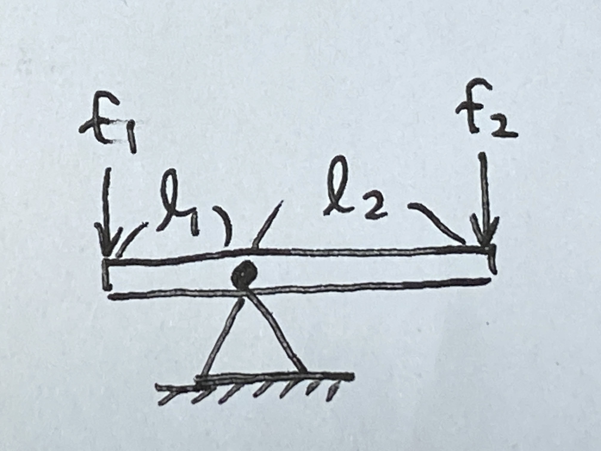
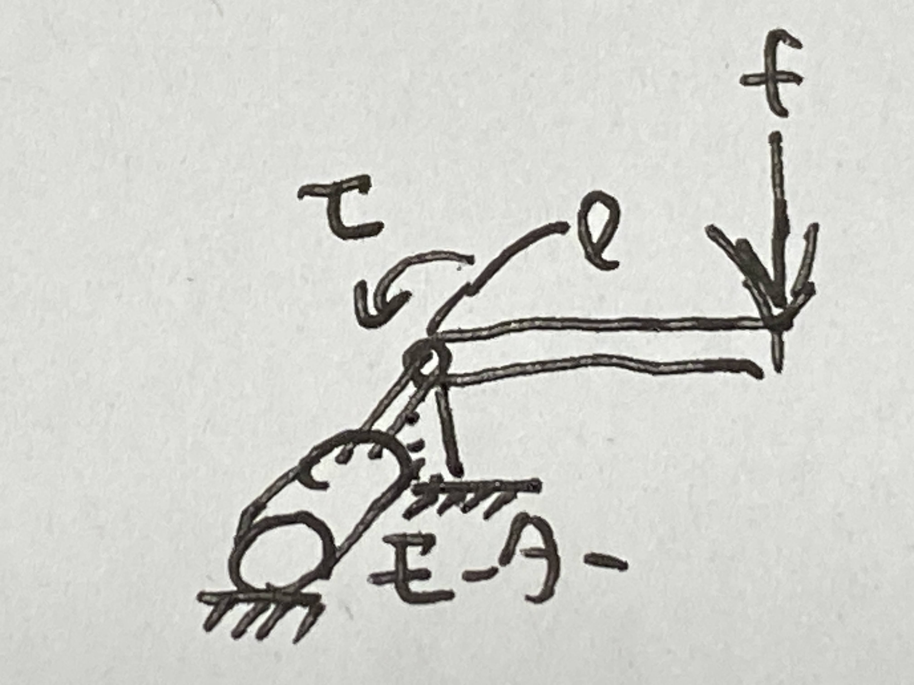
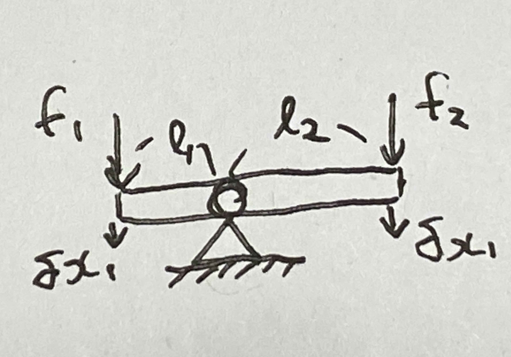
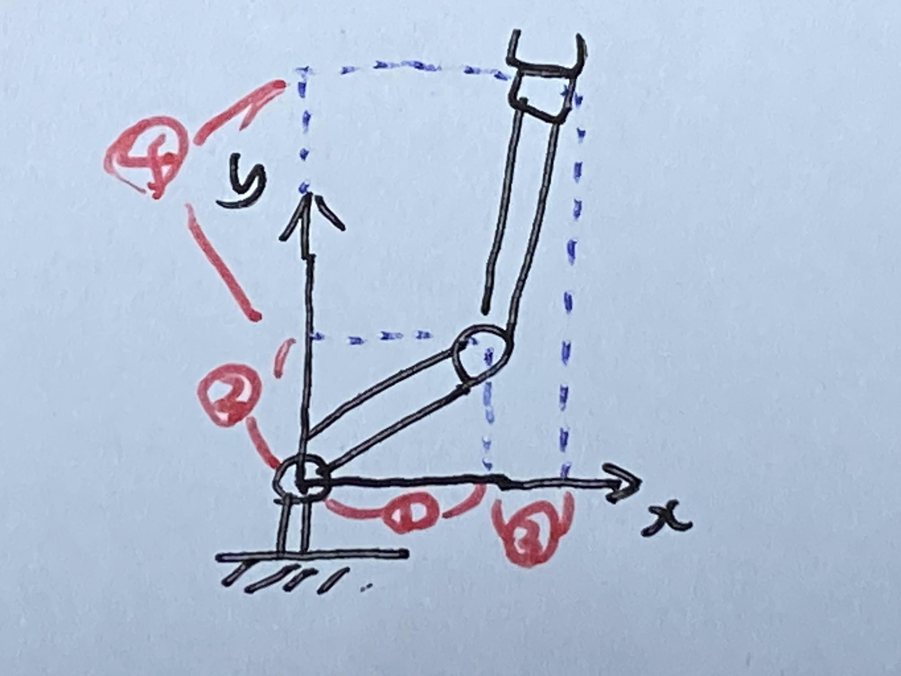

# 第６週　仮想仕事の原理

* [PDF](http:/www.ritsumei.ac.jp/~uemura-m/AnalyticalMechanics/AnalyticalMechanics6thWeek.pdf)
* [Youtube](https://www.youtube.com/watch?v=rtTUMerZj-w)

## 仮想仕事の原理の概要

仮想仕事の原理（かそうしごとのげんり、英: principle of virtual work）

* 静力学の概念
* 「釣り合い」の概念を一般化したもの
* スカラー値の仕事を解析することで、複雑な系でも統一的に釣り合いを解析
* ラグランジュの運動方程式の導出に必要

## 演習（復習）

### 問い



右図の系が釣り合いの状態にあるとき、 $f_1$ と $f_2$ の関係を求めよ。

### 解答

```math
\begin{aligned}
f_1 l_1 = f_1 l_2
\end{aligned}
```

### 問い



右図のモータが $\tau$ のトルクを出力している。この系が釣り合いの状態にあるとき、 $f$ と $\tau$ の関係を求めよ。

### 解答

```math
\begin{aligned}
\tau = f l
\end{aligned}
```

## 質点における釣り合い


```math
質点に働いている力 f_i の合計 \sum_{i=1}^n f_i が 0 のとき、系は釣り合いの状態
```

## 釣り合いの一般化


では、複雑な系での釣り合いは？

→　**仮想仕事の原理**で解析

## 仮想仕事の原理

系が釣り合いの状態にあるとき、系に作用する力がなす仮想仕事の合計は $0$ である（逆も真）

## 仮想仕事の原理の数学的表現


図には沢山の質点があり、お互いに拘束されている。

質点 $i$ に作用している拘束力 $s_i$ と外力 $f_i$ の和が $0$ のとき、釣り合う

### 仮想仕事 $\delta W$

```math
\begin{aligned}
\delta W = \sum_{i=1}^n (s_i + f_i) \cdot \delta {\bf{x}}_i = 0
\end{aligned}
```

$\delta {\bf{X}}_i$ : 各質点の仮想変位 (拘束に矛盾しない微小変位(この場合質点間の距離が一定という条件))

拘束力は仕事をしない

```math
\begin{aligned}
\sum_{i=1}^n s_i \cdot \delta {\bf{x}}_i = 0
\end{aligned}
```

```math
よって、 \delta W = \sum_{i=1}^n f_i \cdot \delta {\bf{x}}_i = 0 であれば系全体は釣り合う
```

## 仮想仕事の原理の適用例



各仮想変位の関係

```math
\begin{aligned}
\frac{\delta x_2}{\delta x_1} = - \frac{l_2}{l_1}
\end{aligned}
```

仮想仕事

```math
\begin{aligned}
\delta W = f_1 \delta x_1 + f_2 \delta x_2
\end{aligned}
```

釣り合いの条件

```math
\begin{aligned}
\delta W = f_1 \delta x_1 + f_2 \delta x_2 = (f_1 l_1 - f_2 l_2) \frac{\delta x_1}{l_1} = 0
\end{aligned}
```

## 演習


### 問い

下図の釣り合いの条件を求めよ。ただし、 $\delta x_1$ ,  $\delta x_1$ は拘束に矛盾しない方向の微小変位であり、 $f_1$ ,  $f_2$ , は仮想変位に平行な力を表すスカラ変数である。

### 解答

各仮想変位の関係

```math
\begin{aligned}
\frac{\delta x_2}{\delta x_1} &= \frac{l_2}{\sqrt{2}l_1} \\
\delta x_2 &= \frac{l_2 \delta x_1}{\sqrt{2}l_1}
\end{aligned}
```

仮想仕事

```math
\begin{aligned}
\delta W &= \sum_{i=1}^n f_i \cdot \delta {\bf{x}}_i \\
&= f_1 \delta x_1 + f_2 \delta x_2
\end{aligned}
```

釣り合いの条件

```math
\begin{aligned}
\delta W &= f_1 \delta x_1 + f_2 \delta x_2 \\
&= f_1 \delta x_1 + f_2 (\frac{l_2 \delta x_1}{\sqrt{2}l_1}) \\
&= \frac{\delta x_1}{l_1} (f_1 l_1 + \frac{1}{\sqrt{2}}f_2 l_2) \\
&= \frac{\delta x_1}{\sqrt{2}l_1} (\sqrt{2} f_1 l_1 + f_2 l_2) = 0
\end{aligned}
```

よって、釣り合いの条件は $\sqrt{2} f_1 l_1 + f_2 l_2 = 0$

## リンク構造の仮想仕事の原理


関節角度のベクトル

```math
\begin{aligned}
\delta {\bf{q}} = \begin{pmatrix}
\delta q_1 \\
\delta q_2
\end{pmatrix}
\end{aligned}
```

各仮想変位の関係

```math
\begin{aligned}
\delta {\bf{x}} = {\bf{J}}({\bf{q}}) \delta {\bf{q}}
\end{aligned}
```

ヤコビ行列(ヤコビアン)

```math
\begin{aligned}
{\bf{J}}({\bf{q}}) = \begin{pmatrix}
\frac{\partial x}{\partial q_1} & \frac{\partial x}{\partial q_2} \\
\frac{\partial y}{\partial q_1} & \frac{\partial y}{\partial q_2}
\end{pmatrix}
\end{aligned}
```

トルクのベクトル

```math
\begin{aligned}
{\boldsymbol{\tau}} = \begin{pmatrix}
\tau_1 \\
\tau_2
\end{pmatrix}
\end{aligned}
```

釣り合いの条件

```math
\begin{aligned}
\delta W &= \sum_{i=1}^n {\bf{f}}_i \cdot \delta {\bf{x}}_i \\
&= {\bf{f}} \cdot \delta {\bf{x}} + {\boldsymbol{\tau}} \cdot \delta {\bf{q}} \\
{\boldsymbol{\tau}} \cdot \delta {\bf{q}} : 回転系の場合&は (トルク)・(角度変位) で仕事を表す \\
{\bf{f}} \cdot \delta {\bf{x}} &= {\bf{f}} \cdot {\bf{J}} \delta {\bf{q}} \\
&= {\bf{f}}^T {\bf{J}} \delta {\bf{q}} \\
&= {\bf{J}}^T {\bf{f}} \cdot \delta {\bf{q}} より \\
\delta W &= {\bf{f}} \cdot \delta {\bf{x}} + {\boldsymbol{\tau}} \cdot \delta {\bf{q}} \\
&= {\bf{J}}^T {\bf{f}} \cdot \delta {\bf{q}} + {\boldsymbol{\tau}} \cdot \delta {\bf{q}} \\
&= ({\bf{J}}^T {\bf{f}} + {\boldsymbol{\tau}}) \cdot \delta {\bf{q}} = 0\\
\end{aligned}
```

よって、 $\boldsymbol{\tau} = - {\bf{J}}^T {\bf{f}}$ のとき系は釣り合う

## 演習


### 問い

下図のリンク系の手先に、 $f = (2, 1)^T$ の力が加わっている。この系を釣り合いの状態にするために必要な関節トルク $\tau$ を求めよ。ただし、手先の微小変位と各関節の微小変位の間には $\delta {\bf{x}} = {\bf{J}}({\bf{q}}) \delta {\bf{q}}$ が成り立っている。

```math
\begin{aligned}
{\bf{J}}({\bf{q}}) = \begin{pmatrix}
2 & 2 \\
3 & 1
\end{pmatrix}
\end{aligned}
```

### 解答

```math
\begin{aligned}
\boldsymbol{\tau} &= - {\bf{J}}^T {\bf{f}} \\
&= - \begin{pmatrix}
2 & 3 \\
2 & 1
\end{pmatrix}\begin{pmatrix}
2 \\
1
\end{pmatrix} \\
&= -\begin{pmatrix}
7 \\
5
\end{pmatrix} \\
&= \begin{pmatrix}
-7 \\
-5
\end{pmatrix} \\\end{aligned}
```

## ヤコビ行列 (ヤコビアン)

手先速度と関節角速度、手先力と関節トルクの関係を表す行列


手先速度と関節速度の関係

```math
\begin{aligned}
\dot{{\bf{x}}} = {\bf{J}}({\bf{q}})\dot{{\bf{q}}}
\end{aligned}
```

ヤコビ行列

```math
\begin{aligned}
{\bf{J}}({\bf{q}}) = \begin{pmatrix}
\frac{\partial x}{\partial q_1} & \frac{\partial x}{\partial q_2} \\
\frac{\partial y}{\partial q_1} & \frac{\partial y}{\partial q_2}
\end{pmatrix}
\end{aligned}
```

手先力・関節トルクの関係

```math
\begin{aligned}
\boldsymbol{\tau} &= - {\bf{J}}^T {\bf{f}} \\
\end{aligned}
```

## 演習

### 問い

下図の関節角 $q_1$ , $q_2$ と手先位置 ${\bf{x}}$ の関係を導出せよまた、ヤコビ行列を導出せよ


$\dot{{\bf{x}}} = {\bf{J}}({\bf{q}})\dot{{\bf{q}}}$
${\bf{J}}({\bf{q}})$ : ヤコビ行列

### 解答



手先位置を求める

```math
\begin{aligned}
{\bf{x}} &= \begin{pmatrix}
x \\
y
\end{pmatrix}  \\
&= \begin{pmatrix}
l_1 \cos q_1 + l_2 \cos (q_1 + q_2) \\
l_1 \sin q_1 + l_2 \sin (q_1 + q_2)
\end{pmatrix}  \\
\end{aligned}
```

時間tで微分し、手先速度を求める。

```math
\begin{aligned}
\dot{\bf{x}} &= \frac{d}{dt}\begin{pmatrix}
l_1 \cos q_1 + l_2 \cos (q_1 + q_2) \\
l_1 \sin q_1 + l_2 \sin (q_1 + q_2)
\end{pmatrix}  \\
&= \begin{pmatrix}
- \dot{q_1} l_1 \sin q_1 - (\dot{q_1} + \dot{q_2}) l_2 \sin (q_1 + q_2) \\
\dot{q_1} l_1 \cos q_1 + (\dot{q_1} + \dot{q_2})l_2 \cos (q_1 + q_2)
\end{pmatrix}  \\
&= \begin{pmatrix}
\dot{q_1}(-l_1 \sin q_1 - l_2 \sin (q_1 + q_2)) + \dot{q_2}(-l_2 \sin (q_1 + q_2)) \\
\dot{q_1}(l_1 \cos q_1 + l_2 \cos (q_1 + q_2)) + \dot{q_2}(l_2 \cos (q_1 + q_2))
\end{pmatrix}  \\
&= \begin{pmatrix}
-l_1 \sin q_1 - l_2 \sin (q_1 + q_2) & -l_2 \sin (q_1 + q_2) \\
l_1 \cos q_1 + l_2 \cos (q_1 + q_2) & l_2 \cos (q_1 + q_2)
\end{pmatrix}\begin{pmatrix}
\dot{q_1} \\
\dot{q_2}
\end{pmatrix}  \\
\end{aligned}
```

よって

```math
\begin{aligned}
{\bf{J}}({\bf{q}}) &= \begin{pmatrix}
-l_1 \sin q_1 - l_2 \sin (q_1 + q_2) & -l_2 \sin (q_1 + q_2) \\
l_1 \cos q_1 + l_2 \cos (q_1 + q_2) & l_2 \cos (q_1 + q_2)
\end{pmatrix} \\
\end{aligned}
```
