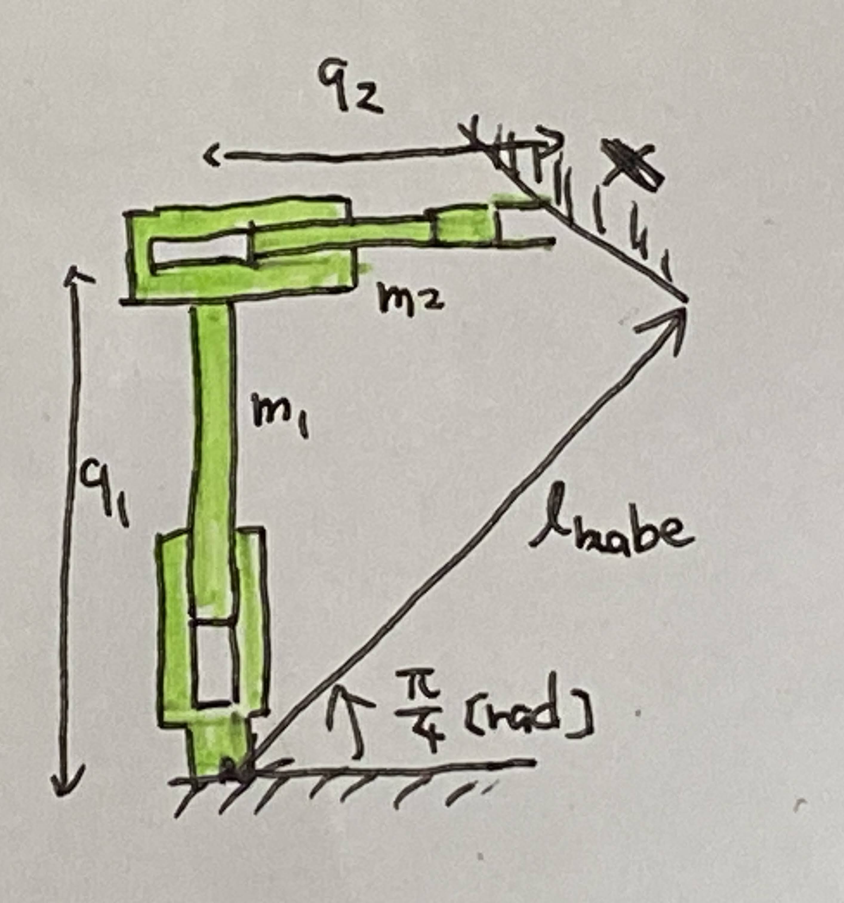
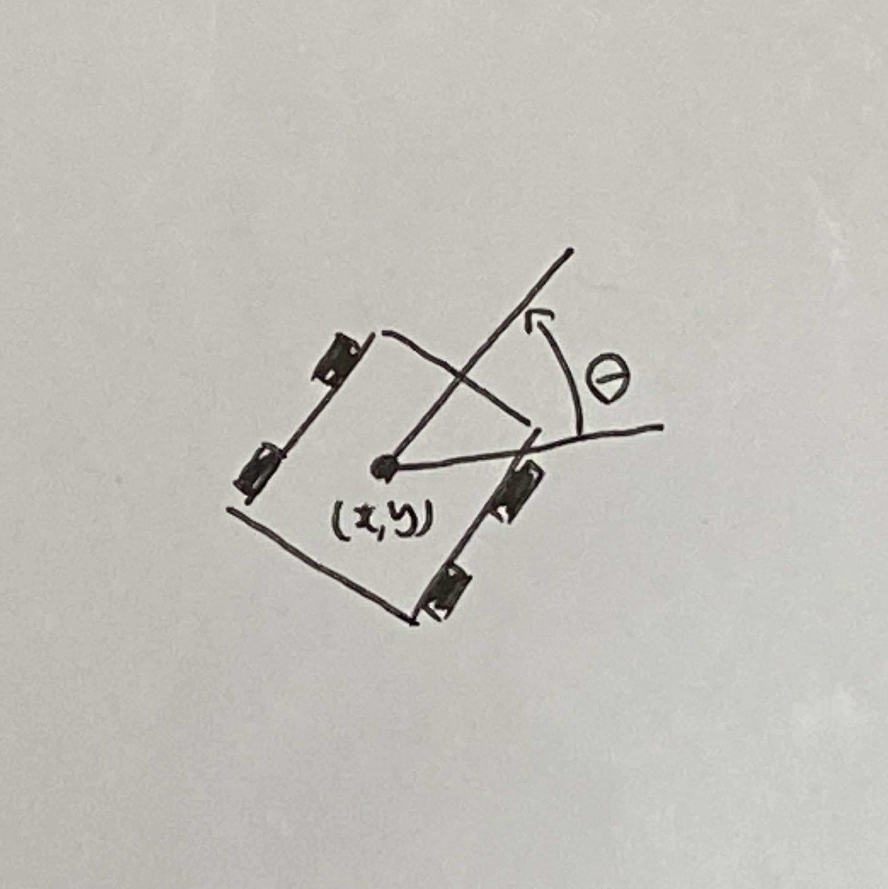
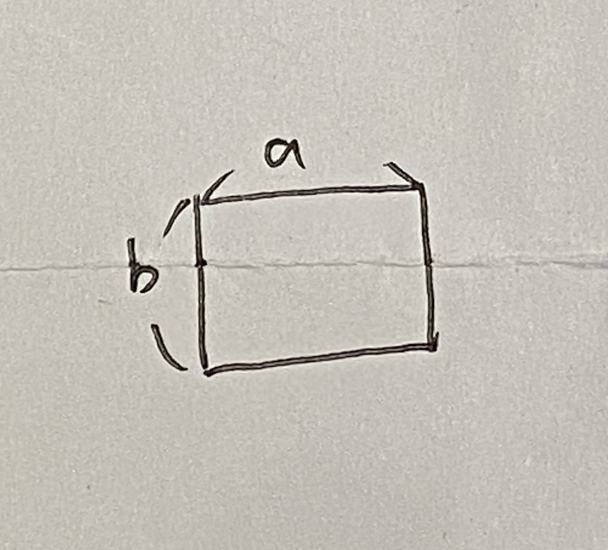
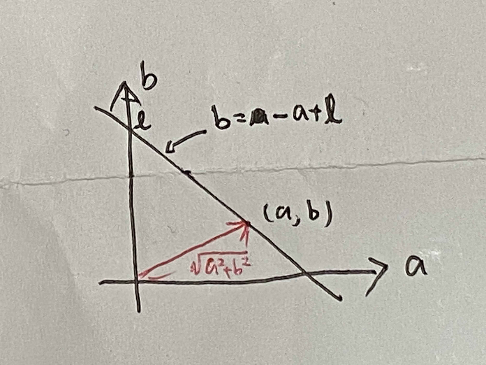

# 第１４週　拘束がある場合の運動方程式

* [Youtube](https://www.youtube.com/watch?v=pAmYRjBCKZQ)
* [PDF](http:/www.ritsumei.ac.jp/~uemura-m/AnalyticalMechanics/AnalyticalMechanics14thWeek.pdf)

## 機械的拘束




手先が壁に沿って動く。そのとき、反力 $f$ が作用する。

## 拘束条件

幾何学的・力学的拘束を関数 $f({\bf{x}}, \dot{\bf{x}}) = 0$ で表したもの
<br>
例


三平方の定理

```math
\begin{aligned}
(x - x_r)^2 + (y - y_r)^2 = r^2
\end{aligned}
```

拘束条件（位置）

```math
\begin{aligned}
f(x,y) = \sqrt{(x - x_r)^2 + (y - y_r)^2 - r^2} = 0
\end{aligned}
```

## 位置・速度・加速度の拘束条件

例

<br>
位置の拘束条件

```math
\begin{aligned}
f(x,y) &= \sqrt{(x - x_r)^2 + (y - y_r)^2 - r^2} \\
&= a^{\frac{1}{2}} = 0
\end{aligned}
```

速度の拘束条件

```math
\begin{aligned}
\dot{f}(x,y) &= \frac{\dot{a}}{2} a^{-\frac{1}{2}} \\
&= (\dot{x}(x - x_r) + \dot{y}(y - y_r)) a^{-\frac{1}{2}} = 0
\end{aligned}
```

加速度の拘束条件

```math
\begin{aligned}
\ddot{f}(x,y) &= \frac{\ddot{a}}{2} a^{-\frac{1}{2}} - \frac{\dot{a}^2}{4} a^{-\frac{3}{2}} \\
&= (\ddot{x}(x - x_r) + \dot{x} + \ddot{y}(y - y_r) + \dot{y}^2) a^{-\frac{1}{2}}  - \frac{\dot{a}^2}{4} a^{-\frac{3}{2}} = 0
\end{aligned}
```

## 例：車両の拘束条件



例えばこの図のように車が二次元平面上を移動するとき、車の前進速度や旋回速度と、並進速度の間には、速度の拘束条件が定義できる。しかし、位置の拘束条件は定義できない。

## 演習：拘束条件


### 問い

図の並進関節を持つ機構の位置・速度・加速度の拘束条件を導出せよ

### 解答

手先位置

```math
\begin{aligned}
{\bf{x}} = \begin{pmatrix}
x \\
y
\end{pmatrix} = \begin{pmatrix}
q_2 \\
q_1
\end{pmatrix}
\end{aligned}
```

壁の位置

```math
y = -x + 2 l_{kabe} \sin \frac{\pi}{4} = - x + \sqrt{2} l_{kabe}
```

位置の拘束条件

```math
\begin{aligned}
f(x,y) = q_2 + q_1 -\sqrt{2} l_{kabe} = 0
\end{aligned}
```

速度の拘束条件

```math
\begin{aligned}
\dot{f}(x,y) = \dot{q}_1 + \dot{q}_2 = 0
\end{aligned}
```

加速度の拘束条件

```math
\begin{aligned}
\ddot{f}(x,y) = \ddot{q}_1 + \ddot{q}_2 = 0
\end{aligned}
```

<br>
<br>
<br>

## ラグランジュの未定乗数法

拘束条件がある場合の関数の極値を求める方法

例



各辺の長さが $a,b$ ，周囲の長さが $l$ (定数) の長方形の面積が最大となる条件を求めよ
<br>
最大化したい関数

```math
g(a, b) = ab
```

拘束条件

```math
2(a + b) - l = 0
```

## ラグランジュの未定乗数法による極値の条件の導出

極値を求めたい関数

```math
g({\bf{x}})
```

拘束条件 (複数の条件をベクトルで表す)

```math
{\bf{f(x)}} = 0
```

極値の条件

```math
\frac{\partial}{\partial {\bf{x}} } (g + {\boldsymbol{\lambda}} \cdot {\bf{f}}) = 0
```

${\boldsymbol{\lambda}}$ : ラグランジュの未定乗数ベクトル

## ラグランジュの未定乗数法による極値の条件の導出（長方形の例）

最大化したい関数

```math
g(a, b) = ab
```

拘束条件

```math
2(a + b) - l = 0
```

極値の条件

```math
\begin{aligned}
\frac{\partial}{\partial a} (g + \lambda f) & = 0 \\
b + 2 \lambda &= 0
\end{aligned}
```

<br>

```math
\begin{aligned}
\frac{\partial}{\partial b} (g + \lambda f) & = 0 \\
a + 2 \lambda &= 0
\end{aligned}
```

$2(a + b) - l = 0$ より、

```math
\therefore \lambda = - \frac{l}{8} , a = \frac{l}{4} , b = \frac{l}{4}
```

## 演習：ラグランジュの未定乗数法による極値の条件の導出



### 問い

原点から直線までの距離が最も短くなる条件を求めよ
<br>
極値を求めたい関数

```math
g(a,b) = a^2 + b^2
```

拘束条件

```math
f(a, b) = a + b - l = 0
```

### 解答

極値の条件

```math
\begin{aligned}
\frac{\partial}{\partial a} (g + \lambda f) & = 0 \\
2a + \lambda & = 0 \\
\end{aligned}
```

<br>

```math
\begin{aligned}
\frac{\partial}{\partial b} (g + \lambda f) & = 0 \\
2b + \lambda & = 0 \\
\end{aligned}
```

$a + b - l = 0$ より、

```math
\therefore \lambda = - l , a = \frac{l}{2} , b = \frac{l}{2}
```

<br>
<br>
<br>

## ラグランジュの未定乗数法による拘束がある場合の運動方程式の導出

極値を求めたい関数

```math
I = \int_0^t L dt
```

位置の拘束条件

```math
{\bf{f(x)}} = 0
```

極値をとる条件（運動方程式）

```math
L' = L + {\boldsymbol{\lambda}} \cdot {\bf{f}}
```

```math
\frac{d}{dt} \frac{\partial L'}{\partial \dot{\bf{x}}} - \frac{\partial L'}{\partial {\bf{x}}} = 0
```

## ラグランジュの未定乗数法による拘束がある場合の運動方程式の例

 <br>
(重力は無視する)
<br>
ラグランジアン

```math
\begin{aligned}
L &= K - U \\
&= \frac{1}{2}(m_1 + m_2) \dot{q}_1^2 + \frac{1}{2} m_2 \dot{q}_2^2
\end{aligned}
```

位置の拘束条件

```math
\begin{aligned}
f(q_1, q_2) = q_1 + q_2 -2 l_{kabe} \sin \frac{\pi}{4} = 0
\end{aligned}
```

運動方程式

```math
L' = L + \lambda \cdot f
```

```math
\begin{aligned}
\frac{d}{dt} \frac{\partial L'}{\partial \dot{\bf{q}}} - \frac{\partial L'}{\partial {\bf{q}}} &= 0 \\
\frac{d}{dt} \begin{pmatrix}
(m_1 + m_2) \dot{q}_1 \\
m_2 \dot{q}_2
\end{pmatrix} - \begin{pmatrix}
\lambda \\
\lambda
\end{pmatrix} &= 0 \\
\begin{pmatrix}
(m_1 + m_2) \ddot{q}_1 \\
m_2 \ddot{q}_2
\end{pmatrix} - \begin{pmatrix}
\lambda \\
\lambda
\end{pmatrix} &= 0 \\
\end{aligned}
```

## 演習: 拘束がある場合の運動方程式


### 問い

ラグランジアン

```math
\begin{aligned}
L = \frac{1}{2} \dot{\bf{q}}^T {\bf{M}} \dot{\bf{q}}
\end{aligned}
```

位置の拘束条件　：　？
<br>
運動方程式

```math
L' = L + \lambda \cdot f
```

```math
\frac{d}{dt} \frac{\partial L'}{\partial \dot{\bf{q}}} - \frac{\partial L'}{\partial {\bf{q}}} = 0
```

### 解答

位置の拘束条件

```math
\begin{aligned}
f({\bf{q}}) &= l_1 \sin q_1 + l_2 \sin (q_1 + q_2) - y_{kabe}
\end{aligned}
```

運動方程式

```math
L' = L + \lambda \cdot f
```

```math
\begin{aligned}
\frac{d}{dt} \frac{\partial L'}{\partial \dot{\bf{q}}} - \frac{\partial L'}{\partial {\bf{q}}} &= 0 \\
\frac{d}{dt} \frac{\partial}{\partial \dot{\bf{q}}}(L + \lambda \cdot f) - \frac{\partial}{\partial {\bf{q}}}(L + \lambda \cdot f) &= 0 \\
\frac{d}{dt} \frac{\partial}{\partial \dot{\bf{q}}}(\frac{1}{2} \dot{\bf{q}}^T {\bf{M}} \dot{\bf{q}} + \lambda \cdot f) - \frac{\partial}{\partial {\bf{q}}}(L + \lambda \cdot f) &= 0 \\
\frac{d}{dt} ({\bf{M}} \dot{\bf{q}} + 0) - \frac{\partial}{\partial {\bf{q}}}(0 + \lambda \cdot f) &= 0 \\
{\bf{M}} \ddot{\bf{q}} + \dot{\bf{M}} \dot{\bf{q}} - \begin{pmatrix}
\frac{\partial f}{\partial q_1} \\
\frac{\partial f}{\partial q_2}
\end{pmatrix} \lambda &= 0 \\
\end{aligned}
```

$ {\bf{h}} = \dot{\bf{M}} \dot{\bf{q}} $ とすると、

```math
\begin{aligned}
{\bf{M}} \ddot{\bf{q}} + \dot{\bf{M}} \dot{\bf{q}} - \begin{pmatrix}
\frac{\partial f}{\partial q_1} \\
\frac{\partial f}{\partial q_2}
\end{pmatrix} \lambda &= 0 \\
{\bf{M}} \ddot{\bf{q}} + {\bf{h}} - \begin{pmatrix}
\frac{\partial f}{\partial q_1} \\
\frac{\partial f}{\partial q_2}
\end{pmatrix} \lambda &= 0 \\
{\bf{M}} \ddot{\bf{q}} + {\bf{h}} - \begin{pmatrix}
- l_1 \cos q_1 - l_2 \cos (q_1 + q_2) \\
- l_2 \cos (q_1 + q_2)
\end{pmatrix} \lambda &= 0 \\
\end{aligned}
```

```math
{\bf{J}}^T_y = \begin{pmatrix}
- l_1 \cos q_1 - l_2 \cos (q_1 + q_2) \\
- l_2 \cos (q_1 + q_2)
\end{pmatrix}
```

とすると

```math
\begin{aligned}
{\bf{M}} \ddot{\bf{q}} + {\bf{h}} - \begin{pmatrix}
- l_1 \cos q_1 - l_2 \cos (q_1 + q_2) \\
- l_2 \cos (q_1 + q_2)
\end{pmatrix} \lambda &= 0 \\
{\bf{M}} \ddot{\bf{q}} + {\bf{h}} - {\bf{J}}^T_y \lambda &= 0 \\
\end{aligned}
```

$\lambda$ の物理的な意味は次週説明される。
