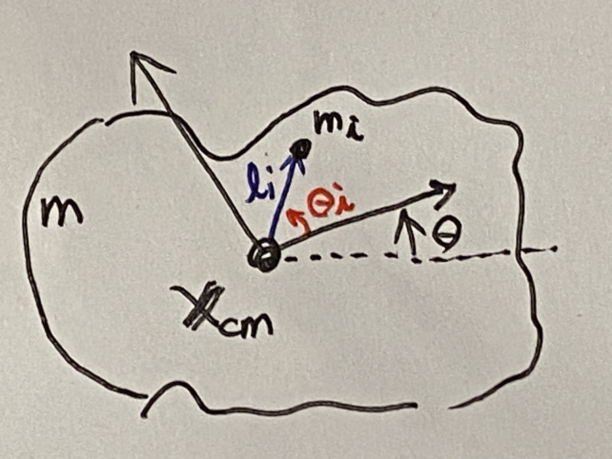

# 第３週　運動エネルギー

* [Youtube](https://www.youtube.com/watch?v=IV4GuiRr7_Y)
* [pdf](http:/www.ritsumei.ac.jp/~uemura-m/AnalyticalMechanics/AnalyticalMechanics3rdWeek.pdf)

## 運動エネルギーとは

運動エネルギーの定義： 運動する物体が持つエネルギー


### 質点の運動エネルギー

```math
K = \frac{1}{2}mv^2
```

### $v^2$ の別表現

```math
v^2 = (\sqrt{\dot{x}^2 + \dot{y}^2})^2 = \dot{x}^2 + \dot{y}^2 = \dot{{\bf{X}}}\cdot\dot{{\bf{X}}}
```

## 内積のおさらい

ベクトルaとbの内積
内積の結果はスカラーになる。

```math
\begin{aligned}
{\bf{a}}\cdot{\bf{b}} &= a_1 b_1 + a_2 b_2 \cdots a_n b_n \\
&= (a_1 a_2 \cdots a_n )\begin{pmatrix}
b_1 \\
b_2 \\
\vdots \\
b_n
\end{pmatrix} \\
&= {\bf{a}}^T{\bf{b}} \\
&= \sum_{i=1}^{n} a_i b_i
\end{aligned}
```

↑すべて別表現

## 演習

### 問い

体重60 [kg] の人が、4 [m/s] で走っている。この人が持つ運動エネルギーを答えよ。

### 解答

```math
\begin{aligned}
K = \frac{1}{2}mv^2 = \frac{1}{2} \times 60 \times 4^2 = 480 [J] \\
1 [cal] \fallingdotseq 4 [J] なので、480 [J] \fallingdotseq 120 [J]
\end{aligned}
```

## 剛体の運動エネルギー（2次元）

### 剛体の運動エネルギー


```math
K = \frac{1}{2}mv_{cm}^2 + \frac{1}{2}I\omega^2
```

$I$ : 慣性モーメント \
$\omega$ : 角速度

**重心の並進運動**と**重心周りの回転運動**に分離可能

### 別表現


```math
K = \frac{1}{2}m \dot{{\bf{X_{cm}}}}\cdot\dot{{\bf{X_{cm}}}} + \frac{1}{2}I\dot{\theta}^2
```

## 証明：剛体の運動エネルギー（2次元）

剛体を質点の集まりとして考える <br>
↓　これまでの力学の延長線上で考える <br>
重心の並行移動と重心周りの回転を考える <br>
↓ <br>
全質点の運動エネルギーの和

```math
K = \sum_{i=1}^{n}\frac{1}{2}m_iv_i^2
```

↓ <br>
剛体の運動エネルギー

```math
K = \frac{1}{2}mv_{cm}^2 + \frac{1}{2}I\omega^2
```

## 剛体の重心

剛体を質点の集まりとして考える

### 剛体の重心位置

```math
{\bf{X_{cm}}} = \frac{1}{m}\sum_{i=1}^{N}m_i {\bf{X_i}} \\
```

$m$ : 剛体全体の質点 \
$m_i$ : 各質点の質量 \
${\bf{X_i}}$ : 各質点の位置ベクトル

### ２質点系での例


```math
x_{cm} = \frac{1}{m_1 + m_2}(m_1 x_1 + m_2 x_2) \\
```

## 各質点の位置



### 各質点の位置 ${\bf{X_i}}$

```math
{\bf{X_i}} = {\bf{X_{cm}}} + \rho_i \\
\rho_i = l_i\begin{pmatrix}
\cos (\theta + \theta_i) \\
\sin (\theta + \theta_i)
\end{pmatrix}
```

$\rho_i$ : 重心から見た位置

### $\rho_i$の性質①

```math
\begin{aligned}
{\bf{X_{cm}}} &= \frac{1}{m}\sum_{i=l}^{N} m_i {\bf{X_i}} \\
&= \frac{1}{m}\sum_{i=l}^{N} m_i {\bf{X_{cm}}} + \frac{1}{m}\sum_{i=l}^{N} m_i {\bf{\rho_i}} \\
&= {\bf{X_{cm}}} \frac{1}{m}\sum_{i=l}^{N} m_i  + \frac{1}{m}\sum_{i=l}^{N} m_i {\bf{\rho_i}} \\

\frac{1}{m}\sum_{i=l}^{N} m_i &= 1 なので \\
&= {\bf{X_{cm}}} + \frac{1}{m}\sum_{i=l}^{N} m_i {\bf{\rho_i}} \\

\therefore \sum_{i=l}^{N} m_i {\bf{\rho_i}} = 0
\end{aligned}
```

### $\rho_i$の性質②

```math
\begin{aligned}
\dot{\rho_i} \cdot \dot{\rho_i} &= l_i^2 \begin{pmatrix}
- \sin (\theta + \theta_i)\dot{\theta} \\
\cos (\theta + \theta_i)\dot{\theta}
\end{pmatrix} \cdot \begin{pmatrix}
- \sin (\theta + \theta_i)\dot{\theta} \\
\cos (\theta + \theta_i)\dot{\theta}
\end{pmatrix} \\
&= l_i^2\dot{\theta^2} \\
&= l_i^2 \omega^2
\end{aligned}
```

## 剛体の運動エネルギーの導出

```math
\begin{aligned}
v_i^2 &= {\bf{\dot{X_i}}} \cdot {\bf{\dot{X_i}}} \\
&= ({\bf{\dot{X_{cm}}}} + {\bf{\dot{\rho_i}}}) \cdot ({\bf{\dot{X_{cm}}}} + {\bf{\dot{\rho_i}}}) \\
&= {\bf{\dot{X_{cm}}}} \cdot {\bf{\dot{X_{cm}}}} +2{\bf{\dot{X_{cm}}}} \cdot {\bf{\dot{\rho_i}}} + {\bf{\dot{\rho_i}}} \cdot {\bf{\dot{\rho_i}}} \\

\dot{{\bf{X_{cm}}}} \cdot \dot{{\bf{X_{cm}}}} &= v_{cm}^2 と \dot{\rho_i} \cdot \dot{\rho_i} = l_i^2 \omega^2 より \\

&= v_{cm}^2 +2{\bf{\dot{X_{cm}}}} \cdot {\bf{\dot{\rho_i}}} + l_i^2 \omega^2 \\
\end{aligned}
```

### 全体の運動エネルギー

```math
\begin{aligned}

K &= \sum_{i=1}^N \frac{1}{2}m_i v_i^2 \\
&= \sum_{i=1}^N \frac{1}{2}m_i (v_{cm}^2 +2{\bf{\dot{X_{cm}}}} \cdot {\bf{\dot{\rho_i}}} + l_i^2 \omega^2) \\
&= \frac{1}{2}\sum_{i=1}^N m_i v_{cm}^2 + {\bf{\dot{X_{cm}}}} \cdot \sum_{i=1}^N m_i {\bf{\dot{\rho_i}}} + \frac{1}{2}\sum_{i=1}^N m_i l_i^2 \omega^2 \\

\sum_{i=1}^N m_i &= m 、 \sum_{i=1}^N m_i {\bf{\dot{\rho_i}}} = 0 、 \sum_{i=1}^N m_i l_i^2 = I より \\

&= \frac{1}{2}mv_{cm}^2 + \frac{1}{2}I \omega^2
\end{aligned}
```

## 慣性モーメント

| 並進運動 | 単位    | 記号         | 回転運動 | 単位       | 記号                |
| ------ | ------- | ----------  | ------- | -----     | ------------------ |
| 位置    |$[m]$   | $x$          |角度     |$[rad]$    |$\theta$             |
| 速度    |$[m/s]$ |$\dot{x}, v$  |角速度    |$[rad/s]$ |$\dot{\theta}, \omega$|
| 加速度  |$[m/s^2]$|$\ddot{x}, a$|角加速度  |$[rad/s^2]$|$\ddot{\theta}$      |
|力      |$[N]$    |$f$           |力のモーメント、<br>またはトルク|$[Nm]$|$\tau$|
|質量     |$[kg]$   |$m$          |慣性モーメント|$[kgm^2]$|$I$|

## 演習

```math
運動エネルギーを K = \frac{1}{2}mv_{cm}^2 + \frac{1}{2}I \dot{\theta}^2 ポテンシャルエネルギーを U = mgy_{cm} とする剛体の運動方程式を求めよ。ただし、座標は {\bf{X}} = \begin{pmatrix}
x_{cm} \\
y_{cm} \\
\theta
\end{pmatrix} とする。
```


ラグランジアン

```math
\begin{aligned}
L &= K - U \\
&= \frac{1}{2}mv_{cm}^2 + \frac{1}{2}I \dot{\theta}^2 - mgy_{cm} \\

v_{cm}^2 = \dot{x}^2_{cm} + \dot{y}^2_{cm} より  \\

&= \frac{1}{2}m(\dot{x}^2_{cm} + \dot{y}^2_{cm}) + \frac{1}{2}I \dot{\theta}^2 - mgy_{cm} \\


\end{aligned}
```

ラグランジュの運動方程式

```math
\begin{aligned}
\frac{d}{dt}(\frac{\partial L}{\partial \dot{\bf{X}}}) - \frac{\partial L}{\partial \bf{X}} &= 0
\end{aligned}
```

各項を計算する。第一項の偏微分を解く。

```math
\begin{aligned}
\frac{\partial L}{\partial \dot{\bf{X}}} &= \frac{\partial}{\partial \dot{\bf{X}}} (\frac{1}{2}m(\dot{x}^2_{cm} + \dot{y}^2_{cm}) + \frac{1}{2}I \dot{\theta}^2 - mgy_{cm}) \\
&= \begin{pmatrix}
\frac{\partial}{\partial \dot{x}} (\frac{1}{2}m(\dot{x}^2_{cm} + \dot{y}^2_{cm}) + \frac{1}{2}I \dot{\theta}^2 - mgy_{cm}) \\
\frac{\partial}{\partial \dot{y}} (\frac{1}{2}m(\dot{x}^2_{cm} + \dot{y}^2_{cm}) + \frac{1}{2}I \dot{\theta}^2 - mgy_{cm}) \\
\frac{\partial}{\partial \dot{\theta}} (\frac{1}{2}m(\dot{x}^2_{cm} + \dot{y}^2_{cm}) + \frac{1}{2}I \dot{\theta}^2 - mgy_{cm})
\end{pmatrix} \\
&= \begin{pmatrix}
m\dot{x}_{cm}\\
m\dot{y}_{cm}\\
I \dot{\theta}
\end{pmatrix}

\end{aligned}
```

第一項の全微分を解く。

```math
\begin{aligned}
\frac{d}{dt}(\frac{\partial L}{\partial \dot{\bf{X}}}) &= \frac{d}{dt}\begin{pmatrix}
m\dot{x}_{cm} \\
m\dot{y}_{cm} \\
I\dot{\theta}
\end{pmatrix} \\
&= \begin{pmatrix}
m\ddot{x}_{cm} \\
m\ddot{y}_{cm} \\
I\ddot{\theta}
\end{pmatrix}
\end{aligned}
```

第二項の偏微分を解く。

```math
\begin{aligned}
\frac{\partial L}{\partial \bf{X}} &= \frac{\partial }{\partial \bf{X}}(\frac{1}{2}m(\dot{x}^2_{cm} + \dot{y}^2_{cm}) + \frac{1}{2}I \dot{\theta}^2 - mgy_{cm}) \\
&= \begin{pmatrix}
0 \\
-mg \\
0
\end{pmatrix}
\end{aligned}
```

よって、ラグランジュの運動方程式

```math
\begin{aligned}
\frac{d}{dt}(\frac{\partial L}{\partial \dot{\bf{X}}}) - \frac{\partial L}{\partial \bf{X}} &= 0 \\

\begin{pmatrix}
m\ddot{x}_{cm} \\
m\ddot{y}_{cm} \\
I\ddot{\theta}
\end{pmatrix} - \begin{pmatrix}
0 \\
-mg \\
0
\end{pmatrix} &= 0 \\

\begin{pmatrix}
m\ddot{x}_{cm} \\
m\ddot{y}_{cm} \\
I\ddot{\theta}
\end{pmatrix} + \begin{pmatrix}
0 \\
mg \\
0
\end{pmatrix} &= 0 \\
\end{aligned}
```

* 重心は放物運動する
* 重心周りは等速回転運動する
