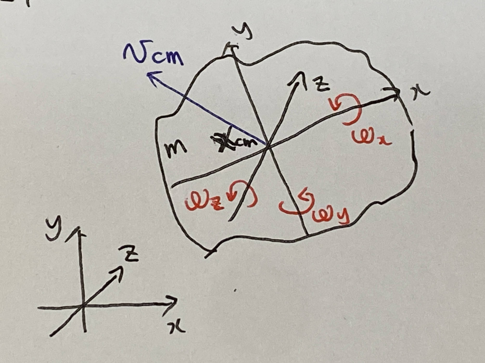
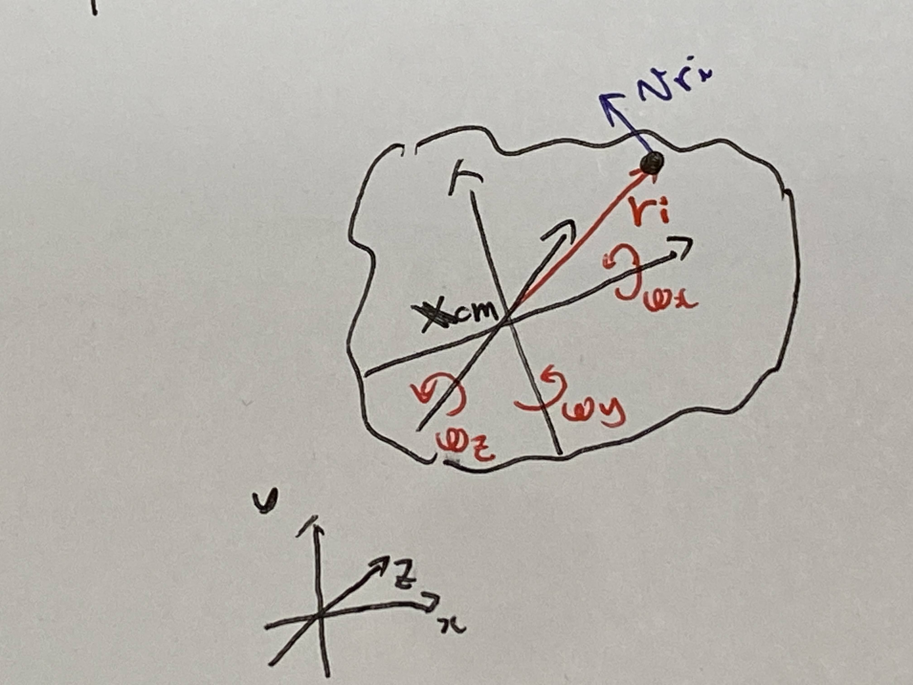
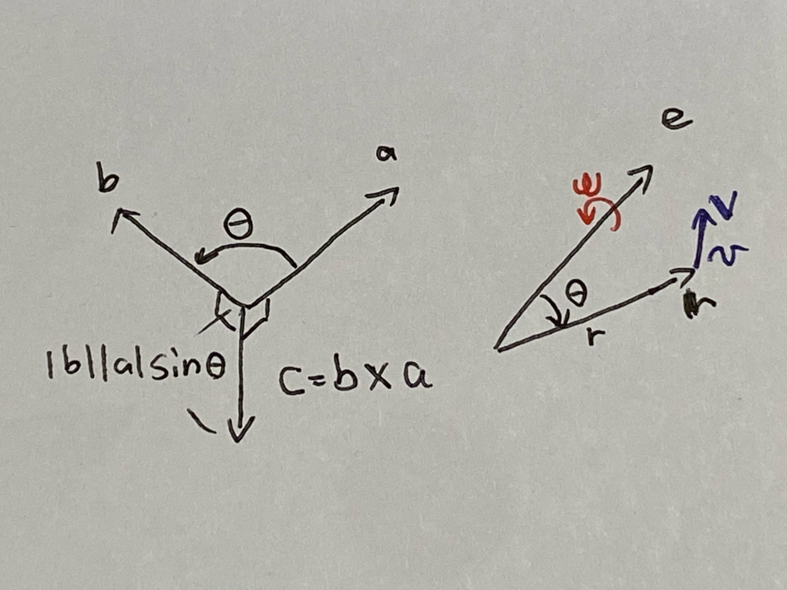

# 第４週　３次元空間を移動する剛体の運動エネルギー

* [Youtube](https://www.youtube.com/watch?v=pLsiqW_BP-0)
* [PDF](http:/www.ritsumei.ac.jp/~uemura-m/AnalyticalMechanics/AnalyticalMechanics4thWeek.pdf)

## 剛体の運動エネルギー（3次元）

## 剛体の運動エネルギー



```math
K = \frac{1}{2}mv_{cm}^2 + \frac{1}{2}\omega^T I \omega^2
```

```math
\begin{aligned}
{\boldsymbol{\omega}} = \begin{pmatrix}
\omega_x \\
\omega_y \\
\omega_z
\end{pmatrix} : 角速度ベクトル  \\
I = \begin{pmatrix}
I_{xx} & I_{xy} & I_{xz} \\
I_{yx} & I_{yy} & I_{yz} \\
I_{zx} & I_{zy} & I_{zz}
\end{pmatrix} : 慣性テンソル \\
\end{aligned}
```

回転軸によって慣性モーメントが違う
剛体に固定した座標系で考える。

## 重心

### 重心位置 ${\bf{X}}_{cm}$

```math
{\bf{X}}_{cm} = \frac{1}{m}\sum_{i=1}^N m_i{\bf{X}}_i
```

### 各質点の位置 ${\bf{X}}_{i}$

```math
{\bf{X}}_{i} = {\bf{X}}_{cm} + {\bf{\rho}}_{i}
```

### ${\bf{\rho}}_{i}$ の性質①

```math
\sum_{i=1}^N mi {\bf{\rho}}_{i} = 0
```

## 各質点の速度



### 質点の速度

```math
\dot{{\bf{X}}}_{i} = \dot{{\bf{X}}}_{cm} + \dot{{\boldsymbol{\rho}}}_{i}
```

```math
\begin{aligned}
\dot{{\boldsymbol{\rho}}}_{i} \cdot \dot{{\boldsymbol{\rho}}}_{i} &= {\bf{v}}_{ri} \cdot {\bf{v}}_{ri} \\
&= ({\boldsymbol{\omega}} \times {\bf{r}}_i) \cdot ({\boldsymbol{\omega}} \times {\bf{r}}_i) \\
&= ({\bf{R}}_i {\boldsymbol{\omega}}) \cdot ({\bf{R}}_i {\boldsymbol{\omega}}) \\
&= ({\bf{R}}_i {\boldsymbol{\omega}})^T ({\bf{R}}_i {\boldsymbol{\omega}}) \\
&= {\boldsymbol{\omega}}^T {\bf{R}}_i^T {\bf{R}}_i {\boldsymbol{\omega}} \\
&= {\boldsymbol{\omega}}^T \bar{{\bf{R}}}_i {\boldsymbol{\omega}} \\
\end{aligned}
```

```math
\begin{aligned}
ただし {\boldsymbol{\omega}} \times {\bf{r}}_i = \begin{pmatrix}
\omega_y r_{zi} + \omega_z r_{yi} \\
\omega_z r_{xi} + \omega_x r_{zi} \\
\omega_x r_{yi} + \omega_y r_{xi}
\end{pmatrix} より
{\bf{R}}_i = \begin{pmatrix}
0 & r_{zi} & -r_{yi} \\
-r_{zi} & 0 & r_{xi} \\
r_{yi} & -r_{xi} & 0
\end{pmatrix} とする \\
ただし \bar{{\bf{R}}}_i = \begin{pmatrix}
r_{yi}^2 + r_{zi}^2 & -r_{xi}r_{yi} & -r_{zi}r_{xi} \\
-r_{xi}r_{yi} & r_{xi}^2 + r_{zi}^2 & -r_{yi}r_{zi} \\
-r_{zi}r_{xi} & -r_{yi}r_{zi} & r_{xi}^2 + r_{yi}^2
\end{pmatrix} とする
\end{aligned}
```

## 外積のおさらい



### 外積

```math
\begin{aligned}
{\bf{c}} &= {\bf{b}} \times {\bf{a}} \\
&= \begin{pmatrix}b_x\\b_y\\b_z\end{pmatrix} \times \begin{pmatrix}a_x\\a_y\\a_z\end{pmatrix} \\
&= \begin{pmatrix}
b_y a_z - b_z a_y\\
b_z a_x - b_x a_z\\
b_x a_y - b_y a_x
\end{pmatrix}
\end{aligned}
```

### 軸周りの速度

```math
v = \omega r \sin \theta \\
```

```math
{\bf{v}} = \omega {\bf{e}} \times {\bf{r}} \\
```

```math
ただし |{\bf{e}}| = 1
```

## 外積による3次元速度の計算(続き)


### 質点の速度

```math
\begin{aligned}
{\bf{v}}_{ri} &= {\boldsymbol{\omega}} \times {\bf{r}}_i \\
{\bf{v}}_{ri} &: 重心から見た質点の速度ベクトル \\
{\bf{r}}_i &: 剛体座標系から見た質点の位置ベクトル
\end{aligned}
```

```math
\begin{aligned}
{\bf{v}}_{ri} &= \omega_x {\bf{e}}_{\bf{x}} \times {\bf{r}}_i
+ \omega_y {\bf{e}}_{\bf{y}} \times {\bf{r}}_i
+ \omega_z {\bf{e}}_{\bf{z}} \times {\bf{r}}_i \\
&= {\boldsymbol{\omega}} \times {\bf{r}}_i
\end{aligned}
```

```math
ただし {\bf{e}}_x = \begin{pmatrix}
1, 0, 0
\end{pmatrix}^T ,
{\bf{e}}_y = \begin{pmatrix}
0, 1, 0
\end{pmatrix}^T ,
{\bf{e}}_z = \begin{pmatrix}
0, 0, 1
\end{pmatrix}^T
```

## 運動エネルギーの導出

```math
\begin{aligned}
v_i^2 &= \dot{{\bf{X}}}_i \cdot \dot{{\bf{X}}}_i \\
&= v_{cm}^2 + 2\dot{{\bf{X}}}_{cm} \cdot \dot{{\boldsymbol{\rho}}}_i + \dot{{\boldsymbol{\rho}}}_i \cdot \dot{{\boldsymbol{\rho}}}_i
\end{aligned}
```

### 運動エネルギー

```math
\begin{aligned}
K &= \sum_{i=1}^N \frac{1}{2}m_i v_i^2 \\
&= \sum_{i=1}^N \frac{1}{2}m_i (v_{cm}^2 + 2\dot{{\bf{X}}}_{cm} \cdot \dot{{\boldsymbol{\rho}}}_i + \dot{{\boldsymbol{\rho}}}_i \cdot \dot{{\boldsymbol{\rho}}}_i) \\
&= \frac{1}{2} \sum_{i=1}^N m_i v_{cm}^2 + \dot{{\bf{X}}}_{cm} \cdot \sum_{i=1}^N m_i \dot{{\boldsymbol{\rho}}}_i + \frac{1}{2} \sum_{i=1}^N m_i {\boldsymbol{\omega}}^T \bar{{\bf{R}}}_i {\boldsymbol{\omega}} \\
\sum_{i=1}^N m_i &= m 、 \sum_{i=1}^N m_i \dot{{\boldsymbol{\rho}}}_i = 0  、 I = \sum_{i=1}^N mi \bar{{\bf{R}}}_i より\\
&= \frac{1}{2} m v_{cm}^2 + \frac{1}{2} {\boldsymbol{\omega}}^T I {\boldsymbol{\omega}} \\
\end{aligned}
```

## 演習

### 問い

```math
\begin{aligned}
質量 m の質点の位置を {\bf{r}} = \begin{pmatrix}r_x\\r_y\\r_z\end{pmatrix} とし、\\
その質点がベクトル {\bf{e}} = \begin{pmatrix}e_x\\e_y\\e_z\end{pmatrix} を回転軸として角速度 ω で回転しているとき、\\
質点の速度 v と運動エネルギー K を求めよ
\end{aligned}
```

### 解答

#### 質点の速度

```math
\begin{aligned}
{\bf{v}} &= \omega {\bf{e}} \times {\bf{r}} \\
&= \omega \begin{pmatrix}e_x\\e_y\\e_z\end{pmatrix} \times \begin{pmatrix}r_x\\r_y\\r_z\end{pmatrix} \\
&= \omega \begin{pmatrix}
e_y r_z - e_z r_y \\
e_z r_x - e_x r_z \\
e_x r_y - e_y r_x
\end{pmatrix}
\end{aligned}
```

#### 運動エネルギー

```math
\begin{aligned}
K &= \frac{1}{2} m v^2 \\
(質点は&慣性テンソルがゼロなので) \\
&= \frac{1}{2} m {\bf{v}} \cdot {\bf{v}} \\
&= \frac{1}{2} m (\omega {\bf{e}} \times {\bf{r}}) \cdot (\omega {\bf{e}} \times {\bf{r}}) \\
\end{aligned}
```
