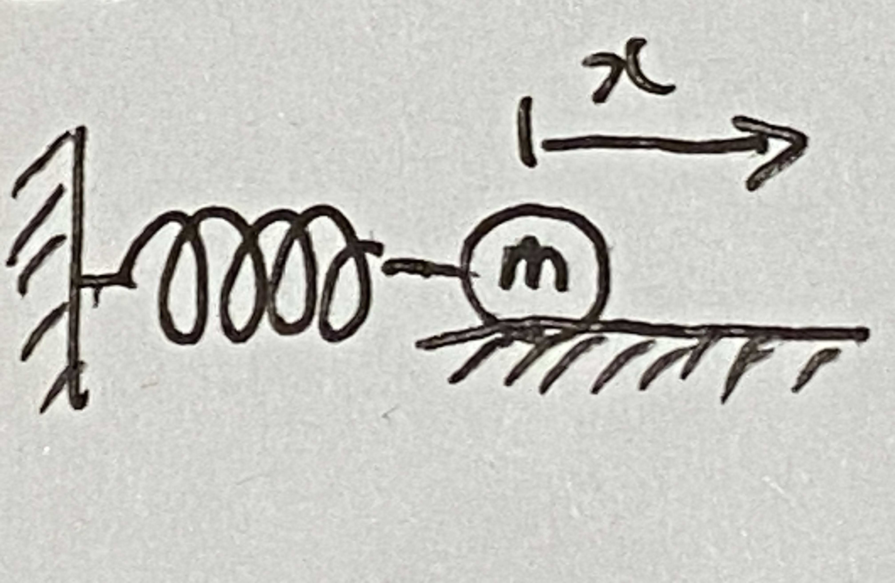
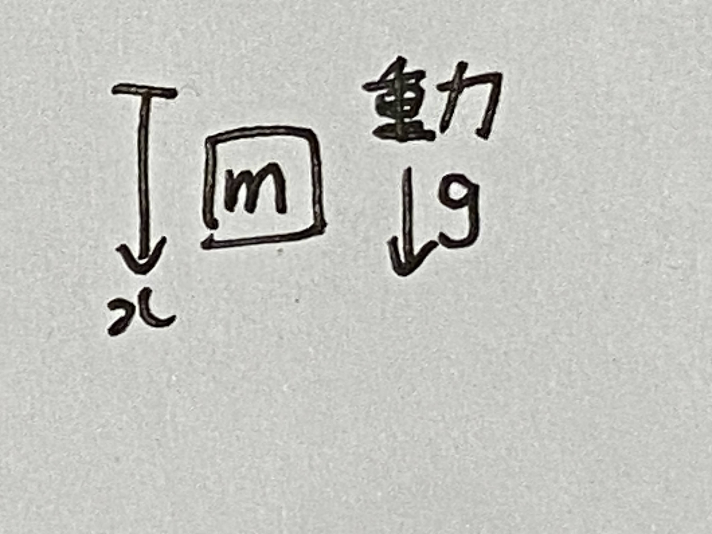
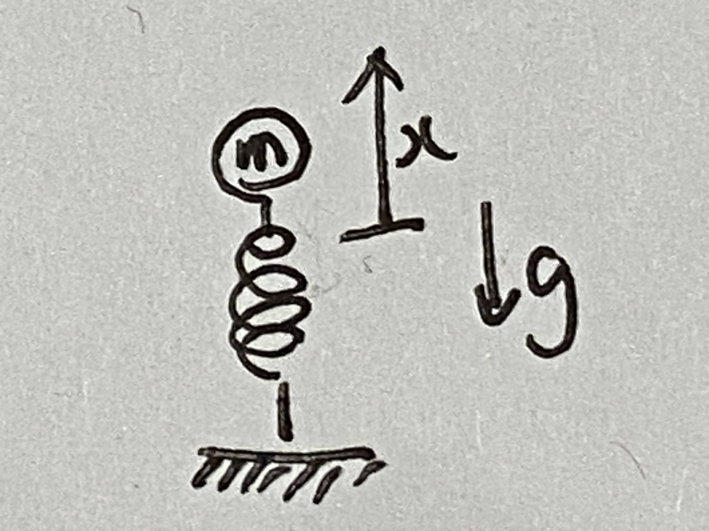
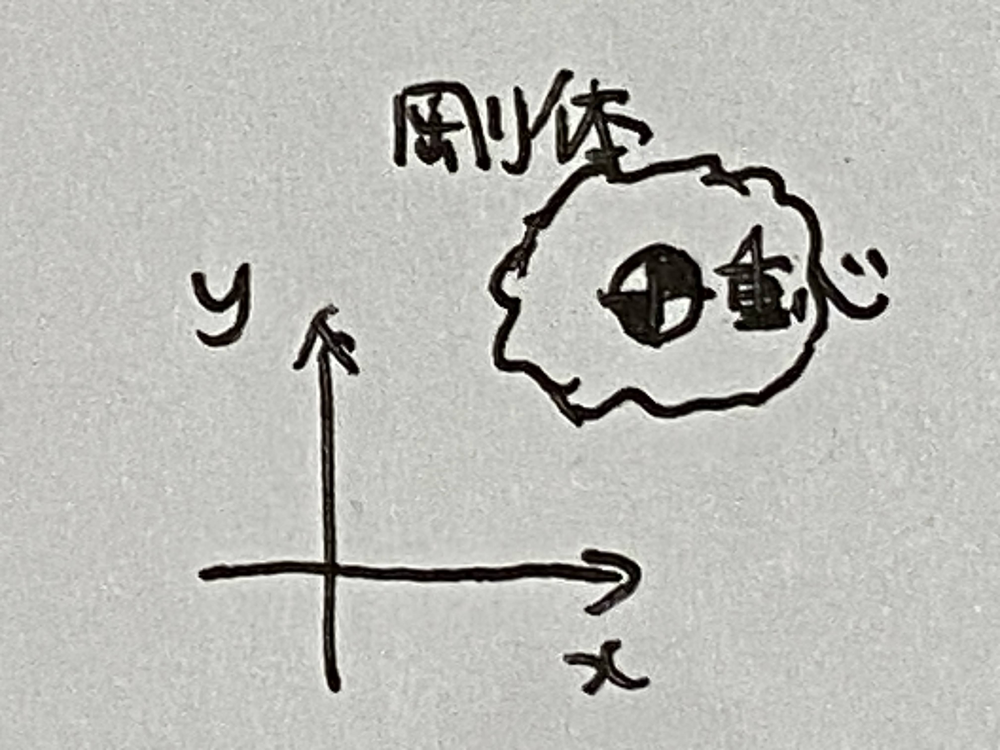
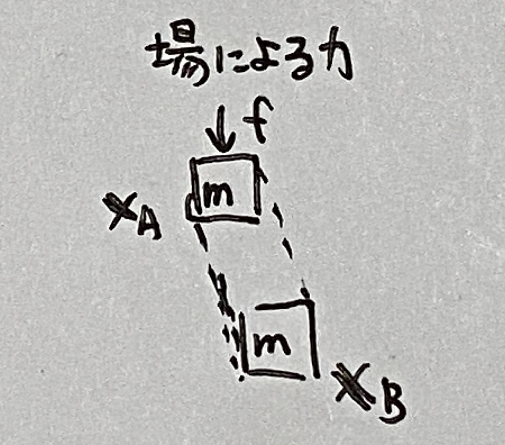
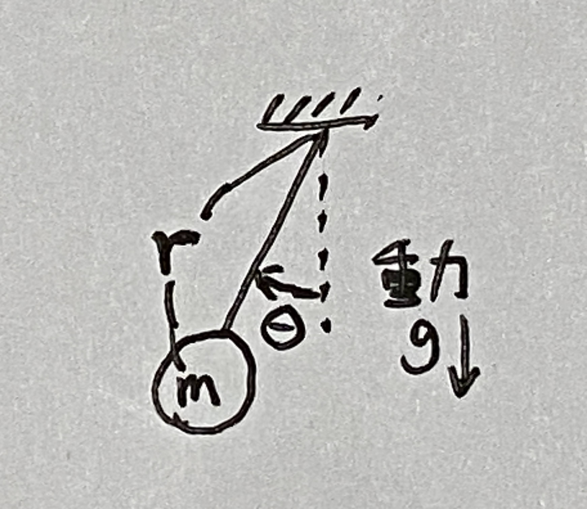

# 第５週　ポテンシャルエネルギー

* [PDF](http:/www.ritsumei.ac.jp/~uemura-m/AnalyticalMechanics/AnalyticalMechanics5thWeek.pdf)
* [Youtube](https://www.youtube.com/watch?v=_oxF2fsdC3g)

## ポテンシャルエネルギーとは？

力を発生する場によって蓄えられるエネルギー



ポテンシャルエネルギー<br>
ばねによって力が蓄えられる。

```math
\begin{aligned}
U = \frac{1}{2}kx^2
\end{aligned}
```



ポテンシャルエネルギー<br>
重力によって力が蓄えられる。

```math
\begin{aligned}
U = -mgx
\end{aligned}
```

## 演習



### 問い

剛性 $k = 2000 [N/m]$ のバネの上に $2 [kg]$ の物体を乗せ、物体の上から力をかけてバネを $0.2 [m]$ 変形させた後、力を抜いたとき、物体の跳ぶ高さを答えよ。ただし、バネを $0.2 [m]$ 変形させたときの物体の位置を $x=0 [m]$ とする。

### 解答

```math
\begin{aligned}
-2 \times 9.8  \times x + \frac{1}{2} \times 2000 \times 0.2^2 = 0 \\
x \fallingdotseq 2.0 [m]
\end{aligned}
```

## 剛体の位置エネルギー



### 剛体の位置エネルギー

```math
\begin{aligned}
U &= \sum_{i=1}^n m_i g y_i \\
&= mgy_{cm}
\end{aligned}
```

### 剛体の重心の高さ

```math
\begin{aligned}
y_{cm} = \frac{1}{m} \sum_{i=1}^n m_i y_i
\end{aligned}
```

## ポテンシャルエネルギーの導出



質点に**場による力** $f$ が作用している場合を考える。このとき、質点が座標 ${\bf{x}_A}$ から ${\bf{x}_B}$ まで移動した。<br>

力 $f$ が質点にする仕事

```math
\begin{aligned}
W = \int_{\bf{x}_A}^{\bf{x}_B} f \cdot d{\bf{x}}
\end{aligned}
```

仕事 : エネルギーと同じ意味。力学では、ある力が生じさせるエネルギーのことを力が成す仕事と呼ぶ。<br>

仕事 $W$ が ${\bf{x}_A}$ から ${\bf{x}_B}$ までの経路によらず一定である場合、力 $f$ を**保存力**という。<br>
逆に力が一定ではなく変化する場合、ポテンシャルエネルギーを導出できない。<br>

力 $f$ が保存力のとき、

```math
\begin{aligned}
U({\bf{x}_A}) - U({\bf{x}_B}) = W \\
U : ポテンシャルエネルギー
\end{aligned}
```

## 例題（重力場）


重力によるポテンシャルエネルギー<br>

場(重力)による力 $f = mg$<br>

重力が質点にする仕事

```math
\begin{aligned}
W = \int_{x_1}^{x_2}fdx = \int_{x_1}^{x_2}mgdx = \left[mgx\right]_{x_1}^{x_2} = mgx_2 - mgx_1
\end{aligned}
```

ポテンシャルエネルギー

```math
\begin{aligned}
U(x_1) - U(x_2) = mgx_2 - mgx_1 \\
U(x) = -mgx
\end{aligned}
```

## 例題（バネ）


場(バネ)による力 $f = -kx$ (フックの法則[wikipedia](https://ja.wikipedia.org/wiki/%E3%83%95%E3%83%83%E3%82%AF%E3%81%AE%E6%B3%95%E5%89%87))<br>

バネが質点にする仕事

```math
\begin{aligned}
W = \int_{x_1}^{x_2} fdx = \int_{x_1}^{x_2} -kxdx = \left[-\frac{1}{2}x^2\right]_{x_1}^{x_2} = -\frac{1}{2}x_{2}^2 + -\frac{1}{2}x_1^2
\end{aligned}
```

ポテンシャルエネルギー

```math
\begin{aligned}
U(x_1) - U(x_2) = -\frac{1}{2}x_{2}^2 + -\frac{1}{2}x_1^2 \\
U(x) = \frac{1}{2}kx^2
\end{aligned}
```

## 保存力の性質

Uの全微分

```math
\begin{aligned}
\partial U &= \frac{\partial}{\partial {\bf{x}}} U \cdot d{\bf{x}} \\
&= \frac{\partial}{\partial x}Udx + \frac{\partial}{\partial y}Udy + \frac{\partial}{\partial z}Udz
\end{aligned}
\tag{1}
```

```math
\begin{aligned}
\partial U &= U({\bf{x}} + d {\bf{x}}) - U({\bf{x}}) \\
&= -f \cdot d{\bf{x}} \\
&= -f_xdx - f_ydy - f_zdz
\end{aligned}
\tag{2}
```

(1)と(2)より、保存力 $f$ の性質

```math
\begin{aligned}
f_x = -\frac{\partial}{\partial x}U , f_y = -\frac{\partial}{\partial y}U, f_z = -\frac{\partial}{\partial z}U
\end{aligned}
```

さらに偏微分すると

```math
\begin{aligned}
\frac{\partial}{\partial y}f_x = -\frac{\partial^2}{\partial x \partial y}U = \frac{\partial}{\partial x}f_y ,　
\frac{\partial}{\partial z}f_x = \frac{\partial}{\partial x}f_z ,　
\frac{\partial}{\partial z}f_y = \frac{\partial}{\partial y}f_z
\end{aligned}
```

## 演習

### 問い

1. $x$ 方向に $f_x = -k_1x^3$ 、y方向に $f_y = -k_2y$ の力を発揮するバネのポテンシャルエネルギーを求めよ
1. 力 $f_x,f_y$ が保存力であることを証明せよ

### 解答

1.

```math
\begin{aligned}
W &= \int_{x_1}^{x_2} {\bf{f}} \cdot dx \\
&= \int_{x_1}^{x_2} (f_x + f_y)dx \\
&= \int_{x_1}^{x_2} (-k_1x^3 -k_2y)dx \\
&= \left[-\frac{1}{4}k_1x^4 -\frac{1}{2}k_2y^2 \right]_{x_1}^{x_2} \\
&= -\frac{1}{4}k_1x_2^4 -\frac{1}{2}k_2y_2^2 + \frac{1}{4}k_1x_1^4 + \frac{1}{2}k_2y_1^2 \\
U({\bf{x}}_1) - U({\bf{x}}_2) = W
\end{aligned}
```

ポテンシャルエネルギー

```math
\begin{aligned}
U({\bf{x}}) &= \frac{1}{4}k_1x^4 + \frac{1}{2}k_2y^2 \\
\end{aligned}
```

2.

```math
\begin{aligned}
\frac{\partial}{\partial x} U &= \frac{\partial}{\partial x}(\frac{1}{4}k_1x^4 + \frac{1}{2}k_2y^2) \\
&= k_1x^3 \\
&= -f_x
\end{aligned}
```

```math
\begin{aligned}
\frac{\partial}{\partial y} U &= \frac{\partial}{\partial y}(\frac{1}{4}k_1x^4 + \frac{1}{2}k_2y^2) \\
&= k_2y \\
&= -f_y
\end{aligned}
```

```math
\begin{aligned}
\frac{\partial}{\partial y} fx = 0, \frac{\partial}{\partial x} fy = 0 であることから\\
\therefore \frac{\partial}{\partial y} fx = \frac{\partial}{\partial x} fy
\end{aligned}
```

よって、力 $f$ は保存力

## エネルギー保存則

系に保存力だけが働く場合、系全体のエネルギーは時間が経過しても変化しない

## エネルギー保存則の例


運動エネルギー $K=\frac{1}{2}m\dot{x}^2$ <br>
ポテンシャルエネルギー $U=\frac{1}{2}kx^2$ <br>
全エネルギー $V = K + U$ <br>
運動方程式 $m \ddot{x} + kx = 0$ <br>
 <br>
エネルギーの時間変化

```math
\begin{aligned}
\dot{V} &= \frac{d}{dt} (\frac{1}{2}m\dot{x}^2 + \frac{1}{2}kx^2) \\
&= m\dot{x}\ddot{x} + kx\dot{x} \\
&= \dot{x}(m\ddot{x} + kx) \\
&= 0
\end{aligned}
```

全エネルギーの変化がゼロであることから、エネルギー保存則が証明された。

## 演習



### 問い

振り子運動に関するエネルギー保存則を導出せよ <br>
 <br>
運動エネルギー $K=\frac{1}{2}m(r\dot{\theta})^2$ <br>
ポテンシャルエネルギー $U=mg(r - r \cos \theta)$ <br>
全エネルギー $V = K + U$ <br>
運動方程式 ? <br>
エネルギーの時間変化 ? <br>

### 解答

運動方程式 <br>
 <br>
ラグランジアン <br>

```math
\begin{aligned}
L &= K - U \\
&= \frac{1}{2}m(r\dot{\theta})^2 - mg(r - r \cos \theta) \\
\end{aligned}
```

ラグランジュの運動方程式

```math
\begin{aligned}
\frac{d}{dt}(\frac{\partial L}{\partial \dot{\theta}}) - \frac{\partial L}{\partial \theta} &= 0 \\
\frac{d}{dt}(\frac{\partial}{\partial \dot{\theta}}(\frac{1}{2}m(r\dot{\theta})^2 - mg(r - r \cos \theta))) - \frac{\partial}{\partial \theta}(\frac{1}{2}m(r\dot{\theta})^2 - mg(r - r \cos \theta)) &= 0 \\
\frac{d}{dt}(mr^2\dot{\theta}) + \frac{\partial}{\partial \theta}(mg(r - r \cos \theta)) &= 0 \\
mr^2\ddot{\theta} + mgr \sin \theta &= 0 \\
\end{aligned}
```

エネルギーの時間変化

```math
\begin{aligned}
\dot{V} &= \frac{d}{dt}(K+U) \\
&= \frac{d}{dt}(\frac{1}{2}m(r\dot{\theta})^2 + mg(r - r \cos \theta)) \\
&= mr^2\dot{\theta}\ddot{\theta} + mgr \dot{\theta} \sin \theta\\
&= \dot{\theta} ( mr^2\ddot{\theta} + mgr \sin \theta)\\
&= 0
\end{aligned}
```
