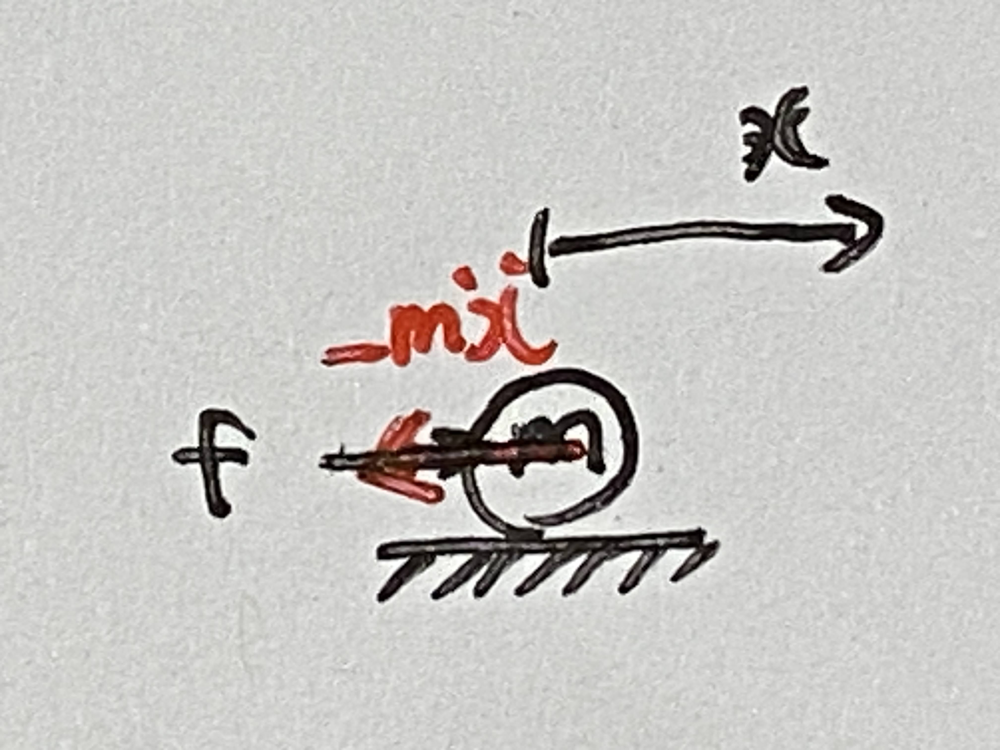
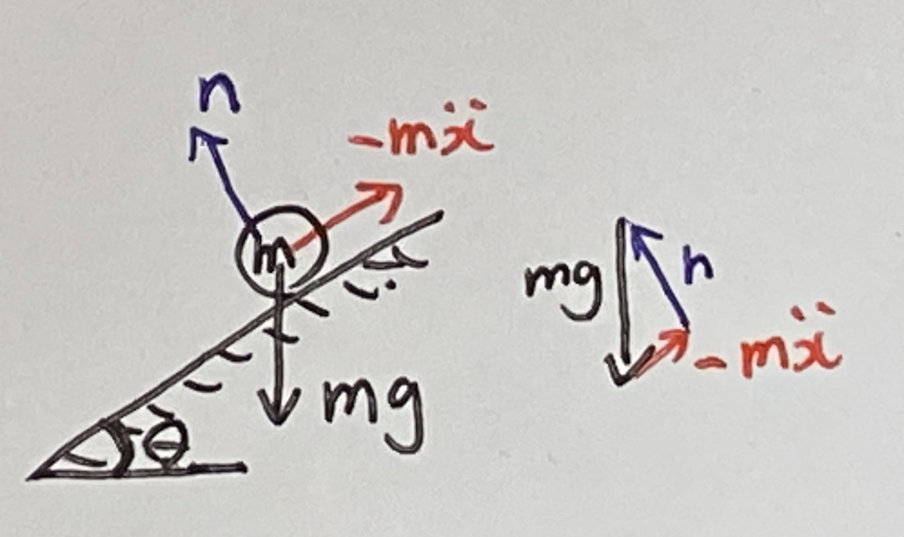
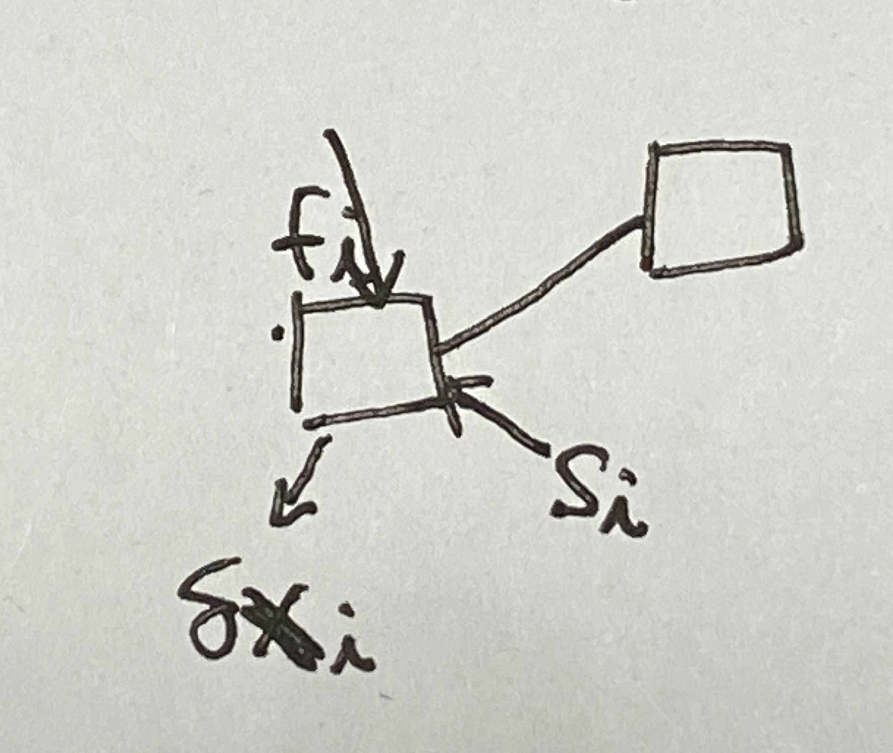
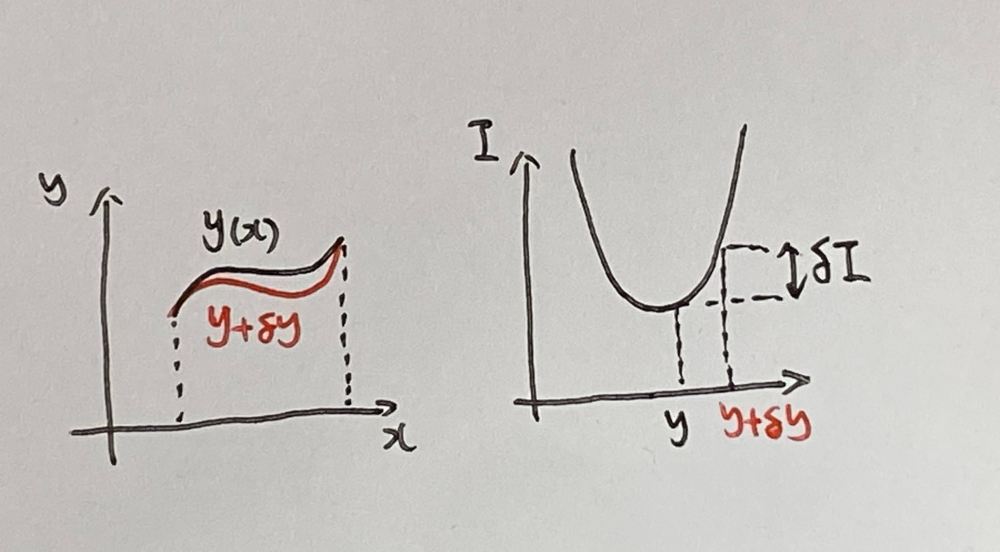
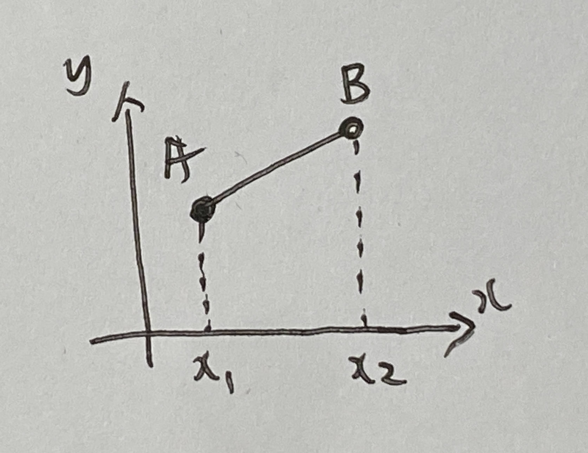

# 第７週　ダランベールの原理・変分法

* [Youtube](https://www.youtube.com/watch?v=S-XDelGLDcQ&t=2s)
* [PDF](http:/www.ritsumei.ac.jp/~uemura-m/AnalyticalMechanics/AnalyticalMechanics7thWeek.pdf)

## ダランベールの原理の概要

* 動力学を釣り合いの観点から考察。釣り合いは静力学の考え方であるが、動力学に拡張する。
* 仮想仕事の原理を動力学へ拡張
* ラグランジュの運動方程式の導出に用いる

## ダランベールの原理考え方


質点の運動方程式

```math
\begin{aligned}
m \ddot{x} = f
\end{aligned}
```

これは動力学なので釣り合いの式ではない。

### ダランベールの原理



$-m\ddot{x}$ を力(慣性力)とみなし、慣性力を含めた全体の力が釣り合っているとみなす

```math
\begin{aligned}
0 = f + (-m\ddot{x})
\end{aligned}
```

これまでの動力学を解釈し直したものだが、仮想仕事の原理を動力学に拡張し、ラグランジュの運動方程式を導出できる、という利点をもたらす。

## ダランベールの原理の例

### 坂を転がる質点



重力、慣性力、床反力が釣り合う <br>
↓ <br>
ベクトルの総和が 0 <br>

```math
\begin{aligned}
m{\bf{g}} + {\bf{n}} + (-m\ddot{{\bf{x}}}) = 0
\end{aligned}
```

```math
\begin{aligned}
m \begin{pmatrix}
0 \\
-g
\end{pmatrix} + n \begin{pmatrix}
- \sin \theta \\
\cos \theta
\end{pmatrix} - m\ddot{x}\begin{pmatrix}
\cos \theta \\
\sin \theta
\end{pmatrix} = \begin{pmatrix}
0 \\
0
\end{pmatrix}
\end{aligned}
```

## 演習


### 問い

坂を転がる質点の運動方程式（ $m, \ddot{x}, 𝑔, \theta$ の関係）をダランベールの原理を用いて導出せよ

### 解答

```math
\begin{aligned}
ダランベールの原理より \\
m{\bf{g}} + {\bf{n}} + (-m\ddot{{\bf{x}}}) &= 0 \\
m \begin{pmatrix}
0 \\
-g
\end{pmatrix} + n \begin{pmatrix}
- \sin \theta \\
\cos \theta
\end{pmatrix} - m\ddot{x}\begin{pmatrix}
\cos \theta \\
\sin \theta
\end{pmatrix} &= \begin{pmatrix}
0 \\
0
\end{pmatrix} \\
最初の式 \\
-n \sin \theta - m\ddot{x} \cos \theta &= 0 \\
n &= - m\ddot{x} \frac{\cos \theta}{\sin \theta} \\
2つ目の式 \\
-mg + n \cos \theta - m\ddot{x} \sin \theta &= 0 \\
-mg - m\ddot{x} \frac{\cos \theta}{\sin \theta} \cos \theta - m\ddot{x} \sin \theta &= 0 \\
-mg \sin \theta - m\ddot{x} \cos^2 \theta - m\ddot{x} \sin ^2 \theta &= 0 \\
-mg \sin \theta - m\ddot{x} (\cos^2 \theta + \sin ^2 \theta ) &= 0 \\
-mg \sin \theta - m\ddot{x} &= 0 \\
m\ddot{x} &= - mg \sin \theta \\
\end{aligned}
```

## 仮想仕事の原理の動力学への拡張



質点 $i$ に拘束力 $s_i$ と外力 $f_i$ が作用しているとき

### 仮想仕事 $\delta W$

```math
\begin{aligned}
\delta W = \sum_{i=0}^n({\bf{s}}_i + {\bf{f}}_i - m_i \ddot{{\bf{x}}}_i) \cdot \delta {\bf{x}}_i = 0
\end{aligned}
```

$\delta {\bf{x}}_i$ : 各質点の仮想変位 (拘束に矛盾しない微小変位) <br>
拘束力は仕事をしない

```math
\begin{aligned}
\sum_{i=0}^n{\bf{s}}_i \cdot \delta {\bf{x}}_i = 0
\end{aligned}
```

よって、以下が成り立つ。

```math
\begin{aligned}
\delta W = \sum_{i=0}^n({\bf{f}}_i - m_i \ddot{{\bf{x}}}_i) \cdot \delta {\bf{x}}_i = 0
\end{aligned}
```

この式は一般化ダランベールの原理とも呼ばれる。次の変分法を用いて、ラグランジュの運動方程式を導出する。

## 変分法の概要

* 変分は微分の一種
* 汎関数の極値を求める方法
* ラグランジュの運動方程式で使用する

## 関数の極値

```math
変数 y(x) の極値は微分 \frac{d}{dx}y(x) = 0 を用いて求まる。
```

### 例

```math
関数 y=ax^2+bx+c のとき x が 2ax+b=0 を満たすとき y は極値をとる。
```

### 変分法

```math
変分法では、汎関数 I の極値を変分 \delta I = 0 を用いて求める
```

## 汎関数

関数の関数を積分したもの <br>

変数 $x$ と関数 $y(x)$ , その微分

```math
y^{\prime} = \frac{d}{dx}y(x)
```

からなる関数 $f(x, y, y^{\prime})$ を $x$ で定積分した関数 $I = \int_{x_1}^{x_2} f(x, y, y^{\prime}) dx$ を汎関数と呼ぶ。

$y^{\prime}$ : $y$ を $x$ で微分したもの

### 例

```math
I = \int_{x_1}^{x_2} f(y^2+y^{\prime 2}+x) dx
```

## 変分法

```math
汎関数 I = \int_{x_1}^{x_2} f(x, y, y^{\prime}) dx の極値は \\
オイラーの微分方程式 \\
\frac{d}{dx}(\frac{\partial}{\partial y^{\prime}}f) - \frac{\partial}{\partial y}f = 0 \\
により求まる。 \\
このとき、 \delta I = 0 となり、この \delta I を I の変分と呼ぶ。
```

↑ラグランジュの運動方程式と同じ形式。これはラグランジュの運動方程式はオイラーの微分方程式から導出されたため。

## 変分の意味

$\delta I$ は関数 $y$ の形が微小に変化したときの汎関数 $I$ の微小変化 <br>
↓ <br>
最適な関数の形を求める問題に有効！ <br>



## 変分法による最短経路問題

### 最短経路問題

２次元平面上の点Ａと点Ｂを結ぶ最短経路を示せ


直感的に最短経路は直線であるが、これを変分法で理論的に説明する。

## 変分法による最短経路問題の解法


微小区間 $dx$ における経路の長さ $dl$

```math
\begin{aligned}
三平方の定理より \\
dl &= \sqrt{(dx)^2 + (\frac{dy}{dx}dx)^2} \\
&= \sqrt{(dx)^2 + (dy)^2} \\
&= \sqrt{1 + (\frac{dy}{dx})^2}dx \\
&= \sqrt{1 + y^{\prime 2}}dx
\end{aligned}
```

全経路の長さ $l$

```math
\begin{aligned}
l = \int_A^B dl = \int_{x_1}^{x_2} \sqrt{1 + y^{\prime 2}}dx
\end{aligned}
```

$l$ の極値

```math
\begin{aligned}
l = \int_{x_1}^{x_2} fdx , f = \sqrt{1 + y^{\prime 2}} より \\
\frac{d}{dx}(\frac{\partial}{\partial y^{\prime}}f) - \frac{\partial}{\partial y}f &= 0 \\
\frac{d}{dx}(\frac{\partial \sqrt{1 + y^{\prime 2}}}{\partial y^{\prime}}) - \frac{\partial \sqrt{1 + y^{\prime 2}}}{\partial y} &= 0 \\
\frac{d}{dx}(\frac{y^{\prime}}{\sqrt{1 + y^{\prime 2}}}) - 0 &= 0 \\
\end{aligned}
```

よって、 $y^{\prime} =$ 定数 であれば $l$ は極値 <br>
↓ <br>
直線のとき、最短経路


