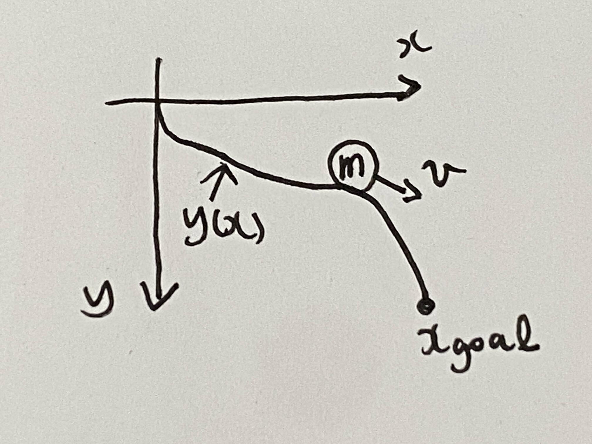
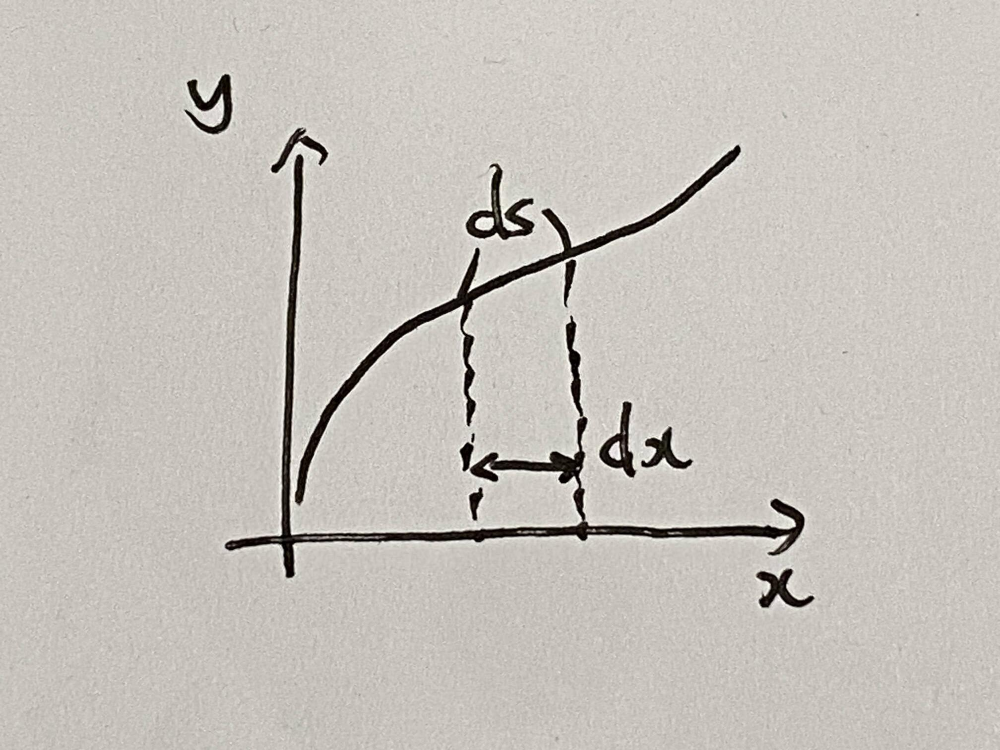
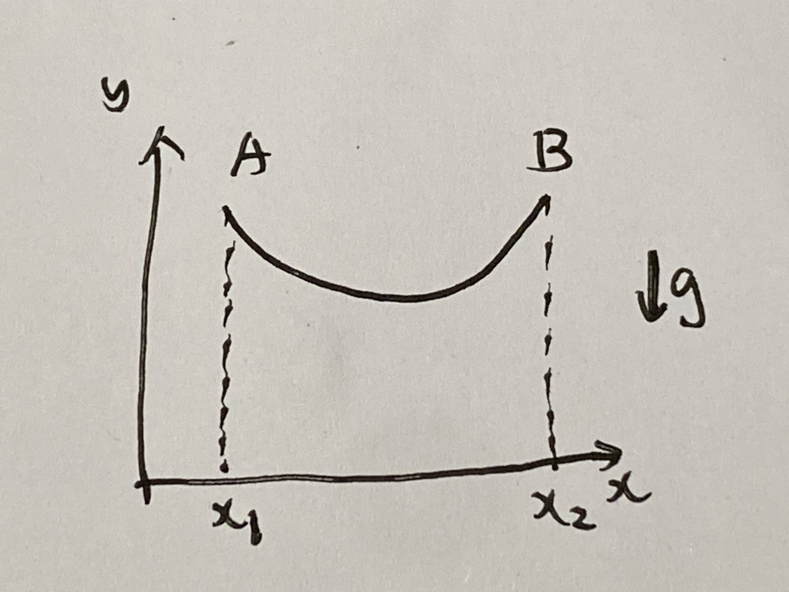

# 第８週　変分法の適用例

* [Youtube](https://www.youtube.com/watch?v=KejBJNKcoLM&t=551s)
* [PDF](http:/www.ritsumei.ac.jp/~uemura-m/AnalyticalMechanics/AnalyticalMechanics8thWeek.pdf)

## 微分と変分の関係

|  | 微分 | 変分 |
|--|-----|----- |
|対象|関数 $y(x)$ | 汎関数 $𝐼=\int_{x_1}^{x_2}𝑓(𝑥,𝑦,𝑦')d𝑥$ |
|考える微小変化|変数 $x$ の値|関数 $y$ の形|
|極値の条件|微分 $d𝑦(𝑥)d𝑥$ が $0$ | 変分 $\delta I$ が $0$ （つまり、オイラーの微分方程式が成立するとき）

## 演習

### 問い

汎関数 $I=\int_{x_1}^{x_2}(x^2+y^2+y'^2)dx$ が極値を取る条件を、変分法により求めよ。

オイラーの微分方程式
$\frac{d}{dx} (\frac{\partial}{\partial y'}f) - \frac{\partial}{\partial y}f = 0$

### 解答

```math
\begin{aligned}
& f(x,y,y') = x^2+y^2+y'^2 \\
& オイラーの微分方程式より \\
& \frac{d}{dx} (\frac{\partial}{\partial y'}f) - \frac{\partial}{\partial y}f \\
&= \frac{d}{dx} (\frac{\partial}{\partial y'}(x^2+y^2+y'^2)) - \frac{\partial}{\partial y}(x^2+y^2+y'^2) \\
&= \frac{d}{dx} (2y') - 2y \\
&= 2y'' - 2y = 0\\
& y'' - y = 0\\
\end{aligned}
```

## 変形オイラーの方程式

汎関数 $I=\int_{x_1}^{x_2}(x^2+y^2+y'^2)dx$ の関数 $f$ が $x$ に陽に依存しない場合、変分法における極値の条件の計算（オイラーの方程式 $\frac{d}{dx} (\frac{\partial}{\partial y'}f) - \frac{\partial}{\partial y}f = 0$ ）が簡略化 $f - \frac{\partial f}{\partial y'}y' = $定数 できる <br>
<br>
陽に : explicit の訳、明示的に

## 汎関数の例



坂道を転がる質点がある点 $x_{goal}$ に最も早く到達するような坂道の形 $y(x)$ を求める問題<br>
(最速降下問題、最速降下曲線)

到達時間 $t_{goal}$

```math
\begin{aligned}
t_{goal} = \int_0^{t_{goal}} dt
\end{aligned}
```

微小時間 $dt$ の間の移動距離 $ds$ <br>
$v$ : 質点の速度

```math
\begin{aligned}
\frac{ds}{dt} = v
\end{aligned}
```

速度 $v$ と位置 $y$ の関係<br>

```math
\begin{aligned}
エネルギー保&存則より \\
\frac{1}{2}mv^2 &= mgy \\
v &= \sqrt{2gy}
\end{aligned}
```



移動距離 $ds$ と各座標の微小変位 $dx, dy$ の関係

```math
\begin{aligned}
ds = \sqrt{1 + y'^2} dx
\end{aligned}
```

```math
\begin{aligned}
\frac{ds}{dt} = v, v = \sqrt{2gy}, ds = \sqrt{1 + y'^2} dx より \\
dt = \frac{ds}{v} = \frac{\sqrt{1 + y'^2}}{\sqrt{2gy}} dx
\end{aligned}
```

$t_{goal}$ の汎関数表現

```math
\begin{aligned}
t_{goal} = \int_0^{t_{goal}} dt = \int_0^{x_{goal}} \frac{\sqrt{1 + y'^2}}{\sqrt{2gy}} dx
\end{aligned}
```

最速降下曲線の導出

```math
\begin{aligned}
t_{goal} = \int_0^{t_{goal}} dt = \int_0^{x_{goal}} \frac{\sqrt{1 + y'^2}}{\sqrt{2gy}}dx
\end{aligned}
```

この汎関数の関数は $x$ に陽に依存しないので、変分法における極値の条件の計算は変形オイラーの方程式により求まる。
<br>
変形オイラーの方程式

```math
\begin{aligned}
&f - \frac{\partial f}{\partial y'}y' \\
&= \frac{\sqrt{1 + y'^2}}{\sqrt{2gy}}  - y' \frac{\partial}{\partial y'} (\frac{\sqrt{1 + y'^2}}{\sqrt{2gy}}) \\
&= \frac{\sqrt{1 + y'^2}}{\sqrt{2gy}}  - y' \frac{y'}{\sqrt{2gy}\sqrt{1 + y'^2}} \\
&= \frac{1}{\sqrt{2gy}\sqrt{1 + y'^2}}(1 + y'^2)  - \frac{1}{\sqrt{2gy}\sqrt{1 + y'^2}} y'^2\\
&= \frac{1}{\sqrt{2gy}\sqrt{1 + y'^2}} \\
&= \frac{1}{\sqrt{2g}\sqrt{y(1 + y'^2)}} \\
&= 定数
\end{aligned}
```

よって $y(1 + y'^2)=$定数のとき、 $t_{goal}$は極値をとる。 <br>
(これはサイクロイド曲線[wikipedia](https://ja.wikipedia.org/wiki/%E3%82%B5%E3%82%A4%E3%82%AF%E3%83%AD%E3%82%A4%E3%83%89))

## 演習(汎関数)



### 問い

重力下で左右の２点 $(A, B)$ が固定された質量 $m[kg]$ 、長さ$l[m]$ のひもを考える重力によるポテンシャルエネルギー$E$を汎関数の形式で求めよ

### 解答

微小長さ $dl$ が持つエネルギー $dE$

```math
\begin{aligned}
dE = m\frac{dl}{l}gy
\end{aligned}
```

ひも全体のエネルギー $E$

```math
\begin{aligned}
E = \int_A^B dE
\end{aligned}
```

$dl$ と $dx, dy$の関係

```math
dl = \sqrt{1+y'^2}dx
```

以上より、

```math
\begin{aligned}
E &= \int_A^B dE \\
&= \int_0^l \frac{mg}{l}ydl \\
&= \int_{x_1}^{x_2} \frac{mg}{l}y \sqrt{1+y'^2}dx\\
&= \frac{mg}{l} \int_{x_1}^{x_2} y \sqrt{1+y'^2}dx\\
\end{aligned}
```

## 演習(変分法)

### 問い

汎関数 $E=\frac{mg}{l} \int_{x_1}^{x_2} y \sqrt{1+y'^2}dx$が極値を取るための関数$y$の条件を変分法を用いてもとめよ。
<br>
(ほっとおくとひもはエネルギー最小の状態になる)

### 解答

この汎関数の関数は $x$ に陽に依存しないので、変分法における極値の条件の計算は変形オイラーの方程式により求まる。
<br>
$f = y \sqrt{1+y'^2}$より変形オイラーの方程式

```math
\begin{aligned}
&f - \frac{\partial f}{\partial y'}y' \\
&= y \sqrt{1+y'^2} - \frac{\partial (y \sqrt{1+y'^2})}{\partial y'}y'\\
& f(y) = 1+y'^2 とすると \frac{\partial \sqrt{f(y)}}{\partial y} = \frac{f'(y)}{2\sqrt{f(y)}} より \\
&= y \sqrt{1+y'^2} - y\frac{ 2y'}{2 \sqrt{1+y'^2}}y'\\
&= y (\frac{1+y'^2}{\sqrt{1+y'^2}} - \frac{ y'^2}{\sqrt{1+y'^2}})\\
&=  \frac{y}{\sqrt{1+y'^2}}\\
&= 定数\\

y=c_1 \cosh c_2 x
\end{aligned}
```

双曲線(ハイパボリックコサイン)と呼ばれる。

### 【参考】双曲線関数

* [wikipedia](https://ja.wikipedia.org/wiki/%E5%8F%8C%E6%9B%B2%E7%B7%9A%E9%96%A2%E6%95%B0)
* [双曲線関数(sinh,cosh,tanh)の定義と性質22個まとめ](https://mathlandscape.com/sinh/)
* [懸垂線](https://toy1972.hatenablog.com/entry/2020/01/31/173038)
