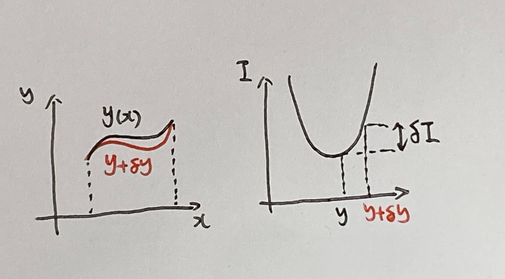
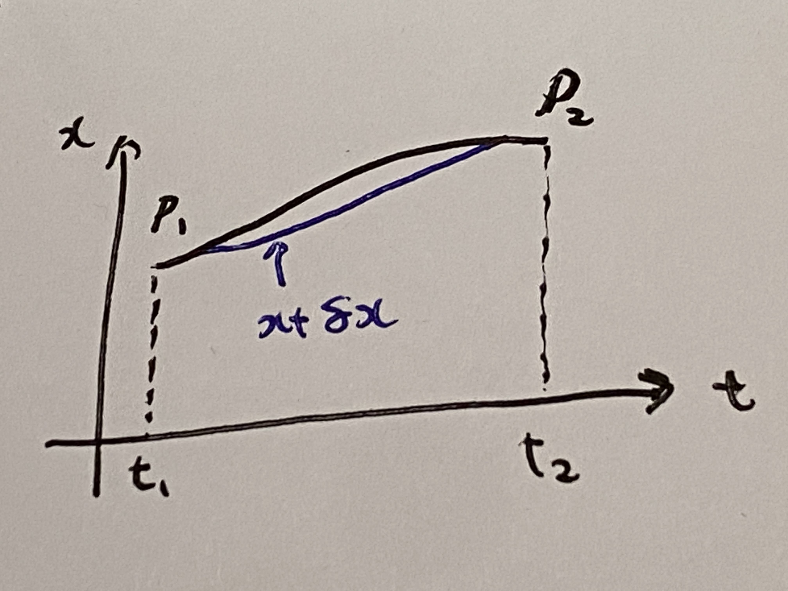
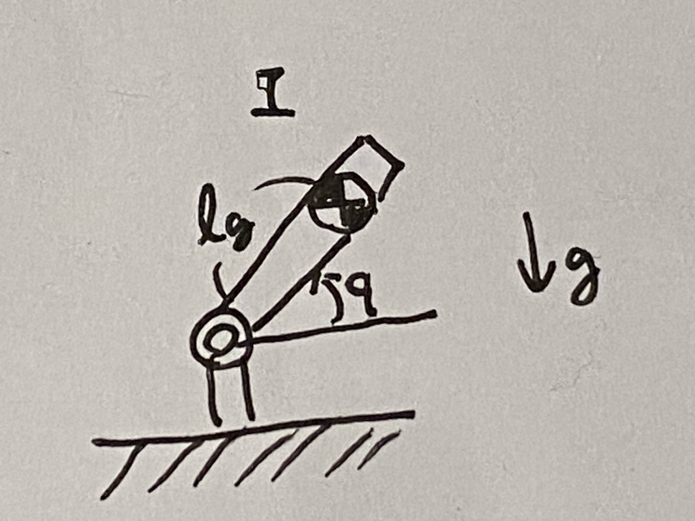

# 第９週　変分法とラグランジュの運動方程式の導出

* [Youtube](https://www.youtube.com/watch?v=KzOMiY1U_-4)
* [PDF](http:/www.ritsumei.ac.jp/~uemura-m/AnalyticalMechanics/AnalyticalMechanics9thWeek.pdf)

## 変分法の導出

$\frac{d}{dx} (\frac{\partial}{\partial y'}f) - \frac{\partial}{\partial y}f = 0$ のとき $\delta I = 0$ となる証明<br>
$\delta I$ : 関数 $y$ の微小変化 $y+\delta y$ による汎関数の変化

```math
\begin{aligned}
\delta I &= I(x, y+\delta y, y' + \delta y') - I(x, y, y') \\
&= \int_{x_1}^{x_2} f(x, y+\delta y, y' + \delta y')dx - \int_{x_1}^{x_2} f(x, y, y')dx \\
1次の項まで&テイラー展開する(2次以降は微小なので無視する) \\
&= \int_{x_1}^{x_2} (\frac{\partial f}{\partial y} \delta y + \frac{\partial f}{\partial y'}\delta y' + f(x, y, y'))dx - \int_{x_1}^{x_2} f(x, y, y')dx \\
&= \int_{x_1}^{x_2} (\frac{\partial f}{\partial y} \delta y + \frac{\partial f}{\partial y'}\delta y')dx \\
積分の中の&第二項に着目する \\
\int_{x_1}^{x_2} (\frac{\partial f}{\partial y'}\delta y')dx &= \int_{x_1}^{x_2} (\frac{\partial f}{\partial y'}\frac{d(\delta y)}{dx})dx\\
&= \left[\frac{\partial f}{\partial y'} \delta y \right]_{x_1}^{x_2} - \int_{x_1}^{x_2} (\frac{d}{dx}\frac{\partial f}{\partial y'}\delta y)dx  \\
\end{aligned}
```

### 部分積分

```math
\begin{aligned}
G(x) は g(x) の&原始関数 (G'(x) = g(x))のとき \\
\int_a^b f(x) g(x) dx &= \left[ f(x) G(x) \right]_a^b - \int_a^b f'(x) G(x) dx
\end{aligned}
```

定積分の計算

```math
\begin{aligned}
\left[ f(x) G(x) \right]_a^b = f(b)G(b) - f(a)G(a)
\end{aligned}
```

図のように $\delta y$ は式 $y(x)$ の形を変えるものであり、始点と終点は変わらない。よって、第一項の定積分 $\left[\frac{\partial f}{\partial y'} \delta y \right]_{x_1}^{x_2} = 0$ となる。



元の式

```math
\begin{aligned}
\int_{x_1}^{x_2} (\frac{\partial f}{\partial y'}\delta y')dx &= \int_{x_1}^{x_2} (\frac{\partial f}{\partial y'}\frac{d(\delta y)}{dx})dx\\
&= \left[\frac{\partial f}{\partial y'} \delta y \right]_{x_1}^{x_2} - \int_{x_1}^{x_2} (\frac{d}{dx}\frac{\partial f}{\partial y'}\delta y)dx  \\
&= - \int_{x_1}^{x_2} (\frac{d}{dx}\frac{\partial f}{\partial y'}\delta y)dx  \\
\end{aligned}
```

```math
\begin{aligned}
\delta I &= \int_{x_1}^{x_2} (\frac{\partial f}{\partial y} \delta y + \frac{\partial f}{\partial y'}\delta y')dx \\
&= \int_{x_1}^{x_2} (\frac{\partial f}{\partial y} \delta y - \frac{d}{dx}\frac{\partial f}{\partial y'}\delta y)dx \\
&= \int_{x_1}^{x_2} (\frac{\partial f}{\partial y} - \frac{d}{dx}\frac{\partial f}{\partial y'}) \delta y dx \\
\end{aligned}
```

```math
\delta I = \int_{x_1}^{x_2} (\frac {\partial f}{\partial y} - \frac{d}{dx}\frac{\partial f}{\partial y'}) \delta y dx \\
```

において $\delta I = 0$ の十分条件は
 $\frac{d}{dx} (\frac{\partial}{\partial y'}f) - \frac{\partial}{\partial y}f = 0$

## ラグランジュの運動方程式の導出

$L = K - U$ が $\frac{d}{dt}(\frac{\partial L}{\partial \dot{{\bf{x}}}}) - \frac{\partial L}{\partial {\bf{x}}} = 0$ を満たすことを証明 <br>
(ハミルトンの原理、最小作用の原理)

* $K$ : 運動エネルギー
* $U$ : ポテンシャルエネルギー

## 仮想仕事の時間積分

一般化ダランベールの原理

```math
\delta W = \sum_{i=1}^{n} ({\bf{f_i}} - m_i \ddot{{\bf{x}}}_i) \cdot \delta {\bf{x}}_i = 0
```

時刻 $t=t_1$ から $t=t_2$ まで積分

```math
\int_{t_1}^{t_2} \delta W dt = 0
```

外力のなす仮想仕事 ( ${\bf{f}}_i$ は保存力とする) <br>

保存力の性質 ${\bf{f}} = - \frac{\partial U}{\partial {\bf{x}}}$ より

```math
\sum_{i=1}^{n} {\bf{f}}_i \cdot \delta {\bf{x}}_i = - \sum_{i=1}^{n} \frac{\partial U}{\partial {\bf{x}}_i} \cdot \delta {\bf{x}}_i
```

${\partial {\bf{x}}_i}$ と $\delta {\bf{x}}_i$ を同じ微小変化とすると、

```math
\sum_{i=1}^{n} {\bf{f}}_i \cdot \delta {\bf{x}}_i = - \sum_{i=1}^{n} \frac{\partial U}{\partial {\bf{x}}_i} \cdot \delta {\bf{x}}_i = - \delta U
```

## 慣性力がなす仮想仕事 ( $- \sum_{i=1}^{n} m_i \ddot{{\bf{x}}}_i \cdot \delta {\bf{x}}_i$ )



```math
\begin{aligned}
&- \int_{t_1}^{t_2} \sum_{i=1}^{n} m_i \ddot{{\bf{x}}}_i \cdot \delta {\bf{x}}_i dt \\
&= - \left[ \sum_{i=1}^{n} m_i \dot{{\bf{x}}}_i \cdot \delta {\bf{x}}_i \right]_{t_1}^{t_2} + \int_{t_1}^{t_2} \sum_{i=1}^{n} m_i \dot{{\bf{x}}}_i \cdot \delta \dot{{\bf{x}}}_i dt \\
&= 0 + \int_{t_1}^{t_2} \sum_{i=1}^{n} m_i \dot{{\bf{x}}}_i \cdot \delta \dot{{\bf{x}}}_i dt \\
&= \int_{t_1}^{t_2} \sum_{i=1}^{n} m_i \dot{{\bf{x}}}_i \cdot \delta \dot{{\bf{x}}}_i dt \\
\end{aligned}
```

```math
\begin{aligned}
\delta (\frac{1}{2} m_i \dot{{\bf{x}}}_i \cdot \dot{{\bf{x}}}_i) &= \frac{1}{2} m_i (\dot{{\bf{x}}} + \delta \dot{{\bf{x}}}_i) \cdot (\dot{{\bf{x}}} + \delta \dot{{\bf{x}}}_i) - \frac{1}{2} m_i \dot{{\bf{x}}} \cdot \dot{{\bf{x}}}\\
&= \frac{1}{2} m_i (\dot{{\bf{x}}} \cdot \dot{{\bf{x}}} + 2 \dot{{\bf{x}}} \cdot \delta \dot{{\bf{x}}} + \delta \dot{{\bf{x}}} \cdot \delta \dot{{\bf{x}}} - \dot{{\bf{x}}} \cdot \dot{{\bf{x}}})\\
&= \frac{1}{2} m_i (2 \dot{{\bf{x}}} \cdot \delta \dot{{\bf{x}}} + \delta \dot{{\bf{x}}} \cdot \delta \dot{{\bf{x}}})\\
&= m_i \dot{{\bf{x}}} \cdot \delta \dot{{\bf{x}}} + \frac{1}{2} m_i \delta \dot{{\bf{x}}} \cdot \delta \dot{{\bf{x}}}\\
\end{aligned}
```

$\delta \dot{{\bf{x}}}$ が十分に微小であることから、 $\delta \dot{{\bf{x}}} \cdot \delta \dot{{\bf{x}}} = 0$ とみなせるため、

```math
\begin{aligned}
\delta (\frac{1}{2} m_i \dot{{\bf{x}}}_i \cdot \dot{{\bf{x}}}_i) &= m_i \dot{{\bf{x}}} \cdot \delta \dot{{\bf{x}}} + \frac{1}{2} m_i \delta \dot{{\bf{x}}} \cdot \delta \dot{{\bf{x}}} \\
&= m_i \dot{{\bf{x}}} \cdot \delta \dot{{\bf{x}}} + 0 \\
&= m_i \dot{{\bf{x}}} \cdot \delta \dot{{\bf{x}}}\\
\end{aligned}
```

よって

```math
\begin{aligned}
&- \int_{t_1}^{t_2} \sum_{i=1}^{n} m_i \ddot{{\bf{x}}}_i \cdot \delta {\bf{x}}_i dt \\
&= \int_{t_1}^{t_2} \sum_{i=1}^{n} m_i \dot{{\bf{x}}}_i \cdot \delta \dot{{\bf{x}}}_i dt \\
&= \int_{t_1}^{t_2} \sum_{i=1}^{n} \delta (\frac{1}{2} m_i \dot{{\bf{x}}}_i \cdot \dot{{\bf{x}}}_i) dt \\
\end{aligned}
```

運動エネルギー $K = \frac{1}{2} m_i \dot{{\bf{x}}}_i \cdot \dot{{\bf{x}}}_i$ より

```math
\begin{aligned}
&- \int_{t_1}^{t_2} \sum_{i=1}^{n} m_i \ddot{{\bf{x}}}_i \cdot \delta {\bf{x}}_i dt \\
&= \int_{t_1}^{t_2} \sum_{i=1}^{n} \delta (\frac{1}{2} m_i \dot{{\bf{x}}}_i \cdot \dot{{\bf{x}}}_i) dt \\
&= \int_{t_1}^{t_2} \sum_{i=1}^{n} \delta K dt \\
\end{aligned}
```

## 汎関数表現

仮想仕事の時間積分

```math
\begin{aligned}
\int_{i_1}^{t_2} \delta W dt &= \int_{i_1}^{t_2} \sum_{i=1}^{n} ({\bf{f_i}} - m_i \ddot{{\bf{x}}}_i) \cdot \delta {\bf{x}}_i dt \\
&= \int_{i_1}^{t_2} \delta (K - U)dt\\
&= \int_{i_1}^{t_2} \delta Ldt \\
&= 0
\end{aligned}
```

汎関数表現

```math
\begin{aligned}
I = \int_{t_1}^{t_2} L dt \\
\delta I = \int_{t_1}^{t_2} \delta L dt = 0
\end{aligned}
```

これは一般化ダランベールの原理の式を時間で積分したものと同じ。

## 変分法によるラグランジュの運動方程式の導出

$\delta I = \int_{t_1}^{t_2} \delta L dt = 0$ を満たす条件は

```math
\begin{aligned}
\frac{d}{dt}(\frac{\partial L}{\partial \dot{{\bf{x}}}}) - \frac{\partial L}{\partial {\bf{x}}} = 0
\end{aligned}
```

「ハミルトンの原理、最小作用の原理」と呼ばれる。<br>
この式はベクトル。ベクトルでも成立する。

## 演習



### 問い

図の系の運動方程式を求めよ。ただし、座標は関節角 $q$ とする。

### 解答

運動エネルギー

```math
\begin{aligned}
K &= \frac{1}{2}mv_{cm}^2 + \frac{1}{2}I\omega^2 \\
\end{aligned}
```

$v_{cm} = l_g \dot{q}$ 、 $\omega = \dot{q}$ より

```math
\begin{aligned}
K &= \frac{1}{2}m(l_g \dot{q})^2 + \frac{1}{2}I\dot{q}^2 \\
\end{aligned}
```

ポテンシャルエネルギー

```math
\begin{aligned}
U = mg l_g \sin q
\end{aligned}
```

ラグランジアン

```math
\begin{aligned}
L &= K - U \\
&= \frac{1}{2}m(l_g \dot{q})^2 + \frac{1}{2}I\dot{q}^2 - mg l_g \sin q
\end{aligned}
```

ラグランジュの運動方程式の準備　①

```math
\begin{aligned}
\frac{\partial L}{\partial \dot{q}} &= \frac{\partial}{\partial \dot{q}} (\frac{1}{2}m(l_g \dot{q})^2 + \frac{1}{2}I\dot{q}^2 - mg l_g \sin q)\\
&= m l_g ^2 \dot{q} + I\dot{q}
\end{aligned}
```

ラグランジュの運動方程式の準備　②

```math
\begin{aligned}
\frac{\partial L}{\partial q} &= \frac{\partial}{\partial q}(\frac{1}{2}m(l_g \dot{q})^2 + \frac{1}{2}I\dot{q}^2 - mg l_g \sin q) \\
&= - mg l_g \cos q
\end{aligned}
```

ラグランジュの運動方程式より

```math
\begin{aligned}
\frac{d}{dt}(\frac{\partial L}{\partial \dot{q}}) - \frac{\partial L}{\partial q} &= \frac{d}{dt}(m l_g ^2 \dot{q} + I\dot{q}) - (- mg l_g \cos q) \\
&= (m l_g ^2 + I)\ddot{q} + mg l_g \cos q = 0
\end{aligned}
```
