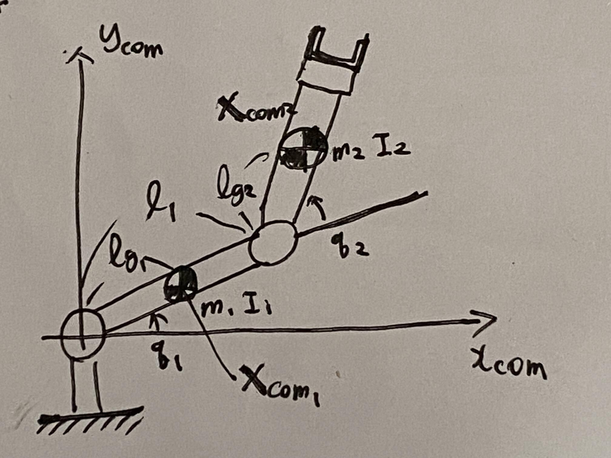
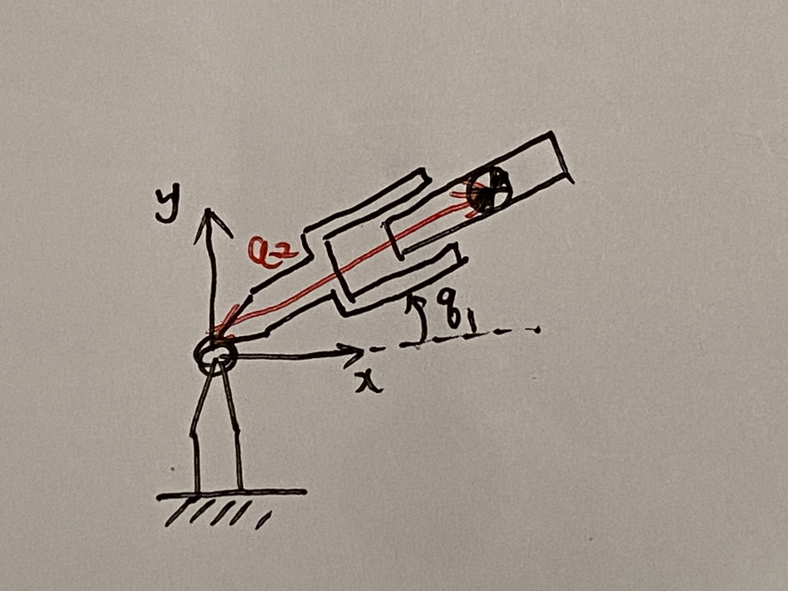

# 第１０週　リンク機構の運動方程式

* [Youtube](https://www.youtube.com/watch?v=gc2XSC9NJj4)
* [PDF](http:/www.ritsumei.ac.jp/~uemura-m/AnalyticalMechanics/AnalyticalMechanics10thWeek.pdf)

## ２リンク機構の運動方程式の導出



運動エネルギー（各リンクは剛体）

```math
\begin{aligned}
K = \frac{1}{2} m_1 v_{com_{1}}^2+ \frac{1}{2} I_1 \dot{\theta}_{com_{1}}^2 + \frac{1}{2} m_2 v_{com_{2}}^2+ \frac{1}{2} I_2 \dot{\theta}_{com_{2}}^2
\end{aligned}
```

重心位置・姿勢

```math
\begin{aligned}
{\bf{x}}_{com_1} &= \begin{pmatrix}
x_{com_1} \\
y_{com_1} \\
\theta_{com_1} \\
\end{pmatrix} \\
&= \begin{pmatrix}
l_{g_1} \cos q_1 \\
l_{g_1} \sin q_1 \\
q_1 \\
\end{pmatrix} \\
\end{aligned}
```

```math
\begin{aligned}
{\bf{x}}_{com_2} &= \begin{pmatrix}
x_{com_2} \\
y_{com_2} \\
\theta_{com_2} \\
\end{pmatrix} \\
&= \begin{pmatrix}
l_{1} \cos q_1 + l_{g_2} \cos (q_1 + q_2)\\
l_{1} \sin q_1 + l_{g_2} \sin (q_1 + q_2)\\
q_1 + q_2\\
\end{pmatrix} \\
\end{aligned}
```

## ２リンク機構の各重心のヤコビ行列

時間で微分する

```math
\begin{aligned}
\dot{{\bf{x}}}_{com_1} &= \begin{pmatrix}
\dot{x}_{com_1} \\
\dot{y}_{com_1} \\
\dot{\theta}_{com_1} \\
\end{pmatrix} \\
&= \begin{pmatrix}
- l_{g_1} \dot{q_1} \sin q_1\\
l_{g_1} \dot{q_1} \cos q_1\\
\dot{q}_1 \\
\end{pmatrix}\\
&= \begin{pmatrix}
- l_{g_1} \sin q_1 & 0\\
l_{g_1} \cos q_1 & 0\\
1 & 0\\
\end{pmatrix}\begin{pmatrix}
\dot{q}_1 \\
\dot{q}_2 \\
\end{pmatrix} \\
&= {\bf{J}}_{com_1} \dot{{\bf{q}}}\\
\end{aligned}
```

```math
\begin{aligned}
\dot{{\bf{x}}}_{com_2} &= \begin{pmatrix}
\dot{x}_{com_2} \\
\dot{y}_{com_2} \\
\dot{\theta}_{com_2} \\
\end{pmatrix} \\
&= \begin{pmatrix}
-l_{1} \dot{q_1} \sin q_1 - l_{g_2} (\dot{q}_1 + \dot{q}_2) \sin (q_1 + q_2)\\
l_{1} \dot{q_1} \cos q_1 + l_{g_2} (\dot{q}_1 + \dot{q}_2) \cos (q_1 + q_2)\\
\dot{q_1} + \dot{q_2}\\
\end{pmatrix} \\
&= \begin{pmatrix}
-l_{1} \sin q_1 - l_{g_2} \sin (q_1 + q_2) & - l_{g_2} \sin (q_1 + q_2)\\
l_{1} \cos q_1 + l_{g_2} \cos (q_1 + q_2) & l_{g_2} \cos (q_1 + q_2)\\
1 & 1\\
\end{pmatrix}\begin{pmatrix}
\dot{q}_1 \\
\dot{q}_2 \\
\end{pmatrix} \\
&= {\bf{J}}_{com_2} \dot{{\bf{q}}}
\end{aligned}
```

## ２リンク機構の慣性行列

```math
\begin{aligned}
K &= \frac{1}{2} m_1 v_{com_{1}}^2+ \frac{1}{2} I_1 \dot{\theta}_{com_{1}}^2 + \frac{1}{2} m_2 v_{com_{2}}^2+ \frac{1}{2} I_2 \dot{\theta}_{com_{2}}^2 \\
&= \frac{1}{2} m_1 (\dot{x}_{com_{1}}^2 + \dot{y}_{com_{1}}^2) + \frac{1}{2} I_1 \dot{\theta}_{com_{1}}^2 + \frac{1}{2} m_2 (\dot{x}_{com_{2}}^2 + \dot{y}_{com_{2}}^2) + \frac{1}{2} I_2 \dot{\theta}_{com_{2}}^2 \\
&= \frac{1}{2} \begin{pmatrix}
\dot{x}_{com_{1}} \\
\dot{y}_{com_{1}} \\
\dot{\theta}_{com_{1}} \\
\end{pmatrix}^T \begin{pmatrix}
m_1 & 0 & 0 \\
0 & m_1 & 0 \\
0 & 0 & m_1 \\
\end{pmatrix}\begin{pmatrix}
\dot{x}_{com_{1}} \\
\dot{y}_{com_{1}} \\
\dot{\theta}_{com_{1}} \\
\end{pmatrix} + \frac{1}{2} \begin{pmatrix}
\dot{x}_{com_{2}} \\
\dot{y}_{com_{2}} \\
\dot{\theta}_{com_{2}} \\
\end{pmatrix}^T \begin{pmatrix}
m_2 & 0 & 0 \\
0 & m_2 & 0 \\
0 & 0 & m_2 \\
\end{pmatrix}\begin{pmatrix}
\dot{x}_{com_{2}} \\
\dot{y}_{com_{2}} \\
\dot{\theta}_{com_{2}} \\
\end{pmatrix} \\
&= \frac{1}{2} \dot{{\bf{x}}}_{com_1}^T {\bf{M}}_1 \dot{{\bf{x}}}_{com_1} + \frac{1}{2} \dot{{\bf{x}}}_{com_2}^T {\bf{M}}_2 \dot{{\bf{x}}}_{com_2} \\
&= \sum_{i=1}^{2} \frac{1}{2} \dot{{\bf{x}}}_{com_i}^T {\bf{M}}_i \dot{{\bf{x}}}_{com_i}\\
&= \sum_{i=1}^{2} \frac{1}{2} \dot{{\bf{q}}}^T {\bf{J}}_{com_i}^T {\bf{M}}_i {\bf{J}}_{com_i} \dot{{\bf{q}}}\\
&= \frac{1}{2} \dot{{\bf{q}}}^T {\bf{M}} \dot{{\bf{q}}}\\
\end{aligned}
```

${\bf{M}}$ : 慣性行列

## ２リンク機構の慣性行列の詳細　

```math
\begin{aligned}
{\bf{J}}_{com_1}^T {\bf{M}}_1 {\bf{J}}_{com_1} &= \begin{pmatrix}
- l_{g_1} \sin q_1 & 0\\
l_{g_1} \cos q_1 & 0\\
1 & 0\\
\end{pmatrix}^T \begin{pmatrix}
m_1 & 0 & 0 \\
0 & m_1 & 0\\
0 & 0 & I_1\\
\end{pmatrix} \begin{pmatrix}
- l_{g_1} \sin q_1 & 0\\
l_{g_1} \cos q_1 & 0\\
1 & 0\\
\end{pmatrix} \\
&= \begin{pmatrix}
- m_1 l_{g_1} \sin q_1 & m_1 l_{g_1} \cos q_1 & I_1\\
0 & 0 & 0 \\
\end{pmatrix} \begin{pmatrix}
- l_{g_1} \sin q_1 & 0\\
l_{g_1} \cos q_1 & 0\\
1 & 0\\
\end{pmatrix} \\
&= \begin{pmatrix}
m_1 l_{g_1}^2 (\sin q_1)^2 + m_1 l_{g_1}^2 (\cos q_1)^2 + I_1 & 0\\
0 & 0 \\
\end{pmatrix} \\
&= \begin{pmatrix}
m_1 l_{g_1}^2 + I_1 & 0\\
0 & 0 \\
\end{pmatrix} \\
\end{aligned}
```

```math
\begin{aligned}
{\bf{J}}_{com_2}^T {\bf{M}}_2 {\bf{J}}_{com_2} &= \begin{pmatrix}
-l_1 \sin q_1 - l_{g_2} \sin (q_1 + q_2) & - l_{g_2} \sin (q_1 + q_2)\\
l_1 \cos q_1 + l_{g_2} \cos (q_1 + q_2) & l_{g_2} \cos (q_1 + q_2)\\
1 & 1\\
\end{pmatrix}^T \begin{pmatrix}
m_2 & 0 & 0 \\
0 & m_2 & 0\\
0 & 0 & I_2\\
\end{pmatrix} \begin{pmatrix}
-l_1 \sin q_1 - l_{g_2} \sin (q_1 + q_2) & - l_{g_2} \sin (q_1 + q_2)\\
l_1 \cos q_1 + l_{g_2} \cos (q_1 + q_2) & l_{g_2} \cos (q_1 + q_2)\\
1 & 1\\
\end{pmatrix} \\
&= \begin{pmatrix}
-l_1 \sin q_1 - l_{g_2} \sin (q_1 + q_2) & l_1 \cos q_1 + l_{g_2} \cos (q_1 + q_2) & 1\\
- l_{g_2} \sin (q_1 + q_2) & l_{g_2} \cos (q_1 + q_2) & 1\\
\end{pmatrix} \begin{pmatrix}
m_2 & 0 & 0 \\
0 & m_2 & 0\\
0 & 0 & I_2\\
\end{pmatrix} \begin{pmatrix}
-l_1 \sin q_1 - l_{g_2} \sin (q_1 + q_2) & - l_{g_2} \sin (q_1 + q_2)\\
l_1 \cos q_1 + l_{g_2} \cos (q_1 + q_2) & l_{g_2} \cos (q_1 + q_2)\\
1 & 1\\
\end{pmatrix} \\
&= \begin{pmatrix}
- m_2 l_1 \sin q_1 - m_2 l_{g_2} \sin (q_1 + q_2) & m_2 l_1 \cos q_1 + m_2 l_{g_2} \cos (q_1 + q_2) & I_2\\
- m_2 l_{g_2} \sin (q_1 + q_2) & m_2 l_{g_2} \cos (q_1 + q_2) & I_2\\
\end{pmatrix} \begin{pmatrix}
-l_1 \sin q_1 - l_{g_2} \sin (q_1 + q_2) & - l_{g_2} \sin (q_1 + q_2)\\
l_1 \cos q_1 + l_{g_2} \cos (q_1 + q_2) & l_{g_2} \cos (q_1 + q_2)\\
1 & 1\\
\end{pmatrix} \\
&= \begin{pmatrix}
a_{11} & a_{12} \\
a_{21} & a_{22} \\
\end{pmatrix} \\
\end{aligned}
```

行列の各要素を計算する

```math
\begin{aligned}
a_{11} &= (- m_2 l_1 \sin q_1 - m_2 l_{g_2} \sin (q_1 + q_2))(-l_1 \sin q_1 - l_{g_2} \sin (q_1 + q_2))
+ (m_2 l_1 \cos q_1 + m_2 l_{g_2} \cos (q_1 + q_2))(l_1 \cos q_1 + l_{g_2} \cos (q_1 + q_2))
+I_2\\
&= (- m_2 l_1 \sin q_1)(-l_1 \sin q_1)
+ (- m_2 l_1 \sin q_1)(- l_{g_2} \sin (q_1 + q_2))
+ (- m_2 l_{g_2} \sin (q_1 + q_2))(-l_1 \sin q_1)
+ (- m_2 l_{g_2} \sin (q_1 + q_2))(- l_{g_2} \sin (q_1 + q_2)) \\
&+ (m_2 l_1 \cos q_1)(l_1 \cos q_1)
+ (m_2 l_1 \cos q_1)(l_{g_2} \cos (q_1 + q_2))
+ (m_2 l_{g_2} \cos (q_1 + q_2))(l_1 \cos q_1)
+ (m_2 l_{g_2} \cos (q_1 + q_2))(l_{g_2} \cos (q_1 + q_2)) \\
&+I_2\\
&= m_2 l_1^2 (\sin q_1)^2
+ m_2 l_1 l_{g_2} \sin q_1 \sin (q_1 + q_2)
+ m_2 l_1 l_{g_2} \sin q_1 \sin (q_1 + q_2)
+ m_2 l_{g_2}^2 (\sin (q_1 + q_2))^2 \\
&+ m_2 l_1^2 (\cos q_1)^2
+ m_2 l_1 l_{g_2} \cos q_1 \cos (q_1 + q_2)
+ m_2 l_1 l_{g_2} \cos q_1 \cos (q_1 + q_2)
+ m_2 l_{g_2}^2 (\cos (q_1 + q_2))^2 \\
&+I_2\\
&= m_2 l_1^2 ((\sin q_1)^2 + (\cos q_1)^2)
+ m_2 l_{g_2}^2 ((\sin (q_1 + q_2))^2 + (\cos (q_1 + q_2))^2)
+ 2 m_2 l_1 l_{g_2} (\cos (q_1 + q_2) \cos q_1 + \sin (q_1 + q_2) \sin q_1)
+ I_2\\
&= m_2 l_1^2 + m_2 l_{g_2}^2
+ 2 m_2 l_1 l_{g_2} \cos ((q_1 + q_2) - q_1)
+ I_2\\
&= m_2 (l_1^2 + l_{g_2}^2) + 2 m_2 l_1 l_{g_2} \cos q_2 + I_2\\
\end{aligned}
```

```math
\begin{aligned}
a_{12} &= (- m_2 l_1 \sin q_1 - m_2 l_{g_2} \sin (q_1 + q_2)) (- l_{g_2} \sin (q_1 + q_2))
+ (m_2 l_1 \cos q_1 + m_2 l_{g_2} \cos (q_1 + q_2)) (l_{g_2} \cos (q_1 + q_2))
+ I_2\\
&= m_2 l_1 l_{g_2} \sin q_1 \sin (q_1 + q_2) + m_2 l_{g_2}^2 (\sin (q_1 + q_2))^2
+ m_2 l_1 l_{g_2} \cos q_1 \cos (q_1 + q_2) + m_2 l_{g_2}^2 (\cos (q_1 + q_2))^2
+ I_2\\
&= m_2 l_1 l_{g_2} (\cos (q_1 + q_2) \cos q_1 + \sin (q_1 + q_2) \sin q_1)
+ m_2 l_{g_2}^2 ((\sin (q_1 + q_2))^2 + (\cos (q_1 + q_2))^2)
+ I_2\\
&= m_2 l_1 l_{g_2} \cos q_2 + m_2 l_{g_2}^2 + I_2\\
\end{aligned}
```

```math
\begin{aligned}
a_{21} &= (- m_2 l_{g_2} \sin (q_1 + q_2)) (-l_1 \sin q_1 - l_{g_2} \sin (q_1 + q_2))
+ (m_2 l_{g_2} \cos (q_1 + q_2)) (l_1 \cos q_1 + l_{g_2} \cos (q_1 + q_2))
+ I_2\\
&= m_2 l_1 l_{g_2} \sin (q_1 + q_2) \sin q_1 + m_2 l_{g_2}^2 (\sin (q_1 + q_2))^2
+ m_2 l_1 l_{g_2} \cos (q_1 + q_2) \cos q_1 + m_2 l_{g_2}^2 (\cos (q_1 + q_2))^2
+ I_2\\
&= m_2 l_{g_2}^2 + m_2 l_1 l_{g_2} \cos q_2 + I_2\\
\end{aligned}
```

```math
\begin{aligned}
a_{22} &= (- m_2 l_{g_2} \sin (q_1 + q_2)) (- l_{g_2} \sin (q_1 + q_2))
+ (m_2 l_{g_2} \cos (q_1 + q_2)) (l_{g_2} \cos (q_1 + q_2))
+ I_2\\
&= m_2 l_{g_2}^2 (\sin (q_1 + q_2))^2
+ m_2 l_{g_2}^2 (\cos (q_1 + q_2))^2
+ I_2\\
&= m_2 l_{g_2}^2 + I_2\\
\end{aligned}
```

よって、

```math
\begin{aligned}
{\bf{J}}_{com_2}^T {\bf{M}}_2 {\bf{J}}_{com_2}　&= \begin{pmatrix}
a_{11} & a_{12} \\
a_{21} & a_{22} \\
\end{pmatrix} \\
&= \begin{pmatrix}
m_2 (l_1^2 + l_{g_2}^2) + 2 m_2 l_1 l_{g_2} \cos q_2 + I_2 & m_2 l_1 l_{g_2} \cos q_2 + m_2 l_{g_2}^2 + I_2 \\
m_2 l_{g_2}^2 + m_2 l_1 l_{g_2} \cos q_2 + I_2 & m_2 l_{g_2}^2 + I_2 \\
\end{pmatrix} \\
\end{aligned}
```

慣性行列

```math
\begin{aligned}
{\bf{M}} &= \sum_{i=1}^2 {\bf{J}}_{com_i}^T {\bf{M}}_i {\bf{J}}_{com_i} \\
&= \begin{pmatrix}
m_1 l_{g_1}^2 + I_1 + m_2 (l_1^2 + l_{g_2}^2) + 2 m_2 l_1 l_{g_2} \cos q_2 + I_2 & m_2 l_1 l_{g_2} \cos q_2 + m_2 l_{g_2}^2 + I_2 \\
m_2 l_{g_2}^2 + m_2 l_1 l_{g_2} \cos q_2 + I_2 & m_2 l_{g_2}^2 + I_2 \\
\end{pmatrix} \\
\end{aligned}
```

## ２リンク機構の運動方程式（重力なし）

```math
\begin{aligned}
K = \frac{1}{2} \dot{\bf{q}}^T {\bf{M}} \dot{\bf{q}}
\end{aligned}
```

重力なし = ポテンシャルエネルギーがゼロ

```math
\begin{aligned}
\frac{d}{dt}(\frac{\partial K}{\partial \dot{\bf{q}}}) - \frac{\partial K}{\partial {\bf{q}}}
&= \frac{d}{dt}({\bf{M}} \dot{\bf{q}}) - \frac{\partial K}{\partial {\bf{q}}} \\
&= {\bf{M}} \ddot{\bf{q}} + \dot{\bf{M}} \dot{\bf{q}} - \frac{\partial K}{\partial {\bf{q}}} \\
&= {\bf{M}} \ddot{\bf{q}} + {\bf{h}} = 0\\
\\
{\bf{h}} = \dot{\bf{M}} \dot{\bf{q}} - \frac{\partial K}{\partial {\bf{q}}}
\end{aligned}
```

${\bf{M}} \ddot{\bf{q}}$ : 慣性項 <br>
${\bf{h}}$ : 遠心・コリオリ項

## 演習

### 問い

2リンク機構のラグランジュの運動方程式を具体的に導出せよ。ただし、系の運動エネルギーは $K = \frac{1}{2} \dot{\bf{q}}^T {\bf{M}} \dot{\bf{q}}$ とする

```math
\begin{aligned}
{\bf{M}} &= \begin{pmatrix}
m_1 l_{g_1}^2 + I_1 + m_2 (l_1^2 + l_{g_2}^2) + 2 m_2 l_1 l_{g_2} \cos q_2 + I_2 & m_2 l_1 l_{g_2} \cos q_2 + m_2 l_{g_2}^2 + I_2 \\
m_2 l_{g_2}^2 + m_2 l_1 l_{g_2} \cos q_2 + I_2 & m_2 l_{g_2}^2 + I_2 \\
\end{pmatrix} \\
\end{aligned}
```

### 解答

ラグランジュの運動方程式

```math
\begin{aligned}
\frac{d}{dt}(\frac{\partial K}{\partial \dot{\bf{q}}}) - \frac{\partial K}{\partial {\bf{q}}}
&= \frac{d}{dt}({\bf{M}} \dot{\bf{q}}) - \frac{\partial K}{\partial {\bf{q}}} \\
&= {\bf{M}} \ddot{\bf{q}} + \dot{\bf{M}} \dot{\bf{q}} - \frac{\partial K}{\partial {\bf{q}}} \\
\end{aligned}
```

<br>

```math
\begin{aligned}
\dot{\bf{M}} = \begin{pmatrix}
- 2 m_2 l_1 l_{g_2} \dot{q}_2 \sin q_2 & - m_2 l_1 l_{g_2} \dot{q}_2 \sin q_2\\
- m_2 l_1 l_{g_2} \dot{q}_2 \sin q_2 & 0 \\
\end{pmatrix}
\end{aligned}
```

<br>

```math
\begin{aligned}
\frac{\partial K}{\partial {\bf{q}}} &= \frac{\partial}{\partial {\bf{q}}} (\frac{1}{2} \dot{\bf{q}}^T {\bf{M}} \dot{\bf{q}}) \\
&= \frac{1}{2} \begin{pmatrix}
\frac{\partial}{\partial q_1} (\dot{\bf{q}}^T {\bf{M}} \dot{\bf{q}}) \\
\frac{\partial}{\partial q_2} (\dot{\bf{q}}^T {\bf{M}} \dot{\bf{q}}) \\
\end{pmatrix} \\
\end{aligned}
```

```math
\begin{aligned}
{\bf{M}} &= \begin{pmatrix}
a_{11} & a_{12} \\
a_{21} & a_{22} \\
\end{pmatrix} \\
\end{aligned}
```

とすると、

```math
\begin{aligned}
\dot{\bf{q}}^T {\bf{M}} \dot{\bf{q}} &= \begin{pmatrix}
\dot{q}_1 & \dot{q}_2
\end{pmatrix}\begin{pmatrix}
a_{11} & a_{12} \\
a_{21} & a_{22} \\
\end{pmatrix}\begin{pmatrix}
\dot{q}_1 \\
\dot{q}_2 \\
\end{pmatrix} \\
&= \begin{pmatrix}
\dot{q}_1 a_{11} + \dot{q}_2 a_{21} & \dot{q}_1 a_{12} + \dot{q}_2 a_{22}
\end{pmatrix}\begin{pmatrix}
\dot{q}_1 \\
\dot{q}_2 \\
\end{pmatrix} \\
&= \dot{q}_1^2 a_{11} + \dot{q}_1 \dot{q}_2 a_{21} + \dot{q}_1 \dot{q}_2 a_{12} + \dot{q}_2^2 a_{22} \\
\end{aligned}
```

<br>

```math
\begin{aligned}
\frac{\partial K}{\partial {\bf{q}}} &= \frac{1}{2} \begin{pmatrix}
\frac{\partial}{\partial q_1} (\dot{\bf{q}}^T {\bf{M}} \dot{\bf{q}}) \\
\frac{\partial}{\partial q_2} (\dot{\bf{q}}^T {\bf{M}} \dot{\bf{q}}) \\
\end{pmatrix} \\
&= \frac{1}{2} \begin{pmatrix}
\frac{\partial}{\partial q_1} (\dot{q}_1^2 a_{11} + \dot{q}_1 \dot{q}_2 a_{21} + \dot{q}_1 \dot{q}_2 a_{12} + \dot{q}_2^2 a_{22}) \\
\frac{\partial}{\partial q_2} (\dot{q}_1^2 a_{11} + \dot{q}_1 \dot{q}_2 a_{21} + \dot{q}_1 \dot{q}_2 a_{12} + \dot{q}_2^2 a_{22}) \\
\end{pmatrix} \\
&= \frac{1}{2} \begin{pmatrix}
0 \\
\dot{q}_1^2 (- 2 m_2 l_1 l_{g_2} \sin q_2) + \dot{q}_1 \dot{q}_2 (- m_2 l_1 l_{g_2} \sin q_2) + \dot{q}_1 \dot{q}_2 (- m_2 l_1 l_{g_2} \sin q_2) \\
\end{pmatrix} \\
&= \begin{pmatrix}
0 \\
- m_2 l_1 l_{g_2} \dot{q}_1^2 \sin q_2 - m_2 l_1 l_{g_2} \dot{q}_1 \dot{q}_2 \sin q_2 \\
\end{pmatrix} \\
\end{aligned}
```

## 並進関節がある場合



```math
\begin{aligned}
{\bf{x}}_{com_1} &= \begin{pmatrix}
l_{g_1} \cos q_1 \\
l_{g_1} \sin q_1 \\
q_1 \\
\end{pmatrix} , \\
{\bf{x}}_{com_2} &= \begin{pmatrix}
q_2 \cos q_1 \\
q_2 \sin q_1 \\
q_1 \\
\end{pmatrix} \\
\end{aligned}
```

```math
\begin{aligned}
\dot{\bf{x}}_{com_1} &= \begin{pmatrix}
- l_{g_1} \dot{q_1} \sin q_1 \\
l_{g_1} \dot{q_1} \cos q_1 \\
\dot{q_1} \\
\end{pmatrix} , \\
\dot{\bf{x}}_{com_2} &= \begin{pmatrix}
\dot{q_2} \cos q_1 - q_2 \dot{q_1} \sin q_1 \\
\dot{q_2} \sin q_1 + q_2 \dot{q_1} \cos q_1 \\
\dot{q_1} \\
\end{pmatrix} \\
\end{aligned}
```

ヤコビ行列を導出する。

```math
\begin{aligned}
\dot{\bf{x}}_{com_1} &= \begin{pmatrix}
- l_{g_1} \dot{q_1} \sin q_1 \\
l_{g_1} \dot{q_1} \cos q_1 \\
\dot{q_1} \\
\end{pmatrix} \\
&= \begin{pmatrix}
- l_{g_1} \sin q_1 & 0\\
l_{g_1} \cos q_1 & 0\\
1 & 0\\
\end{pmatrix}
\begin{pmatrix}
\dot{q}_1 \\
\dot{q}_2 \\
\end{pmatrix}
\end{aligned}
```

```math
\begin{aligned}
\dot{\bf{x}}_{com_2} &= \begin{pmatrix}
\dot{q_2} \cos q_1 - q_2 \dot{q_1} \sin q_1 \\
\dot{q_2} \sin q_1 + q_2 \dot{q_1} \cos q_1 \\
\dot{q_1} \\
\end{pmatrix} \\
&= \begin{pmatrix}
- q_2 \sin q_1 & \cos q_1\\
q_2 \cos q_1 & \sin q_1 \\
1 & 0 \\
\end{pmatrix}
\begin{pmatrix}
\dot{q}_1 \\
\dot{q}_2 \\
\end{pmatrix}
\end{aligned}
```

このようにヤコビ行列が求まれば、慣性行列が求まる。慣性行列から運動エネルギーが求まり、ラグランジュの運動方程式から運動方程式が求まる。
