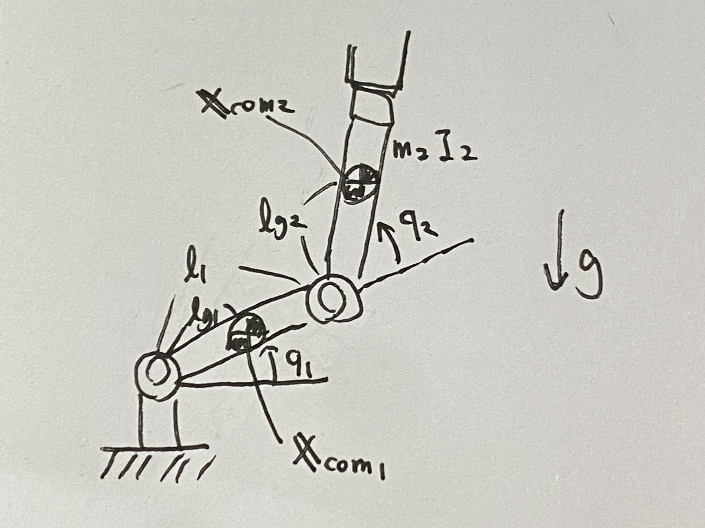
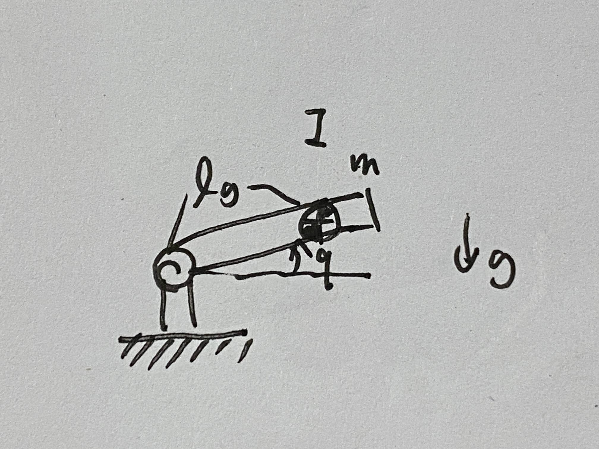

# 第１１週　リンク機構の運動方程式②

* [Youtube](https://www.youtube.com/watch?v=Hr2h-5ZaAto)
* [PDF](http:/www.ritsumei.ac.jp/~uemura-m/AnalyticalMechanics/AnalyticalMechanics11thWeek.pdf)

## 演習 1



### 問い

図の２リンク機構のポテンシャルエネルギーを求めよ <br>
(重力が作用する)

### 解答

２リンク目の重心位置 $y_{com2}$

```math
\begin{aligned}
y_{com2} = l_1 \sin q_1 + l_{g2} \sin (q_1 + q_2)
\end{aligned}
```

ポテンシャルエネルギー

```math
\begin{aligned}
U = m_1 g l_{g1} \sin q_1 + m_2 g \bigl(l_1 \sin q_1 + l_{g2} \sin (q_1 + q_2) \bigr)
\end{aligned}
```

## 演習 2


### 問い

ポテンシャルエネルギー

```math
U = m_1 g l_{g1} \sin q_1 + m_2 g \bigl(l_1 \sin q_1 + l_g2 \sin (q_1 + q_2) \bigr)
```

運動エネルギー

```math
K = \frac{1}{2} \dot{\bf{q}}^T {\bf{M}} {\bf{q}}
```

一般化座標を ${\bf{q}} = \begin{pmatrix} q_1 & q_2\end{pmatrix}^T$ とした場合の重力下２リンク機構の運動方程式を求めよ

### 解答

ラグランジュの運動方程式

```math
\begin{aligned}
& \frac{d}{dt}(\frac{\partial (K - U)}{\partial \dot{\bf{q}}}) - \frac{\partial (K - U)}{\partial {\bf{q}}} \\
&= \frac{d}{dt}(\frac{\partial K}{\partial \dot{\bf{q}}} - \frac{\partial U}{\partial \dot{\bf{q}}}) - \frac{\partial K}{\partial {\bf{q}}} + \frac{\partial U}{\partial {\bf{q}}} \\
&= \frac{d}{dt}({\bf{M}} \dot{\bf{q}} - 0) - \frac{\partial K}{\partial {\bf{q}}} + \frac{\partial U}{\partial {\bf{q}}}\\
&= {\bf{M}} \ddot{\bf{q}} + \dot{\bf{M}} \dot{\bf{q}} - \frac{\partial K}{\partial {\bf{q}}} + \frac{\partial U}{\partial {\bf{q}}}\\
&= {\bf{M}} \ddot{\bf{q}} + {\bf{h}} + {\bf{g}} = 0\\
\end{aligned}
```

${\bf{g}}$ : 重力ベクトル項。Uを偏微分したもの。

```math
\begin{aligned}
{\bf{g}} &= \frac{\partial U}{\partial {\bf{q}}} \\
&= \begin{pmatrix}
\frac{\partial U}{\partial q_1} \\
\frac{\partial U}{\partial q_2} \\
\end{pmatrix}
&= \begin{pmatrix}
m_1 g l_{g1} \cos q_1 + m_2 g \bigl(l_1 \cos q_1 + l_{g2} \cos (q_1 + q_2) \bigr) \\
m_2 g l_{g2} \cos (q_1 + q_2) \\
\end{pmatrix}
\end{aligned}
```

## 二次形式

${\bf{x}}^T {\bf{A}} {\bf{x}}$ を行列 ${\bf{A}}$ の **二次形式** と呼ぶ
<br>
二次形式はスカラーになる。

```math
\begin{aligned}
{\bf{A}} = \begin{pmatrix}
a_{11} & \cdots & a_{1n} \\
\vdots & \ddots & \vdots \\
a_{n1} & \cdots & a_{nn} \\
\end{pmatrix}
\end{aligned}
```

```math
\begin{aligned}
{\bf{x}} = \begin{pmatrix}
x_1 \\
x_1 \\
\vdots \\
x_n\\
\end{pmatrix}
\end{aligned}
```

2行2列の行列での例

```math
\begin{aligned}
{\bf{x}}^T {\bf{A}} {\bf{x}} &= \begin{pmatrix}
x_1 & x_2
\end{pmatrix}\begin{pmatrix}
a_{11} & a_{12} \\
a_{21} & a_{22} \\
\end{pmatrix}\begin{pmatrix}
x_1 \\
x_2 \\
\end{pmatrix} \\
&= \begin{pmatrix}
a_{11} x_1 + a_{21} x_2 & a_{12} x_1 + a_{22} x_2
\end{pmatrix}\begin{pmatrix}
x_1 \\
x_2 \\
\end{pmatrix} \\
&= a_{11} x_1^2 + a_{21} x_1 x_2 + a_{12} x_1 x_2 + a_{22} x_2^2
\end{aligned}
```

## 二次形式の微分

行列 ${\bf{A}}$ が対称行列の場合、 ${\bf{x}}^T {\bf{A}} {\bf{x}}$ を ${\bf{A}}$ で微分すると $2{\bf{A}} {\bf{x}}$ になる

2行2列の行列での例

```math
\begin{aligned}
{\bf{x}}^T {\bf{A}} {\bf{x}} &= a_{11} x_1^2 + a_{21} x_2 x_2 + a_{12} x_1 x_2 + a_{22} x_2^2
\end{aligned}
```

```math
\begin{aligned}
\frac{\partial ({\bf{x}}^T {\bf{A}} {\bf{x}})}{\partial {\bf{x}}} &= \begin{pmatrix}
\frac{\partial ({\bf{x}}^T {\bf{A}} {\bf{x}})}{\partial x_1} \\
\frac{\partial ({\bf{x}}^T {\bf{A}} {\bf{x}})}{\partial x_2} \\
\end{pmatrix} \\
&= \begin{pmatrix}
2 a_{11} x_1 + a_{21} x_2 + a_{12} x_2 \\
a_{21} x_1 + a_{12} x_1 + 2 a_{22} x_2 \\
\end{pmatrix} \\
&= \begin{pmatrix}
2 a_{11} & a_{21} + a_{12} \\
a_{21} + a_{12} & 2 a_{22} \\
\end{pmatrix} \begin{pmatrix}
x_1 \\
x_2
\end{pmatrix} \\
\end{aligned}
```

行列 ${\bf{A}}$ が対称行列なので、 $a_{12} = a_{21}$ となる。よって

```math
\begin{aligned}
&\begin{pmatrix}
2 a_{11} & a_{21} + a_{12} \\
a_{21} + a_{12} & 2 a_{22} \\
\end{pmatrix} \begin{pmatrix}
x_1 \\
x_2
\end{pmatrix} \\
&= \begin{pmatrix}
2 a_{11} & 2 a_{12} \\
2 a_{21} & 2 a_{22} \\
\end{pmatrix} \begin{pmatrix}
x_1 \\
x_2
\end{pmatrix} \\
&= 2{\bf{A}} {\bf{x}} \\
\end{aligned}
```

## 運動方程式を使ったシミュレーション



運動方程式

```math
\begin{aligned}
(I + m l_g^2)\ddot{q} + m g l_g \cos q = 0
\end{aligned}
```

角速度を角加速度の積分で求める。

```math
\begin{aligned}
\dot{q} (t + \Delta t) &= \int_{t}^{t + \Delta t} \ddot{q}(s)ds + \dot{q} (t) \\
\end{aligned}
```

テイラー展開（復習）

```math
\begin{aligned}
\int_a^b f(x) dx = f(x)(b-a) + \frac{f'(a)}{2!}(b - a)^2 + \cdots + \frac{f^{(n)}(a)}{n!}(b - a)^n \\
\end{aligned}
```

```math
\begin{aligned}
\int_{t}^{t + \Delta t} \ddot{q}(s)ds &= \ddot{q}(\Delta t) + \frac{q^{(3)}(t)}{2!}(\Delta t)^2 + \cdots + \frac{f^{(n+1)}(t)}{n!}(\Delta t)^n \\
\end{aligned}
```

微小な2次以降の項を無視すると

```math
\begin{aligned}
\int_{t}^{t + \Delta t} \ddot{q}(s)ds &= \ddot{q}(\Delta t) + \frac{q^{(3)}(t)}{2!}(\Delta t)^2 + \cdots + \frac{f^{(n+1)}(t)}{n!}(\Delta t)^n \\
&\sim \ddot{q}(t) \Delta t
\end{aligned}
```

よって

```math
\begin{aligned}
\dot{q} (t + \Delta t) &= \int_{t}^{t + \Delta t} \ddot{q}(s)ds + \dot{q} (t) \\
&\sim \ddot{q}(t) \Delta t + \dot{q} (t)
\end{aligned}
```

この近似をオイラー積分と呼ぶ。<br>
また同様に時刻 $t$ から微小時間 $\Delta t$ だけ経過した時の角度 $q$ は、角速度から求まる。

```math
\begin{aligned}
q (t + \Delta t) \sim \dot{q}(t) \Delta t + q (t)
\end{aligned}
```

これを繰り返せばシミュレーションできる。

## シミュレーションのプログラム例


```C
void main(){
    const double m = 2, g = 9.8, lg = 0.2, I = 0.05, dt = 0.001;   // 定数
    double ddq = 0, dq = 0, q = 0;

    for(int i=0; i<10000; i++)  //1万回繰り返して10秒シミュレーションする
    {
        ddq = - m * g * lg * cos(q) / (I + m * lg * lg);  // 運動方程式
        dq = dq + ddq * dt;  // オイラー積分で角速度を計算
        q = q + dq * dt;   // オイラー積分で角度を計算
    }
}
```

## 多リンク機構のシミュレーション


運動方程式

```math
\begin{aligned}
{\bf{M}} \ddot{\bf{q}} + {\bf{h}} + {\bf{g}} = {\boldsymbol{\tau}} \\
\end{aligned}
```

積分(オイラー積分)

```math
\begin{aligned}
\dot{\bf{q}} (t + \Delta t) &\sim \ddot{\bf{q}}(t) \Delta t + \dot{{\bf{q}}} (t)
\end{aligned}
```

```math
\begin{aligned}
{\bf{q}} (t + \Delta t) &\sim \dot{\bf{q}}(t) \Delta t + {\bf{q}} (t)
\end{aligned}
```

## 非線形微分方程式とカオス

一定の規則に従う（決定論的）にもかかわらず、予測不能な複雑な振る舞いをすることを **カオス** と呼ぶ。
<br>
非線形微分方程式は数学的に解くことができない。

### 例

一定の規則（非線形微分方程式）

```math
\begin{aligned}
{\bf{M}} \ddot{\bf{q}} + {\bf{h}} + {\bf{g}} = 0\\
\end{aligned}
```

カオス<br>
${\bf{q}}$ は複雑に振る舞う。
<br>
[Youtube動画 2リンク機構が予測不可能な動きをしている例](https://youtu.be/Hr2h-5ZaAto?t=2143)

## バタフライ効果

ブラジルでの蝶の羽ばたきがテキサスでトルネードを引き起こすこと

* 小さな初期条件の違いが、未来に大きな影響を及ぼすという意味
* 天気予報が当たらない理由
