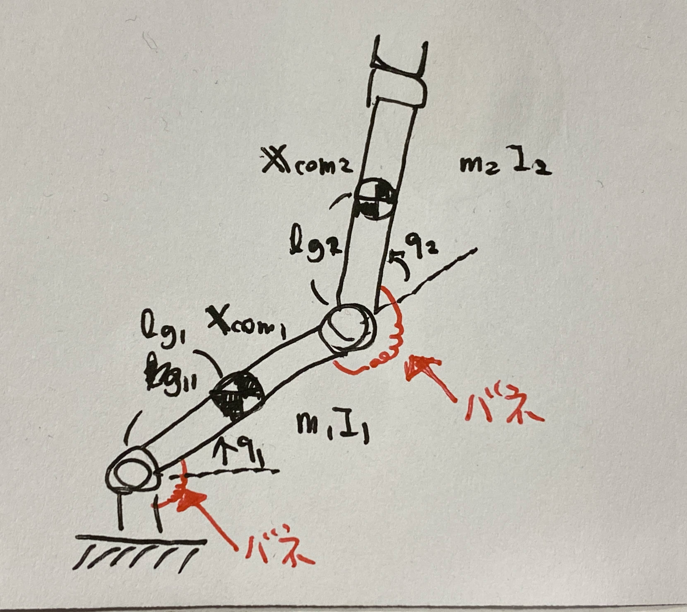
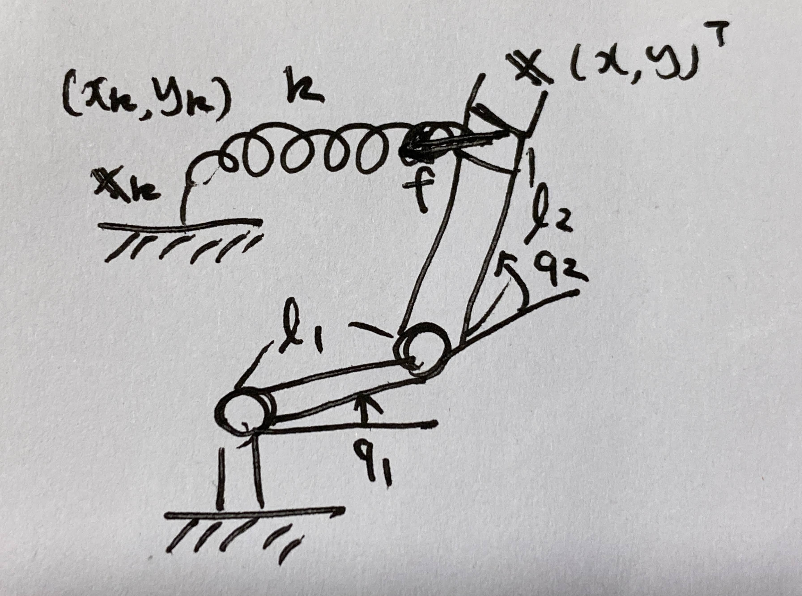

# 第１２週　リンク機構のエネルギー保存則

* [Youtube](https://www.youtube.com/watch?v=Gae_x5r4uR8)
* [PDF](http:/www.ritsumei.ac.jp/~uemura-m/AnalyticalMechanics/AnalyticalMechanics12thWeek.pdf)

## 関節にバネがあるリンク機構のポテンシャルエネルギー



バネが各関節に発生させるトルク

```math
\begin{aligned}
- k_1 q_1, - k_2 q_2
\end{aligned}
```

1つ目のバネのポテンシャルエネルギー

```math
\begin{aligned}
U_1(q_{1b}) - U_1(q_{1a}) &= - \int_{q_{1a}}^{q_{1b}} - k_1 q_1 dq_1 \\
&= \frac{1}{2} k_1 q_{1b}^2 - \frac{1}{2} k_1 q_{1a}^2 \\
\end{aligned}
```

```math
\begin{aligned}
\therefore U_1(q_1) = \frac{1}{2} k_1 q_1^2
\end{aligned}
```

全体のポテンシャルエネルギー

```math
\begin{aligned}
U &= U1 + U2 \\
&= \frac{1}{2} k_1 q_1^2 + \frac{1}{2} k_1 q_2^2 \\
&= \frac{1}{2} {\bf{q}}^T {\bf{K}} {\bf{q}}
\end{aligned}
```

二次形式で表せる。

## 演習:関節にバネがある場合の運動方程式（重力なし）


### 問い

関節にバネがある２リンク機構の運動方程式を求めよ。
<br>
運動エネルギー

```math
\begin{aligned}
K = \frac{1}{2} \dot{\bf{q}}^T {\bf{M}} \dot{\bf{q}}
\end{aligned}
```

ポテンシャルエネルギー

```math
\begin{aligned}
U = \frac{1}{2} {\bf{q}}^T {\bf{K}} {\bf{q}}
\end{aligned}
```

一般化座標

```math
\begin{aligned}
{\bf{q}} = \begin{pmatrix}
q_1 \\
q_2
\end{pmatrix}
\end{aligned}
```

### 解答

```math
\begin{aligned}
L &= K - U\\
&= \frac{1}{2} \dot{\bf{q}}^T {\bf{M}} \dot{\bf{q}} - \frac{1}{2} {\bf{q}}^T {\bf{K}} {\bf{q}}
\end{aligned}
```

ラグランジュの運動方程式

```math
\begin{aligned}
& \frac{d}{dt}(\frac{\partial L}{\partial \dot{\bf{q}}}) - \frac{\partial L}{\partial {\bf{q}}} \\
&= \frac{d}{dt}(\frac{\partial (K-U)}{\partial \dot{\bf{q}}}) - \frac{\partial (K-U))}{\partial {\bf{q}}} \\
&= \frac{d}{dt}(\frac{\partial K}{\partial \dot{\bf{q}}}) - \frac{\partial K}{\partial {\bf{q}}} + \frac{\partial U}{\partial {\bf{q}}} \\
&= \frac{d}{dt}({\bf{M}} \dot{\bf{q}}) - \frac{\partial K}{\partial {\bf{q}}} + \frac{\partial U}{\partial {\bf{q}}}\\
&= {\bf{M}} \ddot{\bf{q}} + \dot{\bf{M}} \dot{\bf{q}} - \frac{\partial K}{\partial {\bf{q}}} + \frac{\partial U}{\partial {\bf{q}}}\\
&= {\bf{M}} \ddot{\bf{q}} + {\bf{h}} + {\bf{K}} {\bf{q}} = 0\\
\end{aligned}
```

<br>

```math
\begin{aligned}
\frac{\partial U}{\partial {\bf{q}}} &= \begin{pmatrix}
\frac{\partial U}{\partial q_1} \\
\frac{\partial U}{\partial q_2}
\end{pmatrix} \\
&= \begin{pmatrix}
\frac{\partial}{\partial q_1} (\frac{1}{2} {\bf{q}}^T {\bf{K}} {\bf{q}}) \\
\frac{\partial}{\partial q_2} (\frac{1}{2} {\bf{q}}^T {\bf{K}} {\bf{q}})
\end{pmatrix} \\
&= \begin{pmatrix}
\frac{\partial}{\partial q_1} (\frac{1}{2} k_1 q_1^2 + \frac{1}{2} k_1 q_2^2) \\
\frac{\partial}{\partial q_2} (\frac{1}{2} k_1 q_1^2 + \frac{1}{2} k_1 q_2^2)
\end{pmatrix} \\
&= \begin{pmatrix}
k_1 q_1 \\
k_1 q_2
\end{pmatrix} \\
&= \begin{pmatrix}
k_1 & 0 \\
0 & k_2
\end{pmatrix}\begin{pmatrix}
q_1\\
q_2
\end{pmatrix}\\
&= {\bf{K}} {\bf{q}}
\end{aligned}
```

## 演習:エネルギー保存則


### 問い

関節にバネによるトルク以外の外力が作用していない２リンク機構の全エネルギーが時間によって変化しないことを示せ
<br>
運動エネルギー

```math
\begin{aligned}
K &= \frac{1}{2} \dot{\bf{q}}^T {\bf{M}} \dot{\bf{q}} \\
&= \frac{1}{2} \dot{\bf{q}}^T \begin{pmatrix}
a_1 + 2 a_2 \cos q_2 & a_3 + a_2 \cos q_2 \\
a_3 + a_2 \cos q_2 & a_3
\end{pmatrix} \dot{\bf{q}} \\
\end{aligned}
```

ポテンシャルエネルギー

```math
\begin{aligned}
U = \frac{1}{2} {\bf{q}}^T {\bf{K}} {\bf{q}}
\end{aligned}
```

### 解答

全エネルギー

```math
\begin{aligned}
{\bf{E}} = {\bf{K}} + {\bf{U}}
\end{aligned}
```

運動方程式

```math
{\bf{M}} \ddot{\bf{q}} + {\bf{h}} + {\bf{K}} {\bf{q}} = 0\\
```

```math
{\bf{h}} = \dot{\bf{M}} \dot{\bf{q}} - \frac{\partial {\bf{K}}}{\partial {\bf{q}}}
```

```math
\begin{aligned}
\dot{\bf{E}} &= \dot{\bf{K}} + \dot{\bf{U}} \\
&= \frac{d}{dt}(\frac{1}{2} \dot{\bf{q}}^T {\bf{M}} \dot{\bf{q}}) + {\bf{q}}^T \frac{\partial U}{\partial {\bf{q}}} \\
&= (\frac{1}{2} \ddot{\bf{q}}^T {\bf{M}} \dot{\bf{q}} + \frac{1}{2} \dot{\bf{q}}^T \dot{\bf{M}} \dot{\bf{q}} + \frac{1}{2} \dot{\bf{q}}^T {\bf{M}} \ddot{\bf{q}}) + \dot{\bf{q}}^T {\bf{K}} {\bf{q}} \\
&= \frac{1}{2} \dot{\bf{q}}^T {\bf{M}} \ddot{\bf{q}} + \frac{1}{2} \dot{\bf{q}}^T \dot{\bf{M}} \dot{\bf{q}} + \frac{1}{2} \dot{\bf{q}}^T {\bf{M}} \ddot{\bf{q}} + \dot{\bf{q}}^T {\bf{K}} {\bf{q}} \\
\end{aligned}
```

```math
\begin{aligned}
&= \dot{\bf{q}}^T {\bf{M}} \ddot{\bf{q}} + \frac{1}{2} \dot{\bf{q}}^T \dot{\bf{M}} \dot{\bf{q}} + \dot{\bf{q}}^T {\bf{K}} {\bf{q}} \\
&= \dot{\bf{q}}^T ({\bf{M}} \ddot{\bf{q}} + \frac{1}{2} \dot{\bf{M}} \dot{\bf{q}} + {\bf{K}} {\bf{q}}) \\
&= \dot{\bf{q}}^T ( - {\bf{h}} + \frac{1}{2} \dot{\bf{M}} \dot{\bf{q}}) \\
\end{aligned}
```

#### 合成関数の偏微分 (復習)

↑の $\dot{U} = {\bf{q}}^T \frac{\partial U}{\partial {\bf{q}}}$ は以下のように求める。

```math
\begin{aligned}
\frac{df}{dt} &= \frac{\partial f}{\partial x}\frac{dx}{dt} + \frac{\partial f}{\partial y}\frac{dy}{dt} \\
&= \frac{\partial f}{\partial x}\dot{x} + \frac{\partial f}{\partial y}\dot{y}
\end{aligned}
```

復習終わり。

```math
\begin{aligned}
\frac{1}{2} \dot{\bf{M}} \dot{\bf{q}} &= \frac{1}{2} \frac{d}{dt} \begin{pmatrix}
a_1 + 2 a_2 \cos q_2 & a_3 + a_2 \cos q_2 \\
a_3 + a_2 \cos q_2 & a_3
\end{pmatrix} \begin{pmatrix}
\dot{q}_1 \\
\dot{q}_2
\end{pmatrix} \\
&= \frac{1}{2} \begin{pmatrix}
- 2 a_2 \dot{q}_2 \sin q_2 & - a_2 \dot{q}_2 \sin q_2 \\
- a_2 \dot{q}_2 \sin q_2 & 0
\end{pmatrix} \begin{pmatrix}
\dot{q}_1 \\
\dot{q}_2
\end{pmatrix} \\
&= \frac{1}{2} \begin{pmatrix}
- 2 a_2 \dot{q}_1 \dot{q}_2 \sin q_2 - a_2 \dot{q}_2^2 \sin q_2 \\
- a_2 \dot{q}_1 \dot{q}_2 \sin q_2
\end{pmatrix} \\
&= \frac{- a_2 \sin q_2}{2} \begin{pmatrix}
2 \dot{q}_1 \dot{q}_2 + \dot{q}_2^2 \\
\dot{q}_1 \dot{q}_2
\end{pmatrix} \\
\end{aligned}
```

<br>

```math
\begin{aligned}
K &= \frac{1}{2} \dot{\bf{q}}^T {\bf{M}} \dot{\bf{q}} \\
&= \frac{1}{2} \dot{\bf{q}}^T \begin{pmatrix}
a_1 + 2 a_2 \cos q_2 & a_3 + a_2 \cos q_2 \\
a_3 + a_2 \cos q_2 & a_3
\end{pmatrix} \dot{\bf{q}} \\
&= \frac{1}{2} \begin{pmatrix}
\dot{q}_1 & \dot{q}_2
\end{pmatrix} \begin{pmatrix}
a_1 + 2 a_2 \cos q_2 & a_3 + a_2 \cos q_2 \\
a_3 + a_2 \cos q_2 & a_3
\end{pmatrix} \begin{pmatrix}
\dot{q}_1 \\
\dot{q}_2
\end{pmatrix} \\
&= \frac{1}{2} \begin{pmatrix}
\dot{q}_1 (a_1 + 2 a_2 \cos q_2) + \dot{q}_2 (a_3 + a_2 \cos q_2) &
\dot{q}_1 (a_3 + a_2 \cos q_2) + \dot{q}_2 a_3
\end{pmatrix} \begin{pmatrix}
\dot{q}_1 \\
\dot{q}_2
\end{pmatrix} \\
&= \frac{1}{2} (\dot{q}_1^2 (a_1 + 2 a_2 \cos q_2) + \dot{q}_1 \dot{q}_2 (a_3 + a_2 \cos q_2) +
\dot{q}_1 \dot{q}_2 (a_3 + a_2 \cos q_2) + \dot{q}_2^2 a_3 )\\
\end{aligned}
```

<br>

```math
\begin{aligned}
\frac{\partial K}{\partial {\bf{q}}} &= \begin{pmatrix}
\frac{\partial}{\partial q_1} K\\
\frac{\partial}{\partial q_2} K
\end{pmatrix} \\
&= \frac{1}{2} \begin{pmatrix}
\frac{\partial}{\partial q_1} ( \dot{q}_1^2 (a_1 + 2 a_2 \cos q_2) + \dot{q}_1 \dot{q}_2 (a_3 + a_2 \cos q_2) +
\dot{q}_1 \dot{q}_2 (a_3 + a_2 \cos q_2) + \dot{q}_2^2 a_3 )\\
\frac{\partial}{\partial q_2} ( \dot{q}_1^2 (a_1 + 2 a_2 \cos q_2) + \dot{q}_1 \dot{q}_2 (a_3 + a_2 \cos q_2) +
\dot{q}_1 \dot{q}_2 (a_3 + a_2 \cos q_2) + \dot{q}_2^2 a_3 ) \\
\end{pmatrix} \\
&= \frac{1}{2} \begin{pmatrix}
0 \\
\dot{q}_1^2 (- 2 a_2 \sin q_2) + \dot{q}_1 \dot{q}_2 (- a_2 \sin q_2) +
\dot{q}_1 \dot{q}_2 (- a_2 \sin q_2) \\
\end{pmatrix} \\
&= - a_2 \sin q_2 \begin{pmatrix}
0 \\
\dot{q}_1^2 + \dot{q}_1 \dot{q}_2 \\
\end{pmatrix} \\
\end{aligned}
```

<br>

```math
\begin{aligned}
- {\bf{h}} + \frac{1}{2} \dot{\bf{M}} \dot{\bf{q}} &= \frac{\partial K}{\partial {\bf{q}}} - \frac{1}{2} \dot{\bf{M}} \dot{\bf{q}} \\
&= - a_2 \sin q_2 \begin{pmatrix}
0 \\
\dot{q}_1^2 + \dot{q}_1 \dot{q}_2 \\
\end{pmatrix} - \frac{- a_2 \sin q_2}{2} \begin{pmatrix}
2 \dot{q}_1 \dot{q}_2 + \dot{q}_2^2 \\
\dot{q}_1 \dot{q}_2
\end{pmatrix} \\
&= \frac{a_2 \sin q_2}{2} \begin{pmatrix}
0 \\
-2 \dot{q}_1^2 -2 \dot{q}_1 \dot{q}_2 \\
\end{pmatrix} + \frac{a_2 \sin q_2}{2} \begin{pmatrix}
2 \dot{q}_1 \dot{q}_2 + \dot{q}_2^2 \\
\dot{q}_1 \dot{q}_2
\end{pmatrix} \\
&= \frac{a_2 \sin q_2}{2} \begin{pmatrix}
2 \dot{q}_1 \dot{q}_2 + \dot{q}_2^2 \\
-2 \dot{q}_1^2 - \dot{q}_1 \dot{q}_2
\end{pmatrix} \\
\end{aligned}
```

<br>

```math
\begin{aligned}
\dot{\bf{E}} &= \dot{\bf{q}}^T ( - {\bf{h}} + \frac{1}{2} \dot{\bf{M}} \dot{\bf{q}}) \\
&= \frac{a_2 \sin q_2}{2} \begin{pmatrix}
\dot{q}_1 & \dot{q}_2
\end{pmatrix} \begin{pmatrix}
2 \dot{q}_1 \dot{q}_2 + \dot{q}_2^2 \\
-2 \dot{q}_1^2 - \dot{q}_1 \dot{q}_2
\end{pmatrix} \\
&= \frac{a_2 \sin q_2}{2} \bigl(
\dot{q}_1 ( 2 \dot{q}_1 \dot{q}_2 + \dot{q}_2^2 ) + \dot{q}_2 ( -2 \dot{q}_1^2 - \dot{q}_1 \dot{q}_2 )
\bigr) \\
&= \frac{a_2 \sin q_2}{2} (2 \dot{q}_1^2 \dot{q}_2 + \dot{q}_1 \dot{q}_2^2 -2 \dot{q}_1^2 \dot{q}_2 - \dot{q}_1 \dot{q}_2^2) \\
&= 0
\end{aligned}
```

## エネルギー保存則の物理

全エネルギー（単位は[J]）
<br>
例: $E = \frac{1}{2}m\dot{x}^2 + \frac{1}{2}kx^2$
<br>
エネルギの時間微分は **パワー** (単位は[W])
<br>
例: $\dot{E} = \dot{x}(m\ddot{x} + kx)$
<br>
$\dot{x}$ : 速度 <br>
$m\ddot{x} + kx$ : 力
<br>
力[N] × 速度 [m/s] = パワー [W] <br>
(回転計では、トルク[Nm] × 角速度 [rad/s] = パワー [W])

## リンク構造でのパワーとエネルギー（手先にバネを取り付けた場合）



ボテンシャルエネルギー

```math
\begin{aligned}
U &= \frac{1}{2}k \bigl( (x - x_k)^2 + (y - y_k)^2 \bigr) \\
&= \frac{1}{2}k \begin{pmatrix}
x - x_k & y - y_k
\end{pmatrix}\begin{pmatrix}
x - x_k \\
y - y_k
\end{pmatrix}\\
&= \frac{1}{2}k {\bf{\Delta x}}^T {\bf{\Delta x}}
\end{aligned}
```

バネのよって発生するトルク

```math
\begin{aligned}
{\boldsymbol{\tau}}_{spring} &= -\frac{\partial U}{\partial {\bf{q}}} \\
&= \begin{pmatrix}
\frac{\partial x}{\partial q_1} & \frac{\partial y}{\partial q_1} \\
\frac{\partial x}{\partial q_2} & \frac{\partial x}{\partial q_2}
\end{pmatrix}\begin{pmatrix}
\frac{\partial U}{\partial x} \\
\frac{\partial U}{\partial y}
\end{pmatrix}\\
&= - {\bf{J}}^T \begin{pmatrix}
k(x - x_k) \\
k(y - y_k)
\end{pmatrix} \\
&= - {\bf{J}}^T k {\bf{\Delta x}}
\end{aligned}
```

```math
バネによる手先力
\begin{pmatrix}
k(x - x_k) \\
k(y - y_k)
\end{pmatrix}
```

バネのポテンシャルエネルギー $U$ の時間変化

```math
\begin{aligned}
\dot{U} &= \frac{d}{dt}(\frac{1}{2}k {\bf{\Delta x}}^T {\bf{\Delta x}}) \\
&= \frac{1}{2}k {\bf{\Delta x}}^T {\bf{\Delta \dot{x}}} + \frac{1}{2}k {\bf{\Delta \dot{x}}}^T {\bf{\Delta x}}\\
&= k {\bf{\Delta \dot{x}}}^T {\bf{\Delta x}}\\
&= k ({\bf{J\dot{q}}})^T {\bf{\Delta x}}\\
&= k {\bf{\dot{q}}}^T {\bf{J}}^T {\bf{\Delta x}}\\
\end{aligned}
```

バネがリンク機構に加えるパワー $P$

```math
\begin{aligned}
P &= {\bf{\dot{q}}}^T {\boldsymbol{\tau}}_{spring} \\
&= - {\bf{\dot{q}}}^T {\bf{J}}^T k {\bf{\Delta x}} \\
\end{aligned}
```

系に加えるエネルギーの分だけ、バネのポテンシャルエネルギーが減る

```math
\dot{U} = -P
```

## エネルギー保存則の導出

運動エネルギー

```math
K = \frac{1}{2} \dot{\bf{q}}^T {\bf{M}} \dot{\bf{q}}
```

全エネルギー

```math
E = K + U
```

運動方程式

```math
{\bf{M}} \ddot{\bf{q}} + {\bf{h}} = {\boldsymbol{\tau}}_{spring}\\
```

全エネルギー $E$ の時間変化

```math
\begin{aligned}
\dot{E} &= \dot{\bf{q}}^T ( {\bf{M}} \ddot{\bf{q}} + \frac{1}{2} \dot{\bf{M}} \dot{\bf{q}} ) + \dot{U} \\
&= \dot{\bf{q}}^T ( \frac{1}{2} \dot{\bf{M}} \dot{\bf{q}} - {\bf{h}} + {\boldsymbol{\tau}}_{spring}) + \dot{U} \\
&= \dot{\bf{q}}^T ( 0 + {\boldsymbol{\tau}}_{spring}) + \dot{U} \\
&= \dot{\bf{q}}^T {\boldsymbol{\tau}}_{spring} + \dot{U} \\
&= P + \dot{U} = 0\\
\end{aligned}
```
