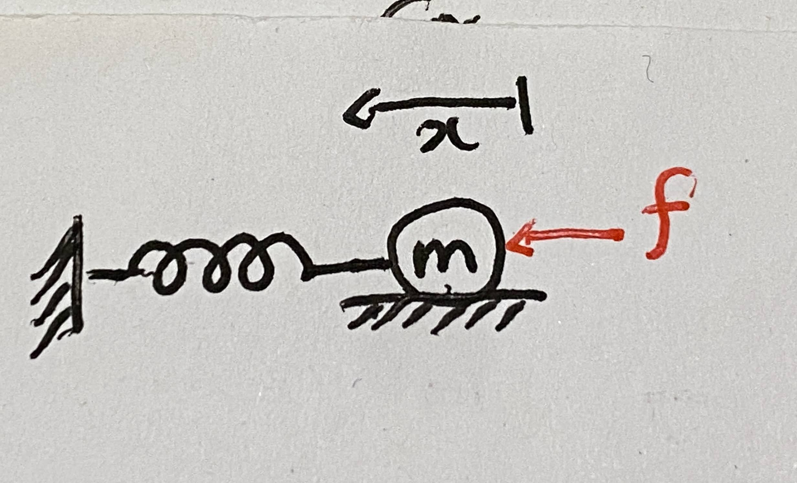
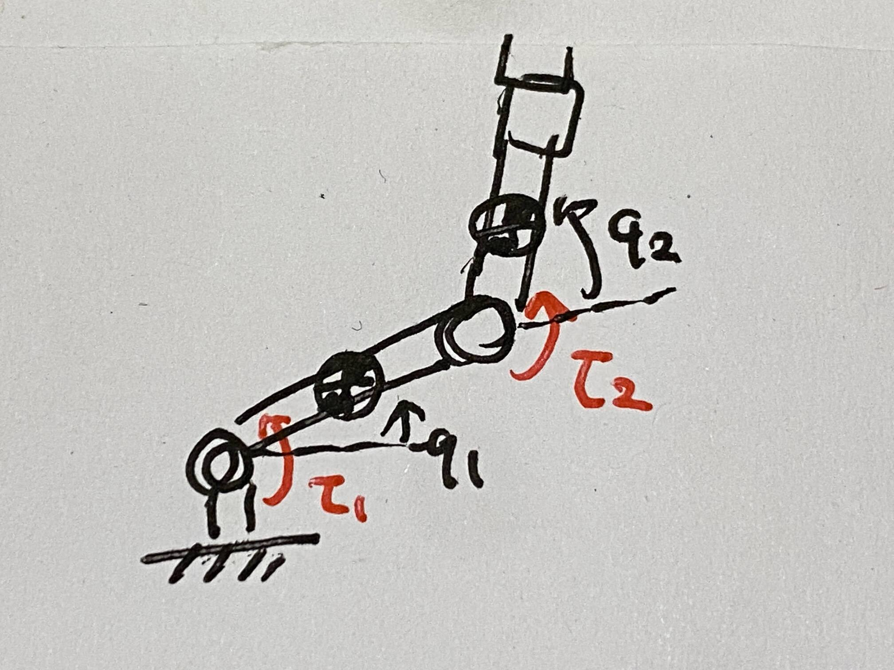
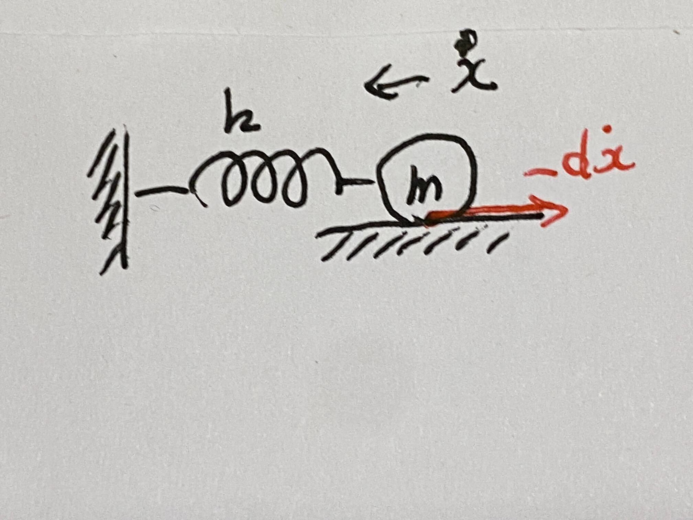
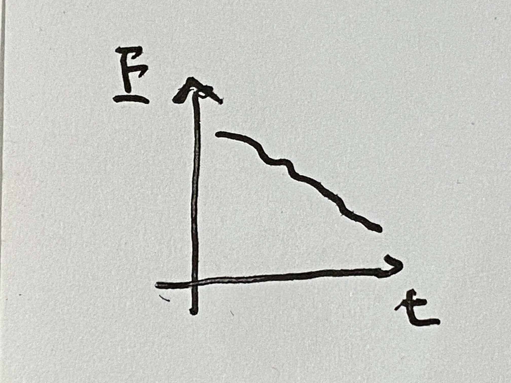
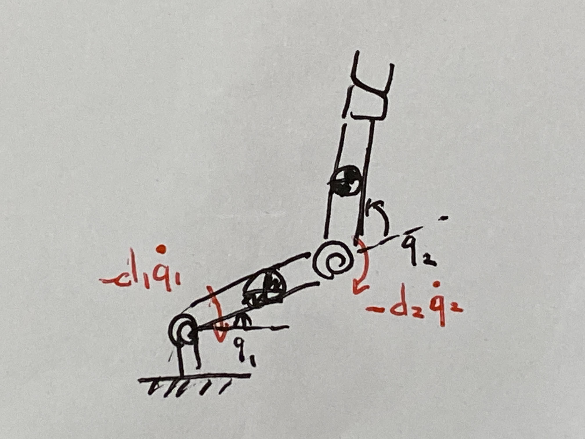
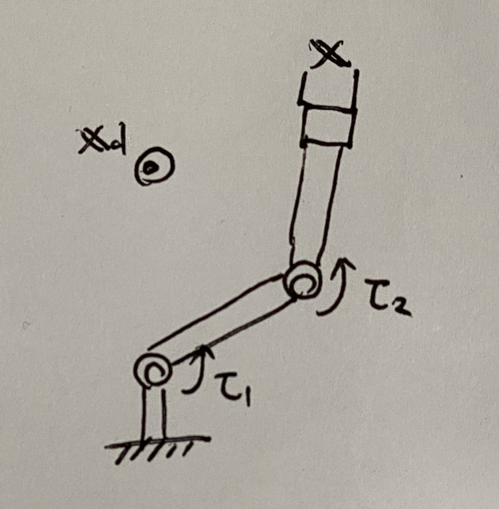
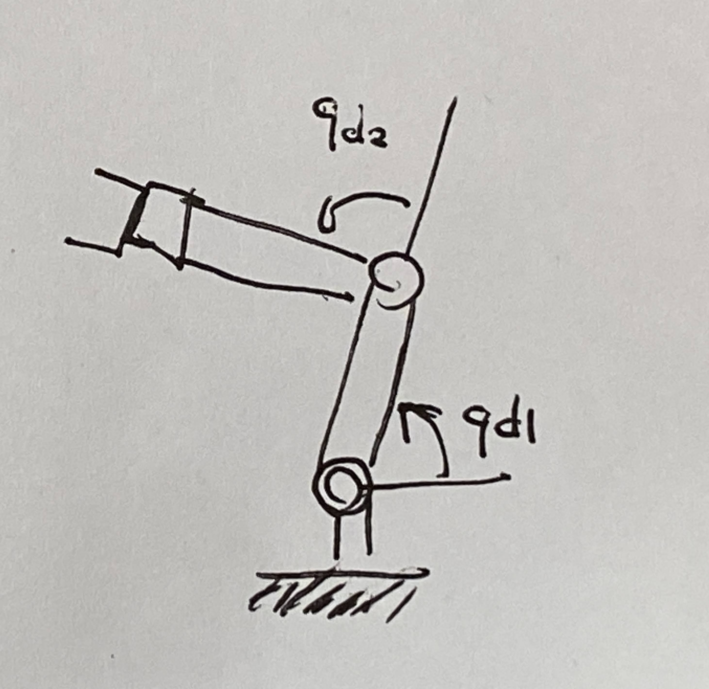

# 第１３週　外力が作用する場合の運動方程式

* [Youtube](https://www.youtube.com/watch?v=oONEqXBqUhU)
* [PDF](http:/www.ritsumei.ac.jp/~uemura-m/AnalyticalMechanics/AnalyticalMechanics13thWeek.pdf)

## 外力が作用する場合

系に外力（トルク）が作用する場合、運動方程式の右辺に外力（トルク）を加える
<br>
例：



運動方程式

```math
\frac{d}{dt} \frac{\partial L}{\partial \dot{x}} - \frac{\partial L}{\partial x} = m \ddot{x} + kx = f
```



運動方程式

```math
\frac{d}{dt} \frac{\partial L}{\partial \dot{{\bf{q}}}} - \frac{\partial L}{\partial {\bf{q}}} = {\bf{M}} \ddot{\bf{q}} + {\bf{h}} = \begin{pmatrix}
\tau_1 \\
\tau_2
\end{pmatrix} = {\boldsymbol{\tau}}
```

## 粘性

**速度と逆方向** に **速度に比例** した力・トルクを粘性力・トルクと呼ぶ
<br>
例：摩擦、空気抵抗



運動方程式

```math
m \ddot{x} + kx = -d \dot{x}
```

## 粘性によるエネルギー消散


全エネルギー

```math
\begin{aligned}
E = \frac{1}{2}m \dot{x}^2 + \frac{1}{2}kx^2
\end{aligned}
```

運動方程式

```math
m \ddot{x} + kx = -d \dot{x}
```

エネルギーの時間微分

```math
\begin{aligned}
\dot{E} &= m \ddot{x} \dot{x} + k x \dot{x} \\
&= \dot{x} (m \ddot{x} + k x) \\
&= -d \dot{x}^2
\end{aligned}
```

<br>

```math
\begin{aligned}
E = \frac{1}{2}m \dot{x}^2 + \frac{1}{2}kx^2 \geq 0
\end{aligned}
```

かつ

```math
\begin{aligned}
\dot{E} = -d \dot{x}^2 \leq 0
\end{aligned}
```

より、Eは時間の経過とともに単調減少 <br>
$ t \rightarrow \infty$ で $\dot{x} = 0$ 、 $x = 0$ になる。



## 関節に粘性があるリンク機構



各関節に速度と逆方向に速度に比例したトルクが生じる

```math
\begin{aligned}
{\boldsymbol{\tau}}_d &= \begin{pmatrix}
-d_1 \dot{q}_1 \\
-d_2 \dot{q}_2
\end{pmatrix} \\
&= - \begin{pmatrix}
-d_1 & 0 \\
0 & -d_2
\end{pmatrix} \begin{pmatrix}
\dot{q}_1 \\
\dot{q}_2
\end{pmatrix} \\
&= - {\bf{D}} \dot{\bf{q}}
\end{aligned}
```

${\bf{D}}$ : 粘性行列
<br>
粘性が無い場合の運動方程式

```math
\begin{aligned}
{\bf{M}} \ddot{\bf{q}} + {\bf{h}} = 0
\end{aligned}
```

粘性がある場合の運動方程式

```math
\begin{aligned}
{\bf{M}} \ddot{\bf{q}} + {\bf{h}} = {\boldsymbol{\tau}}_d = - {\bf{D}} \dot{\bf{q}}
\end{aligned}
```

## 演習：リンク機構のエネルギー消散


### 問い

関節に粘性がある２リンク機構の全エネルギー $E = \frac{1}{2} \dot{\bf{q}}^T {\bf{M}} \dot{\bf{q}}$ が、時間の経過に伴って単調に現象することを示せ (重力なし)
<br>
運動方程式

```math
\begin{aligned}
{\bf{M}} \ddot{\bf{q}} + {\bf{h}} = - {\bf{D}} \dot{\bf{q}}
\end{aligned}
```

### 解答

エネルギーの時間微分

```math
\begin{aligned}
\dot{E} &= \frac{d}{dt} (\frac{1}{2} \dot{\bf{q}}^T {\bf{M}} \dot{\bf{q}}) \\
&= \frac{1}{2} \ddot{\bf{q}}^T {\bf{M}} \dot{\bf{q}} + \frac{1}{2} \dot{\bf{q}}^T \dot{\bf{M}} \dot{\bf{q}} + \frac{1}{2} \dot{\bf{q}}^T {\bf{M}} \ddot{\bf{q}} \\
&= \frac{1}{2} \dot{\bf{q}}^T {\bf{M}} \ddot{\bf{q}} + \frac{1}{2} \dot{\bf{q}}^T \dot{\bf{M}} \dot{\bf{q}} + \frac{1}{2} \dot{\bf{q}}^T {\bf{M}} \ddot{\bf{q}} \\
&= \dot{\bf{q}}^T {\bf{M}} \ddot{\bf{q}} + \frac{1}{2} \dot{\bf{q}}^T \dot{\bf{M}} \dot{\bf{q}} \\
&= \dot{\bf{q}}^T ({\bf{M}} \ddot{\bf{q}} + \frac{1}{2} \dot{\bf{M}} \dot{\bf{q}} )\\
&= \dot{\bf{q}}^T (- {\bf{h}} - {\bf{D}} \dot{\bf{q}} + \frac{1}{2} \dot{\bf{M}} \dot{\bf{q}} )\\
&= \dot{\bf{q}}^T (\frac{1}{2} \dot{\bf{M}} \dot{\bf{q}} - {\bf{h}} - {\bf{D}} \dot{\bf{q}})\\
\end{aligned}
```

$\dot{\bf{q}}^T (\frac{1}{2} \dot{\bf{M}} \dot{\bf{q}} - {\bf{h}}) = 0$ より

```math
\begin{aligned}
\dot{E} &= \dot{\bf{q}}^T (\frac{1}{2} \dot{\bf{M}} \dot{\bf{q}} - {\bf{h}} - {\bf{D}} \dot{\bf{q}})\\
&= - \dot{\bf{q}}^T {\bf{D}} \dot{\bf{q}}\\
\end{aligned}
```

```math
E = \frac{1}{2} \dot{\bf{q}}^T {\bf{M}} \dot{\bf{q}} \geq 0
```

↑正定値対称行列なので正になる。

```math
\dot{E} = - \dot{\bf{q}}^T {\bf{D}} \dot{\bf{q}} \leq 0
```

$D$ が対角行列であり、対角要素がすべて正なので、 $\dot{E}$ はゼロ以下になる。<br>
Eは時間の経過とともに単調減少 <br>


$t \rightarrow \infty$ で $\dot{q} = 0$ になる。
<br>
<br>
<br>
<br>

## 手先位置の制御



### 制御目的

手先位置 ${\bf{x}}$ を目標位置 ${\bf{x}}_d$ に収束させる。<br>
電動モータでトルクを発生させるアーム。

### 制御則

```math
\begin{aligned}
{\boldsymbol{\tau}} = -k_p {\bf{J}}^T \Delta {\bf{x}} - k_v \dot{\bf{q}}
\end{aligned}
```

$-k_p {\bf{J}}^T \Delta {\bf{x}}$ : 人工ポテンシャル (仮想的なバネが取り付けられているイメージ) <br>
$- k_v \dot{\bf{q}}$ : 仮想的な粘性が発生しているイメージ<br>

$\Delta {\bf{x}} = {\bf{x}} - {\bf{x}}_d$ <br>
$k_p$ : 位置フィードバックゲイン<br>
$k_v$ : 速度フィードバックゲイン

## 手先位置の制御(収束性の証明）

### リアプノフ関数

```math
\begin{aligned}
V = \frac{1}{2} \dot{\bf{q}}^T {\bf{M}} \dot{\bf{q}} + \frac{1}{2} k_p \Delta {\bf{x}}^T \Delta {\bf{x}} \geq 0
\end{aligned}
```

## $V$ の時間微分

```math
\begin{aligned}
\dot{V} = - k_v \dot{\bf{q}}^T \dot{\bf{q}} \leq 0
\end{aligned}
```

$t \rightarrow \infty$ で $\dot{\bf{q}} \rightarrow 0$ になる。<br>
さらに静力学解析により、 ${\bf{x}} \rightarrow {\bf{x}}_d$ になる。

## 演習：関節角の制御



### 問い

関節角 ${\bf{q}}$ を目標角 ${\bf{q}}_d$ に収束させる。制御則 ${\boldsymbol{\tau}} = ?$ を提案し、収束性を証明せよ。

### 解答

制御則

```math
\begin{aligned}
{\boldsymbol{\tau}} = -k_p \Delta {\bf{q}} - k_v \dot{\bf{q}}
\end{aligned}
```

$-k_p \Delta {\bf{q}}$ : 人工ポテンシャル

$\Delta {\bf{q}} = {\bf{q}} - {\bf{q}}_d$ <br>
$k_p$ : 位置フィードバックゲイン<br>
$k_v$ : 速度フィードバックゲイン<br>
<br>
収束性の証明 <br>
リアプノフ関数

```math
\begin{aligned}
V = \frac{1}{2} \dot{\bf{q}}^T {\bf{M}} \dot{\bf{q}} + \frac{1}{2} k_p \Delta {\bf{q}}^T \Delta {\bf{q}} \geq 0
\end{aligned}
```

$V$ の時間微分

```math
\begin{aligned}
\dot{V} = - k_v \dot{\bf{q}}^T \dot{\bf{q}} \leq 0
\end{aligned}
```

$t \rightarrow \infty$ で $\dot{\bf{q}} \rightarrow 0$ になる。<br>
さらに静力学解析により、 ${\bf{q}} \rightarrow {\bf{q}}_d$ になる。<br>
このような人工的なバネや粘性を使ってリンク機構を制御する人工ポテンシャル法や受動性に基づく制御法という。
