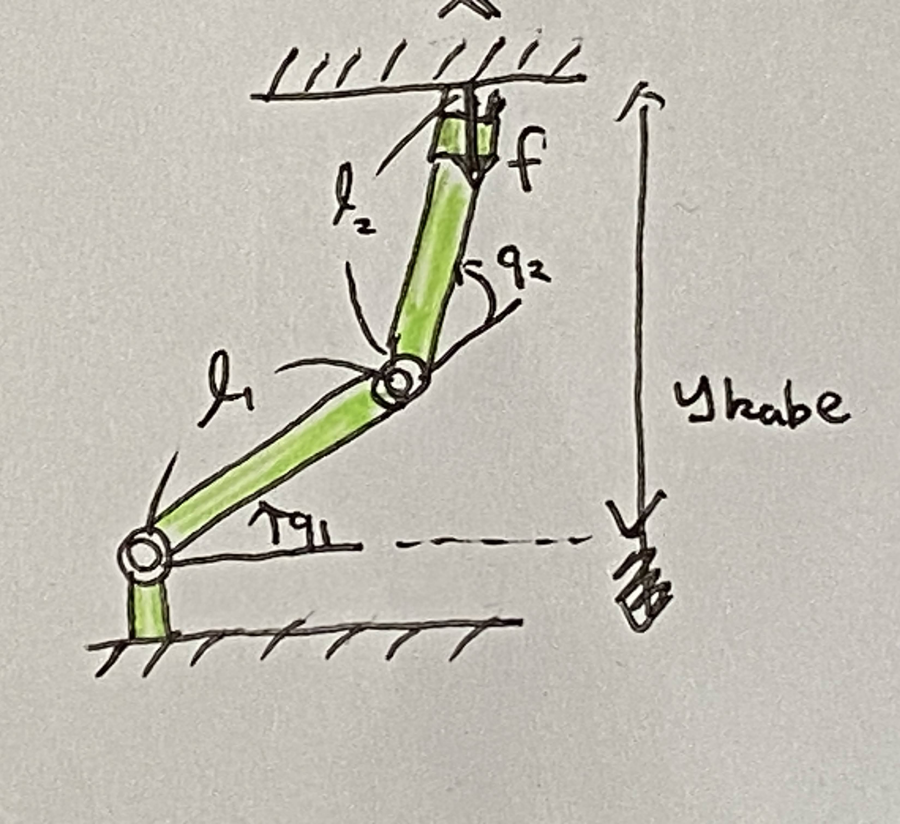

# 第１５週（最終週）　拘束がある場合の運動方程式②

* [Youtube](https://www.youtube.com/watch?v=tU6BGZikVWU)
* [PDF](http:/www.ritsumei.ac.jp/~uemura-m/AnalyticalMechanics/AnalyticalMechanics15thWeek.pdf)

## ラグランジュの未定乗数 $\lambda$ の物理的意味


運動方程式

```math
\begin{aligned}
\begin{pmatrix}
(m_1 + m_2) \ddot{q}_1 \\
m_2 \ddot{q}_2
\end{pmatrix} - \begin{pmatrix}
\lambda \\
\lambda
\end{pmatrix} &= 0 \\
\end{aligned}
```

式の次元は力
<br>

${\boldsymbol{\lambda}}$ **は力**

```math
\begin{aligned}
{\bf{f}} = \begin{pmatrix}
\lambda \\
\lambda
\end{pmatrix}
\end{aligned}
```

<br>
<br>
<br>


運動方程式

```math
\begin{aligned}
{\bf{M}} \ddot{\bf{q}} + {\bf{h}} - {\bf{J}}^T_y \lambda &= 0 \\
\end{aligned}
```

式の次元はトルク
<br>
${\bf{J}}^T_y$ : ヤコビ行列。次元は距離(m)
<br>
${\boldsymbol{\lambda}}$ **は力**

```math
\begin{aligned}
{\bf{f}} = \begin{pmatrix}
0 \\
\lambda
\end{pmatrix}
\end{aligned}
```

<br>

### まとめ

拘束条件が位置のとき、ラグランジュの未定乗数は運動方程式において **力** を表す

<br>

ラグランジアン

```math
L' = K = U + {\boldsymbol{\lambda}} \cdot {\bf{f}}
```

式の次元はエネルギー。 $f$ は位置。
<br>
位置 × 力 で エネルギー になることからも分かる。

## 拘束がある場合のエネルギー保存則

拘束によって発生する力・トルクは仕事をしない

<br>
<br>
<br>

### 並進リンク系での例


<br>
運動方程式

```math
\begin{aligned}
\begin{pmatrix}
(m_1 + m_2) \ddot{q}_1 \\
m_2 \ddot{q}_2
\end{pmatrix} - \begin{pmatrix}
\lambda \\
\lambda
\end{pmatrix} &= 0 \\
\end{aligned}
```

速度の拘束条件

```math
\dot{q}_1 + \dot{q}_2 = 0
```

拘束力が系に加えるパワー

```math
\begin{aligned}
P &= \begin{pmatrix}
\dot{q}_1 \\
\dot{q}_2
\end{pmatrix} \cdot \begin{pmatrix}
\lambda \\
\lambda
\end{pmatrix} \\
&= \dot{q}_1 \lambda + \dot{q}_2 \lambda \\
&= \lambda (\dot{q}_1 + \dot{q}_2) \\
&= \lambda \cdot 0 \\
&= 0
\end{aligned}
```

全エネルギー

```math
\begin{aligned}
E = \frac{1}{2}(m_1 + m_2) \dot{q}_1^2 + \frac{1}{2} m_2 \dot{q}_2^2
\end{aligned}
```

```math
\begin{aligned}
\dot{E} &= (m_1 + m_2) \dot{q}_1 \ddot{q}_1 + m_2 \dot{q}_2 \ddot{q}_2 \\
&= \begin{pmatrix}
\dot{q}_1 \\
\dot{q}_2
\end{pmatrix} \cdot \begin{pmatrix}
(m_1 + m_2) \ddot{q}_1 \\
m_2 \ddot{q}_2
\end{pmatrix} \\
&= \begin{pmatrix}
\dot{q}_1 \\
\dot{q}_2
\end{pmatrix} \cdot \begin{pmatrix}
\lambda \\
\lambda
\end{pmatrix} \\
&= P = 0
\end{aligned}
```

<br>
<br>
<br>

### 回転リンク系での例


運動方程式

```math
\begin{aligned}
{\bf{M}} \ddot{\bf{q}} + {\bf{h}} = {\bf{J}}^T_y \lambda \\
\end{aligned}
```

速度の拘束条件

```math
\dot{y} = {\bf{J}}_y \dot{\bf{q}} = 0 \\
```

拘束力が系に加えるパワー

```math
\begin{aligned}
P &= \dot{\bf{q}} \cdot ({\bf{J}}_y \lambda) \\
&= \lambda ({\bf{J}}_y \dot{\bf{q}})^T \\
&= 0 \\
\end{aligned}
```

全エネルギー

```math
E = \frac{1}{2} \dot{\bf{q}}^T {\bf{M}} \dot{\bf{q}}
```

```math
\begin{aligned}
\dot{E} &= \frac{1}{2} \ddot{\bf{q}}^T {\bf{M}} \dot{\bf{q}} + \frac{1}{2} \dot{\bf{q}}^T \dot{\bf{M}} \dot{\bf{q}} + \frac{1}{2} \dot{\bf{q}}^T {\bf{M}} \ddot{\bf{q}} \\
&= \frac{1}{2} \dot{\bf{q}}^T {\bf{M}} \ddot{\bf{q}} + \frac{1}{2} \dot{\bf{q}}^T \dot{\bf{M}} \dot{\bf{q}} + \frac{1}{2} \dot{\bf{q}}^T {\bf{M}} \ddot{\bf{q}} \\
\end{aligned}
```

```math
\begin{aligned}
&= \dot{\bf{q}}^T {\bf{M}} \ddot{\bf{q}} + \frac{1}{2} \dot{\bf{q}}^T \dot{\bf{M}} \dot{\bf{q}} \\
&= \dot{\bf{q}}^T ( {\bf{M}} \ddot{\bf{q}} + \frac{1}{2} \dot{\bf{M}} \dot{\bf{q}} ) \\
&= \dot{\bf{q}}^T ( \frac{1}{2} \dot{\bf{M}} \dot{\bf{q}} - {\bf{h}} + {\bf{J}}^T_y \lambda ) \\
&= \dot{\bf{q}}^T ( \frac{1}{2} \dot{\bf{M}} \dot{\bf{q}} - {\bf{h}} + {\bf{J}}^T_y \lambda ) \\
\end{aligned}
```

$\frac{1}{2} \dot{\bf{M}} \dot{\bf{q}} - {\bf{h}} = 0$ より

```math
\begin{aligned}
&= \dot{\bf{q}}^T ( \frac{1}{2} \dot{\bf{M}} \dot{\bf{q}} - {\bf{h}} + {\bf{J}}^T_y \lambda ) \\
&= \dot{\bf{q}}^T ( 0 + {\bf{J}}^T_y \lambda ) \\
&= \dot{\bf{q}}^T {\bf{J}}^T_y \lambda = 0 \\
\end{aligned}
```

## 演習：拘束がある場合のエネルギー保存則


### 問い

ひもで拘束された質点のx, y座標での運動方程式を求め、全エネルギーが保存することを示せ

<br>
位置の拘束条件

```math
\sqrt{(x - x_r)^2 + (y - y_r)^2} -r = 0
```

運動方程式

```math
\begin{aligned}
\begin{pmatrix}
m \ddot{x} \\
m \ddot{y}
\end{pmatrix} = {\bf{f}} = ?
\end{aligned}
```

速度の拘束条件：？
<br>
拘束力が系に加えるパワー：？

### 解答

一般化座標

```math
{\bf{x}} = \begin{pmatrix}
x \\
y
\end{pmatrix} \\
```

位置の拘束条件

```math
f(x, y) = \sqrt{(x - x_r)^2 + (y - y_r)^2} -r = 0
```

ラグランジアン

```math
\begin{aligned}
L' &= K - U + {\boldsymbol{\lambda}} \cdot {\bf{f}} \\
&= \frac{1}{2} m (\dot{x}^2 + \dot{y}^2) + \lambda (\sqrt{(x - x_r)^2 + (y - y_r)^2} -r)
\end{aligned}
```

```math
\begin{aligned}
\frac{\partial L'}{\partial \dot{\bf{x}}} &=  \frac{\partial}{\partial \dot{\bf{x}}} ( \frac{1}{2} m (\dot{x}^2 + \dot{y}^2) + \lambda (\sqrt{(x - x_r)^2 + (y - y_r)^2} -r) ) \\
&= \begin{pmatrix}
\frac{\partial}{\partial \dot{x}} ( \frac{1}{2} m (\dot{x}^2 + \dot{y}^2) + \lambda (\sqrt{(x - x_r)^2 + (y - y_r)^2} -r) ) \\
\frac{\partial}{\partial \dot{y}} ( \frac{1}{2} m (\dot{x}^2 + \dot{y}^2) + \lambda (\sqrt{(x - x_r)^2 + (y - y_r)^2} -r) )
\end{pmatrix} \\
&= \begin{pmatrix}
m \dot{x} \\
m \dot{y}
\end{pmatrix} \\
\end{aligned}
```

```math
\begin{aligned}
\frac{d}{dt} \frac{\partial L'}{\partial \dot{\bf{x}}} &= \frac{d}{dt} \begin{pmatrix}
m \dot{x} \\
m \dot{y}
\end{pmatrix} \\
&= \begin{pmatrix}
m \ddot{x} \\
m \ddot{y}
\end{pmatrix}\\
\end{aligned}
```

```math
\begin{aligned}
\frac{\partial L'}{\partial {\bf{x}}} &= \begin{pmatrix}
\frac{\partial}{\partial x} ( \frac{1}{2} m (\dot{x}^2 + \dot{y}^2) + \lambda (\sqrt{(x - x_r)^2 + (y - y_r)^2} -r) ) \\
\frac{\partial}{\partial y} ( \frac{1}{2} m (\dot{x}^2 + \dot{y}^2) + \lambda (\sqrt{(x - x_r)^2 + (y - y_r)^2} -r) )
\end{pmatrix} \\
&= \lambda \begin{pmatrix}
\frac{\partial}{\partial x} \sqrt{(x - x_r)^2 + (y - y_r)^2} \\
\frac{\partial}{\partial y} \sqrt{(x - x_r)^2 + (y - y_r)^2}
\end{pmatrix} \\
\end{aligned}
```

平方根の微分(復習)

```math
(\sqrt{f(x)})' = \frac{1}{2 \sqrt{f(x)}} f'(x)
```

より

```math
\begin{aligned}
&= \lambda \begin{pmatrix}
\frac{\partial}{\partial x} \sqrt{(x - x_r)^2 + (y - y_r)^2} \\
\frac{\partial}{\partial y} \sqrt{(x - x_r)^2 + (y - y_r)^2}
\end{pmatrix} \\
&= \lambda \begin{pmatrix}
\frac{1}{2 \sqrt{(x - x_r)^2 + (y - y_r)^2}} (2 x -2 x_r)\\
\frac{1}{2 \sqrt{(x - x_r)^2 + (y - y_r)^2}} (2 y -2 y_r)
\end{pmatrix} \\
&= \lambda \begin{pmatrix}
\frac{x - x_r}{\sqrt{(x - x_r)^2 + (y - y_r)^2}}\\
\frac{y - y_r}{\sqrt{(x - x_r)^2 + (y - y_r)^2}}
\end{pmatrix} \\
\end{aligned}
```

<br>
<br>

```math
\begin{aligned}
\frac{d}{dt} \frac{\partial L'}{\partial \dot{\bf{x}}} - \frac{\partial L'}{\partial {\bf{x}}} &= 0 \\
\begin{pmatrix}
m \ddot{x} \\
m \ddot{y}
\end{pmatrix} - \lambda \begin{pmatrix}
\frac{x - x_r}{\sqrt{(x - x_r)^2 + (y - y_r)^2}}\\
\frac{y - y_r}{\sqrt{(x - x_r)^2 + (y - y_r)^2}}
\end{pmatrix} &= 0 \\
\begin{pmatrix}
m \ddot{x} \\
m \ddot{y}
\end{pmatrix} &= \begin{pmatrix}
\lambda \frac{x - x_r}{\sqrt{(x - x_r)^2 + (y - y_r)^2}}\\
\lambda \frac{y - y_r}{\sqrt{(x - x_r)^2 + (y - y_r)^2}}
\end{pmatrix} \\
\end{aligned}
```

運動方程式

```math
\begin{aligned}

\begin{pmatrix}
m \ddot{x} \\
m \ddot{y}
\end{pmatrix} = {\bf{f}} = \begin{pmatrix}
\lambda \frac{x - x_r}{\sqrt{(x - x_r)^2 + (y - y_r)^2}}\\
\lambda \frac{y - y_r}{\sqrt{(x - x_r)^2 + (y - y_r)^2}}
\end{pmatrix}
\end{aligned}
```

速度の拘束条件は位置の拘束条件を微分する。

```math
\begin{aligned}
f'(x, y) = \frac{d}{dt} (\sqrt{(x - x_r)^2 + (y - y_r)^2} - r ) &= 0 \\
\frac{1}{2 \sqrt{(x - x_r)^2 + (y - y_r)^2}} ( \dot{x}(2 x -2 x_r) + \dot{y}(2 y -2 y_r) ) &= 0 \\
\frac{\dot{x}(x - x_r) + \dot{y}(y - y_r)}{\sqrt{(x - x_r)^2 + (y - y_r)^2}} &= 0 \\
\end{aligned}
```

拘束力が系に加えるパワー

```math
\begin{aligned}
P &= \dot{\bf{x}} \cdot {\boldsymbol{f}} \\
&= \begin{pmatrix}
\dot{x} \\
\dot{y}
\end{pmatrix} \cdot \begin{pmatrix}
\lambda \frac{x - x_r}{\sqrt{(x - x_r)^2 + (y - y_r)^2}}\\
\lambda \frac{y - y_r}{\sqrt{(x - x_r)^2 + (y - y_r)^2}}
\end{pmatrix} \\
&= \lambda \frac{\dot{x}(x - x_r)}{\sqrt{(x - x_r)^2 + (y - y_r)^2}} + \lambda \frac{\dot{y}(y - y_r)}{\sqrt{(x - x_r)^2 + (y - y_r)^2}} \\
&= \lambda \frac{\dot{x}(x - x_r) + \dot{y}(y - y_r)}{\sqrt{(x - x_r)^2 + (y - y_r)^2}} \\
&= 0 \\
\end{aligned}
```

全エネルギー

```math
\begin{aligned}
E = \frac{1}{2} m (\dot{x}^2 + \dot{y}^2)
\end{aligned}
```

```math
\begin{aligned}
\dot{E} &= m (\dot{x} \ddot{x} + \dot{y} \ddot{y}) \\
&= \begin{pmatrix}
\dot{x} \\
\dot{y}
\end{pmatrix} \cdot \begin{pmatrix}
m \ddot{x} \\
m \ddot{y}
\end{pmatrix} \\
&= \begin{pmatrix}
\dot{x} \\
\dot{y}
\end{pmatrix} \cdot {\bf{f}} \\
&= P = 0
\end{aligned}
```

## 最後に

「本講義で紹介した解析力学は物理システムの設計や制御シミュレーションには欠かせない手法であり、今後の技術者や研究者にとって非常に役に立つものです。実際多くの人の卒業論文や修士論文で使用することになります。他の学科で学んだ人に比べた時の、機械工学やロボティクスを学んだ者の大きなアドバンテージになりますので、ぜひこの機会に習得しましょう。」

植村先生、ありがとうございました。
